# RoomFlow – Smart Room Booking Management Portal
## Software Architecture & Planning Document

| Field | Value |
|---|---|
| Project Name | RoomFlow – Smart Room Booking Management Portal |
| Document Type | Software Architecture & Design Specification (SAD) |
| Version | 1.0 |
| Status | Draft for Review — *no implementation until sign-off* |
| Stack | MongoDB · Express.js · React.js (Vite) · Node.js (MERN) |
| Prepared By | Software Architecture Team |
| Audience | Project Guide, Evaluation Panel, Development Team |

---

## Table of Contents

1. [Functional Requirements](#1-functional-requirements)
2. [Non-Functional Requirements](#2-non-functional-requirements)
3. [Software Architecture](#3-software-architecture)
4. [High Level Architecture Diagram](#4-high-level-architecture-diagram)
5. [Low Level Architecture](#5-low-level-architecture)
6. [Complete MERN Folder Structure](#6-complete-mern-folder-structure)
7. [Database Design](#7-database-design)
8. [ER Diagram](#8-er-diagram)
9. [Collections With Relationships](#9-collections-with-relationships)
10. [API Planning](#10-api-planning)
11. [Authentication Flow](#11-authentication-flow)
12. [Complete User Journey](#12-complete-user-journey)
13. [UI Planning](#13-ui-planning)
14. [Component Hierarchy (React)](#14-component-hierarchy-react)
15. [Backend Folder Architecture](#15-backend-folder-architecture)
16. [MVC Architecture](#16-mvc-architecture)
17. [Middleware Planning](#17-middleware-planning)
18. [MongoDB Schema Design](#18-mongodb-schema-design)
19. [Validation Rules](#19-validation-rules)
20. [Booking Conflict Detection Algorithm](#20-booking-conflict-detection-algorithm)
21. [Booking Status Flow](#21-booking-status-flow)
22. [REST API Naming Convention](#22-rest-api-naming-convention)
23. [Security Best Practices](#23-security-best-practices)
24. [Performance Optimization](#24-performance-optimization)
25. [Deployment Architecture](#25-deployment-architecture)
26. [Development Roadmap](#26-development-roadmap)
27. [Git Branch Strategy](#27-git-branch-strategy)
28. [Project Timeline (10 Weeks)](#28-project-timeline-10-weeks)
29. [Future Scope](#29-future-scope)
30. [Risks and Mitigation](#30-risks-and-mitigation)

---

## 0. Architectural Philosophy (Why This Document Exists)

Before requirements, the guiding principles. Every decision later in this document traces back to one of these five:

| # | Principle | Consequence in RoomFlow |
|---|---|---|
| P1 | **The database is the source of truth for conflicts, not the UI.** | Conflict detection is enforced at the persistence layer with a transaction + unique-ish guard, never only in a React form. A booking made by two users in the same millisecond must still be resolved correctly. |
| P2 | **API-first, client-agnostic.** | The backend never renders HTML and never assumes React. It speaks JSON over REST. This is what makes the *future mobile app integration* a client addition, not a rewrite. |
| P3 | **Thin controllers, fat services, dumb models.** | Business rules live in one layer only (`services/`). Controllers are HTTP adapters. Models are schema + indexes. This is the practical form of Single Responsibility. |
| P4 | **Role is data, permission is policy.** | Roles are stored on the user; permissions are evaluated by a central policy module. Adding a "Warden" role later must not require editing 40 route files. |
| P5 | **Stateless backend, horizontally scalable.** | No server-side session store for auth state; JWT + refresh token in DB. Render can restart or scale the container freely. |

---

# 1. Functional Requirements

Functional requirements (FR) are numbered `FR-<module>-<n>` so they can be traced to test cases and to the roadmap in §26.

## 1.1 FR-AUTH — Authentication & Identity

| ID | Requirement | Actor | Priority |
|---|---|---|---|
| FR-AUTH-01 | System shall allow a new user to register with name, email, password, role-request, and organisation identifier (roll no. / employee ID). | Guest | Must |
| FR-AUTH-02 | System shall verify email uniqueness at registration and reject duplicates with a specific error. | System | Must |
| FR-AUTH-03 | System shall hash passwords using bcrypt (cost ≥ 12) before persistence. Plaintext passwords shall never be stored or logged. | System | Must |
| FR-AUTH-04 | System shall issue a short-lived JWT access token and a long-lived refresh token on successful login. | System | Must |
| FR-AUTH-05 | System shall allow token refresh without re-entering credentials, and shall rotate the refresh token on each use. | All | Must |
| FR-AUTH-06 | System shall allow logout, invalidating the refresh token server-side. | All | Must |
| FR-AUTH-07 | System shall provide "Forgot Password" — email a single-use, time-limited (15 min) reset link. | All | Must |
| FR-AUTH-08 | System shall allow password reset via that token and invalidate all existing refresh tokens on success. | All | Must |
| FR-AUTH-09 | System shall enforce role-based authorization on every protected endpoint. | System | Must |
| FR-AUTH-10 | System shall require Admin approval before a self-registered user claiming `staff` role is granted staff privileges. | Admin | Should |
| FR-AUTH-11 | System shall rate-limit login and forgot-password endpoints to mitigate brute force. | System | Must |
| FR-AUTH-12 | System shall support optional guest booking via a limited-scope guest account. | Guest | Could |

## 1.2 FR-ROOM — Room Management

| ID | Requirement | Actor | Priority |
|---|---|---|---|
| FR-ROOM-01 | Admin shall create a room with code, name, category, capacity, floor, building, facilities, and images. | Admin | Must |
| FR-ROOM-02 | Room code shall be unique across the system. | System | Must |
| FR-ROOM-03 | Admin shall update any room attribute. | Admin | Must |
| FR-ROOM-04 | Admin shall soft-delete a room; rooms with future confirmed bookings shall not be hard-deleted. | Admin | Must |
| FR-ROOM-05 | System shall support room categories (Classroom, Lab, Seminar Hall, Conference Room, Auditorium, Hostel Room, Library Study Room, Meeting Pod). | Admin | Must |
| FR-ROOM-06 | System shall store facilities as a controlled vocabulary (Projector, AC, Whiteboard, Wi-Fi, Smart Board, Audio System, Video Conferencing, Power Outlets, Accessible). | Admin | Must |
| FR-ROOM-07 | System shall accept up to 5 images per room, uploaded to Cloudinary; only the secure URL and public ID are stored in MongoDB. | Admin | Must |
| FR-ROOM-08 | System shall expose real-time availability of a room for a given date/time window. | All | Must |
| FR-ROOM-09 | System shall allow filtering and searching rooms by category, capacity range, facilities, building, and availability window. | All | Must |
| FR-ROOM-10 | Admin shall toggle a room between `active`, `maintenance`, and `inactive`; non-active rooms are not bookable. | Admin | Must |
| FR-ROOM-11 | System shall support per-room operating hours and blackout dates (holidays, exams). | Admin | Should |
| FR-ROOM-12 | System shall paginate room listings (default 12 per page). | System | Must |

## 1.3 FR-BOOK — Booking Management

| ID | Requirement | Actor | Priority |
|---|---|---|---|
| FR-BOOK-01 | Authenticated user shall request a booking specifying room, date, start time, end time, purpose, and attendee count. | Student/Staff | Must |
| FR-BOOK-02 | System shall reject a booking that overlaps an existing `pending` or `approved` booking for the same room. | System | Must |
| FR-BOOK-03 | Conflict detection shall be atomic and race-safe under concurrent requests. | System | Must |
| FR-BOOK-04 | System shall reject bookings where attendee count exceeds room capacity. | System | Must |
| FR-BOOK-05 | System shall reject bookings in the past, outside room operating hours, or on blackout dates. | System | Must |
| FR-BOOK-06 | System shall enforce configurable min duration (15 min), max duration (default 4 h), and max advance window (default 60 days). | System | Should |
| FR-BOOK-07 | Staff bookings may be configured to auto-approve; student bookings shall require approval. | Admin | Must |
| FR-BOOK-08 | Approver (Admin/Staff) shall approve or reject a pending booking with an optional remark. | Admin/Staff | Must |
| FR-BOOK-09 | Requester shall cancel their own booking before its start time. | All | Must |
| FR-BOOK-10 | Admin shall cancel any booking with a mandatory reason. | Admin | Must |
| FR-BOOK-11 | System shall display booking history per user with filters (status, date range, room). | All | Must |
| FR-BOOK-12 | System shall present a calendar view (month/week/day) of bookings, scoped by role. | All | Must |
| FR-BOOK-13 | System shall support recurring bookings (daily/weekly, until end date) with per-occurrence conflict reporting. | Staff | Could |
| FR-BOOK-14 | System shall auto-transition `approved` bookings to `completed` after end time via a scheduled job. | System | Should |
| FR-BOOK-15 | System shall auto-expire `pending` bookings not actioned before start time. | System | Should |
| FR-BOOK-16 | Every booking state change shall be recorded in an immutable audit log. | System | Must |

## 1.4 FR-DASH — Dashboards

| ID | Requirement | Actor | Priority |
|---|---|---|---|
| FR-DASH-01 | Admin dashboard shall show total rooms, active bookings today, pending approvals, total users, utilisation %, and a 7-day booking trend chart. | Admin | Must |
| FR-DASH-02 | Staff dashboard shall show my bookings, bookings awaiting my approval, my rooms' schedule today, and quick-book. | Staff | Must |
| FR-DASH-03 | Student dashboard shall show my upcoming bookings, my pending requests, quick availability search, and recent notifications. | Student | Must |
| FR-DASH-04 | Dashboard aggregates shall be computed server-side in a single endpoint per role — the client shall not issue N calls to build one dashboard. | System | Must |

## 1.5 FR-REP — Reports

| ID | Requirement | Actor | Priority |
|---|---|---|---|
| FR-REP-01 | System shall generate a daily bookings report for a chosen date. | Admin/Staff | Must |
| FR-REP-02 | System shall generate weekly and monthly booking summaries. | Admin | Must |
| FR-REP-03 | System shall compute room utilisation % = booked hours ÷ available operating hours, per room and overall. | Admin | Must |
| FR-REP-04 | System shall rank most-booked rooms and peak booking hours. | Admin | Must |
| FR-REP-05 | System shall export any report as CSV (and PDF as a stretch goal). | Admin | Should |
| FR-REP-06 | Reports shall be computed via MongoDB aggregation pipelines, not in Node memory. | System | Must |

## 1.6 FR-NOTIF — Notifications

| ID | Requirement | Actor | Priority |
|---|---|---|---|
| FR-NOTIF-01 | System shall email the requester on booking submission (confirmation of receipt). | System | Must |
| FR-NOTIF-02 | System shall email the requester on approval, including room details and an .ics calendar attachment. | System | Must |
| FR-NOTIF-03 | System shall email the requester on rejection with the reason. | System | Must |
| FR-NOTIF-04 | System shall email approvers when a new booking needs action. | System | Should |
| FR-NOTIF-05 | System shall send a reminder email 1 hour before an approved booking starts. | System | Should |
| FR-NOTIF-06 | System shall persist every notification in-app, with read/unread state and a bell counter. | System | Must |
| FR-NOTIF-07 | Email dispatch shall be asynchronous — a mail failure shall never fail the booking transaction. | System | Must |

## 1.7 FR-USER — User Management

| ID | Requirement | Actor | Priority |
|---|---|---|---|
| FR-USER-01 | Admin shall list, search, filter, and paginate all users. | Admin | Must |
| FR-USER-02 | Admin shall change a user's role. | Admin | Must |
| FR-USER-03 | Admin shall block/unblock a user; a blocked user's tokens shall be invalidated immediately. | Admin | Must |
| FR-USER-04 | Admin shall not be able to demote or block their own account (self-lockout guard). | System | Must |
| FR-USER-05 | Admin shall soft-delete a user; historical bookings shall remain intact. | Admin | Should |

## 1.8 FR-SET — Settings

| ID | Requirement | Actor | Priority |
|---|---|---|---|
| FR-SET-01 | User shall view and update their profile (name, phone, department, avatar). | All | Must |
| FR-SET-02 | User shall change password by supplying the current password. | All | Must |
| FR-SET-03 | Admin shall configure system settings: institution name, working hours, max booking duration, advance window, auto-approve rules, holiday list. | Admin | Should |
| FR-SET-04 | System configuration shall be a single document read through a cached accessor, not hard-coded constants. | System | Should |

---

# 2. Non-Functional Requirements

NFRs are the quality attributes the architecture must *actively* deliver. Each states a measurable target and the architectural mechanism that achieves it.

## 2.1 Performance

| ID | Requirement | Target | Mechanism |
|---|---|---|---|
| NFR-P-01 | API response time, read endpoints | p95 < 400 ms | Compound indexes, lean queries, projection, pagination |
| NFR-P-02 | API response time, conflict-checked write | p95 < 800 ms | Single indexed overlap query inside a short transaction |
| NFR-P-03 | Frontend First Contentful Paint | < 1.8 s on 4G | Vite build, route-level code splitting, Cloudinary transformed images |
| NFR-P-04 | Frontend main bundle | < 250 KB gzipped | Lazy routes, tree-shaking, no heavy date/UI mega-libraries |
| NFR-P-05 | Concurrent users supported | 200 concurrent, 1000 registered | Stateless API, connection pooling, Atlas M0/M10 |
| NFR-P-06 | Report aggregation | < 2 s for 1-month range | `$match` before `$group`, indexed date fields, capped result sets |

## 2.2 Scalability

- **Horizontal**: the API is stateless (no in-process session), so Render can run N instances behind its load balancer without sticky sessions.
- **Vertical data growth**: bookings are the fastest-growing collection. Design accounts for this by indexing on `(room, date, status)` and by archiving completed bookings older than 2 years into `bookings_archive` (future scope §29).
- **Feature growth**: modules are vertically sliced (`routes → controller → service → model` per domain), so adding an "Equipment Booking" module means adding a folder, not editing existing ones — the Open/Closed Principle at directory level.

## 2.3 Availability & Reliability

| ID | Requirement | Target |
|---|---|---|
| NFR-A-01 | System uptime | ≥ 99 % (accounting for Render free-tier cold starts) |
| NFR-A-02 | Data durability | MongoDB Atlas replica set, automated daily backups |
| NFR-A-03 | Graceful degradation | If Cloudinary or SMTP is down, core booking still works; media/mail failures are logged and retried |
| NFR-A-04 | Zero data loss on conflict | Transactions ensure a booking is either fully written or not at all |
| NFR-A-05 | Health endpoint | `GET /api/v1/health` returns DB connectivity + uptime for uptime monitors and to defeat cold starts |

## 2.4 Security

Detailed in §23. Summary targets: bcrypt cost 12; access token TTL 15 min; refresh token TTL 7 days stored hashed; Helmet security headers; strict CORS allowlist; `express-mongo-sanitize` against NoSQL injection; Zod validation on every request boundary; rate limiting; no secret in the repository; RBAC enforced server-side on every route (never trusted from the client).

## 2.5 Usability & Accessibility

- WCAG 2.1 AA colour contrast; all interactive elements keyboard-reachable; visible focus rings.
- Every form field has a `<label>`; errors are announced via `aria-live`.
- Mobile-first responsive: 320 px → 1920 px, breakpoints `sm/md/lg/xl` from Tailwind defaults.
- No action requiring more than 3 clicks from the dashboard (book a room = Dashboard → Room → Confirm).

## 2.6 Maintainability

- ESLint + Prettier enforced via a pre-commit hook (Husky + lint-staged).
- Conventional Commits (`feat:`, `fix:`, `docs:`, `refactor:`, `test:`, `chore:`).
- Cyclomatic complexity target ≤ 10 per function; a controller that exceeds ~40 lines is a signal that logic belongs in a service.
- JSDoc on every exported service function.
- Test coverage target ≥ 70 % on `services/` and `utils/` (the layers holding business rules).

## 2.7 Portability & Interoperability

- Backend is a pure JSON REST API — consumable by React web, React Native/Flutter mobile, or a third-party integration with no server change (**P2**).
- All configuration through environment variables (12-Factor App), no host-specific code, so the backend can move from Render to Railway/AWS by changing env vars only.
- Timestamps stored in UTC (ISO 8601); timezone conversion is a presentation concern handled client-side.

## 2.8 Auditability & Compliance

- Every state-changing operation writes an `AuditLog` entry (actor, action, entity, before/after, IP, timestamp).
- Audit logs are append-only — no update or delete route exists for them.
- Personal data minimised: only name, email, phone, department, ID number stored.

---

# 3. Software Architecture

## 3.1 Architectural Style — and Why

RoomFlow uses a **3-tier client–server architecture** with a **layered (N-tier) modular monolith** on the server.

**Decision: Modular monolith, not microservices.**

*Rationale.* Microservices would add service discovery, inter-service auth, distributed transactions, and multi-deployment CI for a system with one database and one bounded context (room scheduling). The dominant cost in this project is *correctness of conflict detection*, which is far easier to guarantee inside a single transactional boundary. The monolith is kept **modular** — each domain is a self-contained vertical slice — so that any module could be extracted into a service later without rewriting call sites. This is the "modular monolith first, extract if proven necessary" path, which is the mainstream senior-engineering position for systems of this size.

**Decision: Layered architecture inside the monolith (Routes → Controller → Service → Repository/Model).**

*Rationale.* This gives a single, obvious home for each kind of code (**P3**) and makes the business rules testable without HTTP. Conflict detection can be unit-tested by calling `bookingService.checkConflict()` directly.

## 3.2 The Four Server Layers

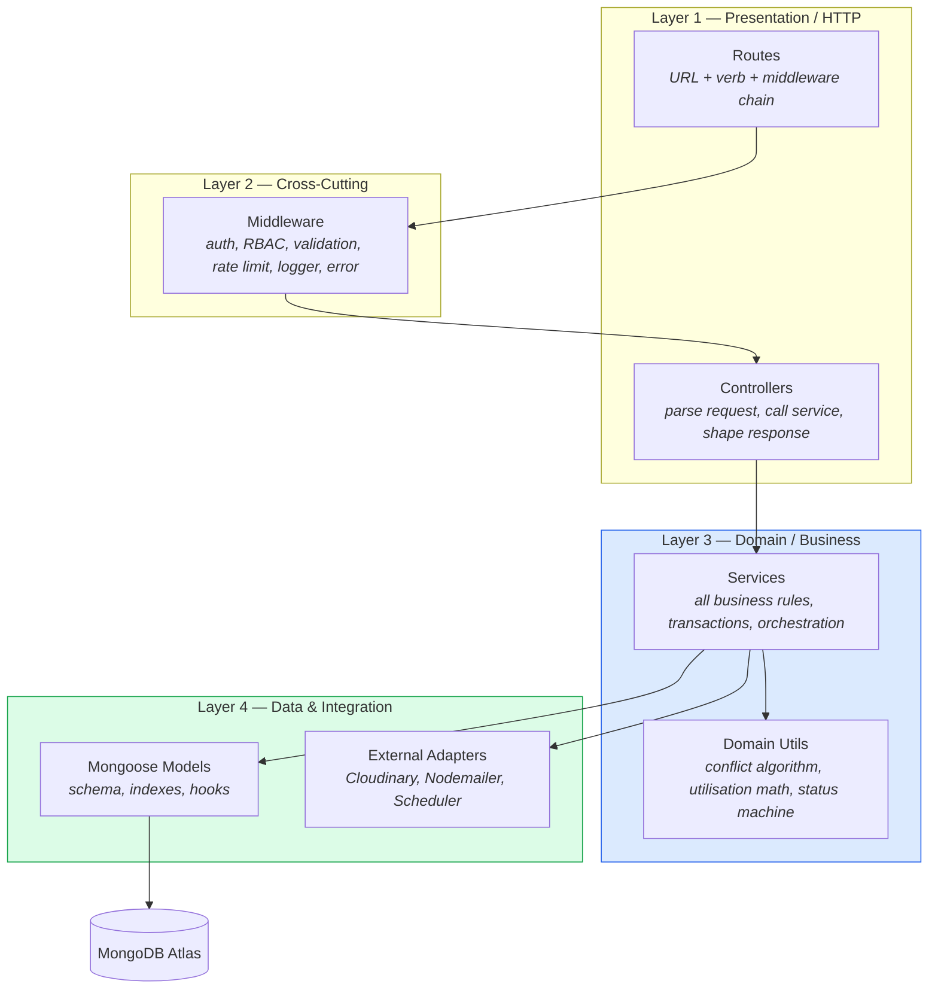
```mermaid
flowchart TD
    subgraph L1["Layer 1 — Presentation / HTTP"]
        A1["Routes<br/><i>URL + verb + middleware chain</i>"]
        A2["Controllers<br/><i>parse request, call service, shape response</i>"]
    end
    subgraph L2["Layer 2 — Cross-Cutting"]
        B1["Middleware<br/><i>auth, RBAC, validation, rate limit, logger, error</i>"]
    end
    subgraph L3["Layer 3 — Domain / Business"]
        C1["Services<br/><i>all business rules, transactions, orchestration</i>"]
        C2["Domain Utils<br/><i>conflict algorithm, utilisation math, status machine</i>"]
    end
    subgraph L4["Layer 4 — Data & Integration"]
        D1["Mongoose Models<br/><i>schema, indexes, hooks</i>"]
        D2["External Adapters<br/><i>Cloudinary, Nodemailer, Scheduler</i>"]
    end

    A1 --> B1 --> A2 --> C1
    C1 --> C2
    C1 --> D1
    C1 --> D2
    D1 --> DB[("MongoDB Atlas")]

    style L3 fill:#dbeafe,stroke:#2563eb
    style L4 fill:#dcfce7,stroke:#16a34a
```

**Dependency rule (strictly one-directional):** an upper layer may import a lower layer; a lower layer must **never** import an upper one. A service never imports a controller, never touches `req`/`res`. This is Dependency Inversion applied pragmatically — the service does not know it is being called over HTTP, which is exactly what makes the same service reusable by a future mobile BFF, a CLI seeder, or a cron job.

## 3.3 SOLID Mapping — Explicit

| Principle | Application in RoomFlow |
|---|---|
| **S** — Single Responsibility | `bookingController` only adapts HTTP. `bookingService` only holds rules. `conflictDetector.js` only answers "does this overlap?". Each React component does one visual job. |
| **O** — Open/Closed | Adding a new role means adding an entry to `permissions.js`, not editing route guards. Adding a notification channel (SMS) means adding a provider to the notification service, not editing booking logic. |
| **L** — Liskov Substitution | All notification providers implement the same `send(payload)` contract, so `EmailProvider` can be swapped for `SmsProvider`/`MockProvider` in tests with no caller change. |
| **I** — Interface Segregation | Services expose narrow, purpose-named functions (`approveBooking`, `cancelBooking`) rather than one `manageBooking(action, …)` god-function. React components receive only the props they use. |
| **D** — Dependency Inversion | Controllers depend on service *functions*, not on Mongoose. External SDKs (Cloudinary, Nodemailer) are wrapped in `config/` + `services/` adapters, so swapping to S3/SendGrid touches one file. |

## 3.4 Frontend Architecture

**Decision: Feature-based folders + Context API for state.**

*Rationale.* The app has a small amount of truly global state (auth user, theme, notification count, toast queue) and a large amount of server state (rooms, bookings). Redux Toolkit would be ceremony for the former; the latter is best handled by request-scoped hooks with caching rather than a global store. Context API — one context per concern, not one mega-context — plus custom hooks (`useRooms`, `useBookings`) gives the same result with far less boilerplate, which is the correct trade at this scale.

**Critical detail:** contexts are **split** (`AuthContext`, `NotificationContext`, `ThemeContext`, `BookingFilterContext`) because a single combined context re-renders every consumer on any change. Values are memoised with `useMemo`, callbacks with `useCallback`.

## 3.5 Communication Architecture

| Concern | Choice | Reason |
|---|---|---|
| Protocol | HTTPS / REST / JSON | Universal client support, cacheable, simple to document and demo (**P2**) |
| Versioning | URL prefix `/api/v1` | Lets a v2 mobile contract coexist with v1 web |
| Auth transport | `Authorization: Bearer <accessToken>`; refresh token in httpOnly cookie | Access token never in `localStorage` long-term; refresh token unreadable by JS (XSS-resistant) |
| Response envelope | `{ success, message, data, meta, errors }` | One predictable shape lets the client write a single response interceptor |
| Real-time | Polling in v1; Socket.IO reserved for v2 | Polling every 30 s on the calendar is adequate for a booking portal and removes sticky-session/scaling complexity from the first release |

---

# 4. High Level Architecture Diagram

## 4.1 System Context

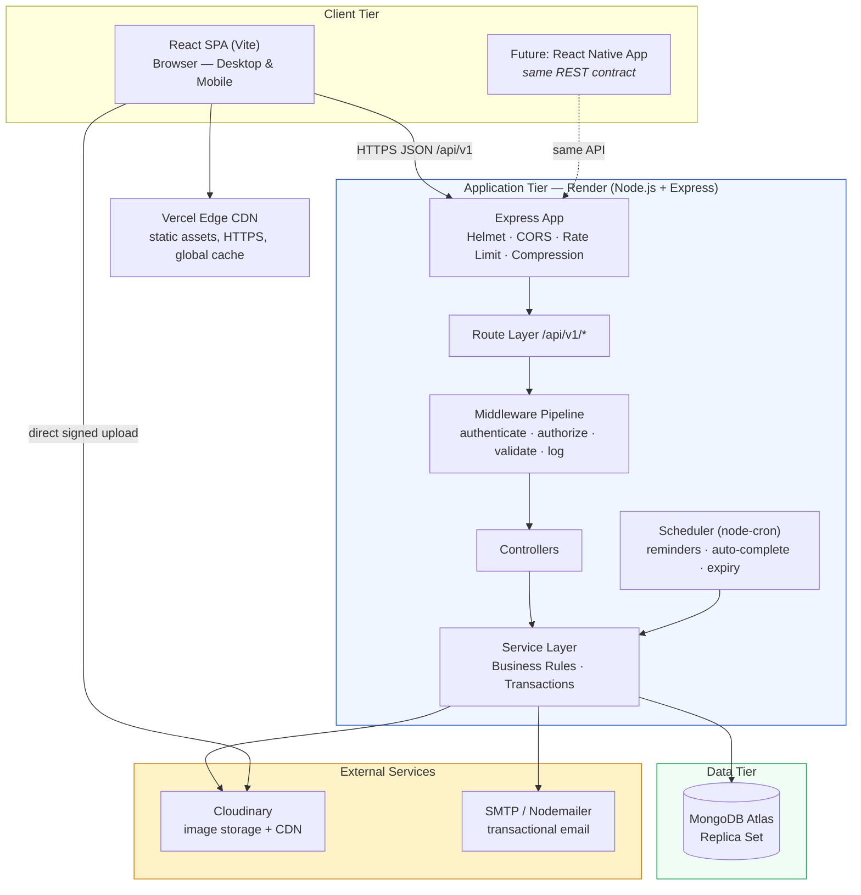
```mermaid
flowchart TB
    subgraph Clients["Client Tier"]
        W["React SPA (Vite)<br/>Browser — Desktop & Mobile"]
        M["Future: React Native App<br/><i>same REST contract</i>"]
    end

    CDN["Vercel Edge CDN<br/>static assets, HTTPS, global cache"]

    subgraph App["Application Tier — Render (Node.js + Express)"]
        GW["Express App<br/>Helmet · CORS · Rate Limit · Compression"]
        RT["Route Layer /api/v1/*"]
        MW["Middleware Pipeline<br/>authenticate · authorize · validate · log"]
        CT["Controllers"]
        SV["Service Layer<br/>Business Rules · Transactions"]
        JOB["Scheduler (node-cron)<br/>reminders · auto-complete · expiry"]
    end

    subgraph Data["Data Tier"]
        DB[("MongoDB Atlas<br/>Replica Set")]
    end

    subgraph Ext["External Services"]
        CL["Cloudinary<br/>image storage + CDN"]
        SMTP["SMTP / Nodemailer<br/>transactional email"]
    end

    W --> CDN
    W -- "HTTPS JSON /api/v1" --> GW
    M -. "same API" .-> GW
    GW --> RT --> MW --> CT --> SV
    SV --> DB
    SV --> CL
    SV --> SMTP
    JOB --> SV
    W -- "direct signed upload" --> CL

    style App fill:#eff6ff,stroke:#2563eb
    style Data fill:#f0fdf4,stroke:#16a34a
    style Ext fill:#fef3c7,stroke:#d97706
```

## 4.2 Request Lifecycle (End to End)

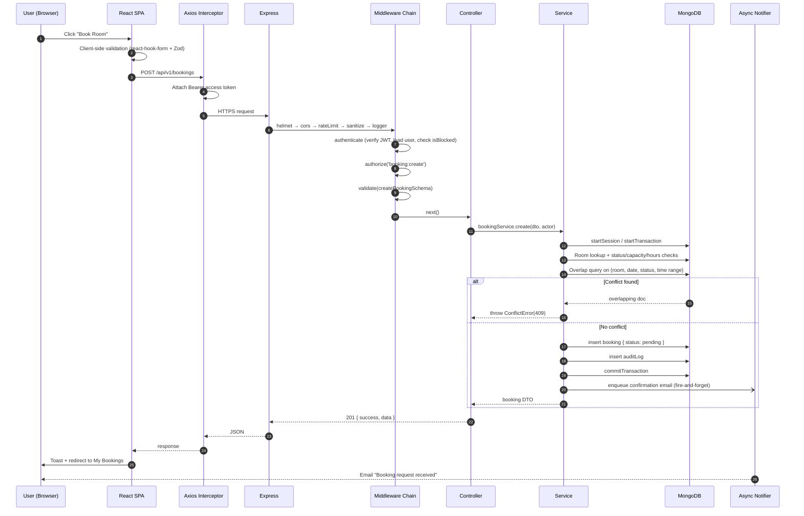
```mermaid
sequenceDiagram
    autonumber
    participant U as User (Browser)
    participant R as React SPA
    participant AX as Axios Interceptor
    participant EX as Express
    participant MW as Middleware Chain
    participant CO as Controller
    participant SE as Service
    participant DB as MongoDB
    participant Q as Async Notifier

    U->>R: Click "Book Room"
    R->>R: Client-side validation (react-hook-form + Zod)
    R->>AX: POST /api/v1/bookings
    AX->>AX: Attach Bearer access token
    AX->>EX: HTTPS request
    EX->>MW: helmet → cors → rateLimit → sanitize → logger
    MW->>MW: authenticate (verify JWT, load user, check isBlocked)
    MW->>MW: authorize('booking:create')
    MW->>MW: validate(createBookingSchema)
    MW->>CO: next()
    CO->>SE: bookingService.create(dto, actor)
    SE->>DB: startSession / startTransaction
    SE->>DB: Room lookup + status/capacity/hours checks
    SE->>DB: Overlap query on (room, date, status, time range)
    alt Conflict found
        DB-->>SE: overlapping doc
        SE-->>CO: throw ConflictError(409)
    else No conflict
        SE->>DB: insert booking { status: pending }
        SE->>DB: insert auditLog
        SE->>DB: commitTransaction
        SE-)Q: enqueue confirmation email (fire-and-forget)
        SE-->>CO: booking DTO
    end
    CO-->>EX: 201 { success, data }
    EX-->>AX: JSON
    AX-->>R: response
    R->>U: Toast + redirect to My Bookings
    Q-->>U: Email "Booking request received"
```

## 4.3 Deployment Topology (High Level)

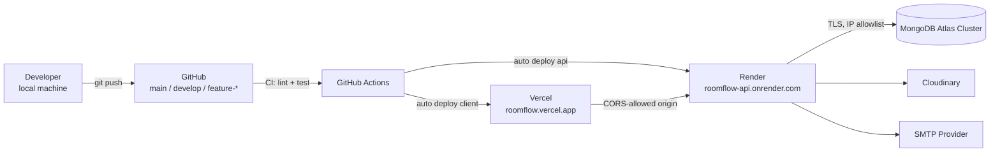
```mermaid
flowchart LR
    DEV["Developer<br/>local machine"] -->|git push| GH["GitHub<br/>main / develop / feature-*"]
    GH -->|CI: lint + test| CI["GitHub Actions"]
    CI -->|auto deploy client| V["Vercel<br/>roomflow.vercel.app"]
    CI -->|auto deploy api| RN["Render<br/>roomflow-api.onrender.com"]
    RN -->|TLS, IP allowlist| ATL[("MongoDB Atlas Cluster")]
    RN --> CLD["Cloudinary"]
    RN --> MAIL["SMTP Provider"]
    V -->|CORS-allowed origin| RN
```

---

# 5. Low Level Architecture

## 5.1 Backend Module Anatomy (Vertical Slice)

Every domain module has the identical internal shape. Uniformity is deliberate: a new developer who has read one module has read them all.

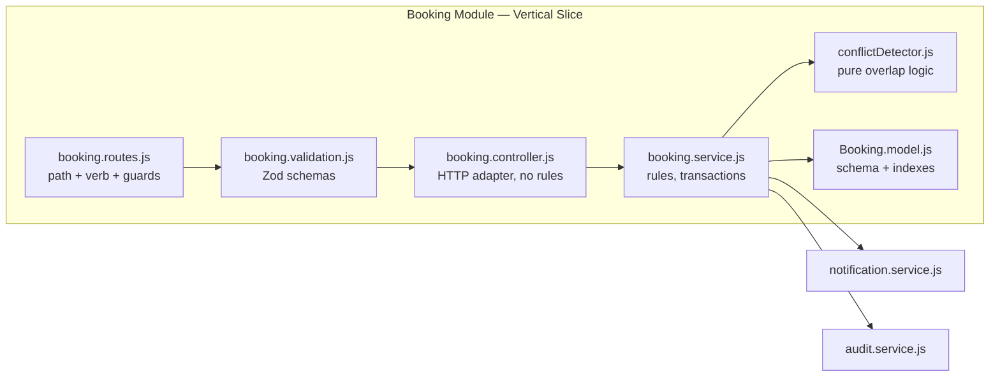
```mermaid
flowchart LR
    subgraph Booking["Booking Module — Vertical Slice"]
        direction TB
        R["booking.routes.js<br/>path + verb + guards"]
        V["booking.validation.js<br/>Zod schemas"]
        C["booking.controller.js<br/>HTTP adapter, no rules"]
        S["booking.service.js<br/>rules, transactions"]
        H["conflictDetector.js<br/>pure overlap logic"]
        M["Booking.model.js<br/>schema + indexes"]
    end
    R --> V --> C --> S
    S --> H
    S --> M
    S --> NS["notification.service.js"]
    S --> AS["audit.service.js"]
```

| File | Allowed to do | Forbidden to do |
|---|---|---|
| `*.routes.js` | Declare path, verb, middleware order | Contain any logic |
| `*.validation.js` | Define request shape/constraints | Hit the DB |
| `*.controller.js` | Read `req`, call one service, send response | Query models, contain `if` business rules |
| `*.service.js` | Business rules, transactions, call other services | Touch `req`/`res`, know about HTTP status codes (throws typed errors instead) |
| `*.model.js` | Schema, indexes, virtuals, hooks | Contain cross-entity workflow |
| pure helpers | Deterministic computation | I/O of any kind |

## 5.2 Frontend Low-Level Architecture

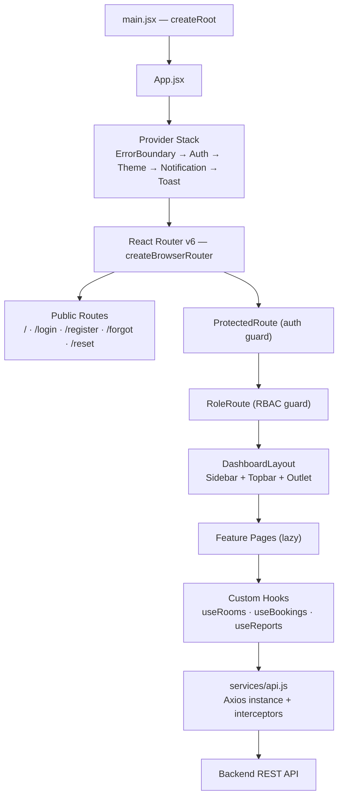
```mermaid
flowchart TD
    MAIN["main.jsx — createRoot"] --> APP["App.jsx"]
    APP --> PROV["Provider Stack<br/>ErrorBoundary → Auth → Theme → Notification → Toast"]
    PROV --> RTR["React Router v6 — createBrowserRouter"]
    RTR --> PUB["Public Routes<br/>/ · /login · /register · /forgot · /reset"]
    RTR --> PRT["ProtectedRoute (auth guard)"]
    PRT --> ROLE["RoleRoute (RBAC guard)"]
    ROLE --> LAY["DashboardLayout<br/>Sidebar + Topbar + Outlet"]
    LAY --> PAGES["Feature Pages (lazy)"]
    PAGES --> HOOKS["Custom Hooks<br/>useRooms · useBookings · useReports"]
    HOOKS --> API["services/api.js<br/>Axios instance + interceptors"]
    API --> BE["Backend REST API"]
```

**Axios interceptor design (single point of truth for cross-cutting client concerns):**

- *Request interceptor* — attach `Authorization` header from `AuthContext` memory store.
- *Response interceptor* — on `401 TOKEN_EXPIRED`: pause, call `/auth/refresh` once, replay the queued original requests, and if refresh fails, hard-logout. A module-level `isRefreshing` flag plus a promise queue prevents a refresh stampede when five requests expire simultaneously.
- *Error normaliser* — convert any backend error envelope into a single `{ code, message, fieldErrors }` object so components never parse raw Axios errors.

## 5.3 Data Access Strategy

| Rule | Reason |
|---|---|
| Always `.lean()` on read-only queries | Skips Mongoose document hydration — measurably faster and less memory |
| Always project fields explicitly (`.select('name code capacity')`) | Prevents over-fetching and accidental leakage of `password`/`refreshTokens` |
| Never build a query object directly from `req.query` | NoSQL injection vector; a whitelist mapper builds the filter |
| Pagination is mandatory on every list endpoint | Bounded response size regardless of data growth |
| `populate()` limited to 1 level with explicit field selection | Deep populate chains are the #1 cause of slow Mongo APIs |
| Writes that touch 2+ collections use a transaction | Atomicity for booking + audit log (**P1**) |

---

# 6. Complete MERN Folder Structure

```text
roomflow/
├── client/                              # React + Vite frontend
│   ├── public/
│   │   ├── favicon.svg
│   │   └── robots.txt
│   ├── src/
│   │   ├── assets/
│   │   │   ├── images/
│   │   │   └── icons/
│   │   ├── components/                  # REUSABLE, feature-agnostic
│   │   │   ├── ui/                      # Design-system atoms
│   │   │   │   ├── Button.jsx
│   │   │   │   ├── Input.jsx
│   │   │   │   ├── Select.jsx
│   │   │   │   ├── TextArea.jsx
│   │   │   │   ├── Checkbox.jsx
│   │   │   │   ├── Badge.jsx
│   │   │   │   ├── Card.jsx
│   │   │   │   ├── Modal.jsx
│   │   │   │   ├── Drawer.jsx
│   │   │   │   ├── Tabs.jsx
│   │   │   │   ├── Table.jsx
│   │   │   │   ├── Pagination.jsx
│   │   │   │   ├── Spinner.jsx
│   │   │   │   ├── Skeleton.jsx
│   │   │   │   ├── Toast.jsx
│   │   │   │   ├── Tooltip.jsx
│   │   │   │   ├── Avatar.jsx
│   │   │   │   ├── EmptyState.jsx
│   │   │   │   └── ConfirmDialog.jsx
│   │   │   ├── form/                    # Form-bound wrappers
│   │   │   │   ├── FormField.jsx
│   │   │   │   ├── FormError.jsx
│   │   │   │   ├── DatePicker.jsx
│   │   │   │   ├── TimeRangePicker.jsx
│   │   │   │   └── ImageUploader.jsx
│   │   │   ├── layout/
│   │   │   │   ├── PublicLayout.jsx
│   │   │   │   ├── DashboardLayout.jsx
│   │   │   │   ├── Sidebar.jsx
│   │   │   │   ├── Topbar.jsx
│   │   │   │   ├── Footer.jsx
│   │   │   │   ├── Breadcrumbs.jsx
│   │   │   │   └── PageHeader.jsx
│   │   │   ├── charts/
│   │   │   │   ├── BarChart.jsx
│   │   │   │   ├── LineChart.jsx
│   │   │   │   ├── DonutChart.jsx
│   │   │   │   └── StatCard.jsx
│   │   │   └── common/
│   │   │       ├── ErrorBoundary.jsx
│   │   │       ├── ProtectedRoute.jsx
│   │   │       ├── RoleRoute.jsx
│   │   │       ├── ScrollToTop.jsx
│   │   │       ├── SEO.jsx
│   │   │       └── LoadingScreen.jsx
│   │   ├── features/                    # FEATURE-SPECIFIC components
│   │   │   ├── auth/
│   │   │   │   ├── components/
│   │   │   │   │   ├── LoginForm.jsx
│   │   │   │   │   ├── RegisterForm.jsx
│   │   │   │   │   ├── ForgotPasswordForm.jsx
│   │   │   │   │   ├── ResetPasswordForm.jsx
│   │   │   │   │   └── PasswordStrengthMeter.jsx
│   │   │   │   └── authApi.js
│   │   │   ├── rooms/
│   │   │   │   ├── components/
│   │   │   │   │   ├── RoomCard.jsx
│   │   │   │   │   ├── RoomGrid.jsx
│   │   │   │   │   ├── RoomFilters.jsx
│   │   │   │   │   ├── RoomForm.jsx
│   │   │   │   │   ├── RoomGallery.jsx
│   │   │   │   │   ├── FacilityChips.jsx
│   │   │   │   │   └── AvailabilityStrip.jsx
│   │   │   │   └── roomApi.js
│   │   │   ├── bookings/
│   │   │   │   ├── components/
│   │   │   │   │   ├── BookingForm.jsx
│   │   │   │   │   ├── BookingCard.jsx
│   │   │   │   │   ├── BookingTable.jsx
│   │   │   │   │   ├── BookingStatusBadge.jsx
│   │   │   │   │   ├── BookingTimeline.jsx
│   │   │   │   │   ├── ApprovalPanel.jsx
│   │   │   │   │   ├── CancelBookingDialog.jsx
│   │   │   │   │   ├── ConflictWarning.jsx
│   │   │   │   │   └── SlotPicker.jsx
│   │   │   │   └── bookingApi.js
│   │   │   ├── calendar/
│   │   │   │   ├── components/
│   │   │   │   │   ├── CalendarView.jsx
│   │   │   │   │   ├── MonthGrid.jsx
│   │   │   │   │   ├── WeekGrid.jsx
│   │   │   │   │   ├── DayTimeline.jsx
│   │   │   │   │   ├── EventChip.jsx
│   │   │   │   │   └── CalendarToolbar.jsx
│   │   │   │   └── calendarApi.js
│   │   │   ├── dashboard/
│   │   │   │   ├── components/
│   │   │   │   │   ├── AdminStats.jsx
│   │   │   │   │   ├── StaffStats.jsx
│   │   │   │   │   ├── StudentStats.jsx
│   │   │   │   │   ├── PendingApprovals.jsx
│   │   │   │   │   ├── UpcomingBookings.jsx
│   │   │   │   │   └── QuickBook.jsx
│   │   │   │   └── dashboardApi.js
│   │   │   ├── reports/
│   │   │   │   ├── components/
│   │   │   │   │   ├── ReportFilters.jsx
│   │   │   │   │   ├── UtilizationChart.jsx
│   │   │   │   │   ├── MostBookedRooms.jsx
│   │   │   │   │   ├── PeakHoursChart.jsx
│   │   │   │   │   └── ExportButton.jsx
│   │   │   │   └── reportApi.js
│   │   │   ├── users/
│   │   │   │   ├── components/
│   │   │   │   │   ├── UserTable.jsx
│   │   │   │   │   ├── UserFilters.jsx
│   │   │   │   │   ├── RoleSelector.jsx
│   │   │   │   │   └── BlockUserDialog.jsx
│   │   │   │   └── userApi.js
│   │   │   ├── notifications/
│   │   │   │   ├── components/
│   │   │   │   │   ├── NotificationBell.jsx
│   │   │   │   │   ├── NotificationList.jsx
│   │   │   │   │   └── NotificationItem.jsx
│   │   │   │   └── notificationApi.js
│   │   │   └── settings/
│   │   │       ├── components/
│   │   │       │   ├── ProfileForm.jsx
│   │   │       │   ├── ChangePasswordForm.jsx
│   │   │       │   ├── AvatarUploader.jsx
│   │   │       │   └── SystemConfigForm.jsx
│   │   │       └── settingsApi.js
│   │   ├── pages/                       # Route-level screens (thin)
│   │   │   ├── public/
│   │   │   │   ├── LandingPage.jsx
│   │   │   │   ├── AboutPage.jsx
│   │   │   │   ├── ContactPage.jsx
│   │   │   │   └── NotFoundPage.jsx
│   │   │   ├── auth/
│   │   │   │   ├── LoginPage.jsx
│   │   │   │   ├── RegisterPage.jsx
│   │   │   │   ├── ForgotPasswordPage.jsx
│   │   │   │   └── ResetPasswordPage.jsx
│   │   │   ├── admin/
│   │   │   │   ├── AdminDashboardPage.jsx
│   │   │   │   ├── ManageRoomsPage.jsx
│   │   │   │   ├── RoomFormPage.jsx
│   │   │   │   ├── ManageBookingsPage.jsx
│   │   │   │   ├── ApprovalsPage.jsx
│   │   │   │   ├── ManageUsersPage.jsx
│   │   │   │   ├── ReportsPage.jsx
│   │   │   │   ├── AuditLogPage.jsx
│   │   │   │   └── SystemSettingsPage.jsx
│   │   │   ├── staff/
│   │   │   │   ├── StaffDashboardPage.jsx
│   │   │   │   ├── StaffApprovalsPage.jsx
│   │   │   │   └── StaffReportsPage.jsx
│   │   │   ├── student/
│   │   │   │   └── StudentDashboardPage.jsx
│   │   │   └── shared/
│   │   │       ├── RoomListPage.jsx
│   │   │       ├── RoomDetailPage.jsx
│   │   │       ├── BookRoomPage.jsx
│   │   │       ├── MyBookingsPage.jsx
│   │   │       ├── BookingDetailPage.jsx
│   │   │       ├── CalendarPage.jsx
│   │   │       ├── NotificationsPage.jsx
│   │   │       ├── ProfilePage.jsx
│   │   │       └── ChangePasswordPage.jsx
│   │   ├── context/
│   │   │   ├── AuthContext.jsx
│   │   │   ├── ThemeContext.jsx
│   │   │   ├── NotificationContext.jsx
│   │   │   ├── ToastContext.jsx
│   │   │   └── BookingFilterContext.jsx
│   │   ├── hooks/
│   │   │   ├── useAuth.js
│   │   │   ├── useToast.js
│   │   │   ├── useTheme.js
│   │   │   ├── useFetch.js
│   │   │   ├── useDebounce.js
│   │   │   ├── usePagination.js
│   │   │   ├── useRooms.js
│   │   │   ├── useBookings.js
│   │   │   ├── useAvailability.js
│   │   │   ├── useReports.js
│   │   │   ├── useOnClickOutside.js
│   │   │   └── useLocalStorage.js
│   │   ├── services/
│   │   │   ├── api.js                   # Axios instance + interceptors
│   │   │   ├── tokenService.js
│   │   │   └── cloudinaryService.js
│   │   ├── utils/
│   │   │   ├── dateUtils.js
│   │   │   ├── timeUtils.js
│   │   │   ├── formatters.js
│   │   │   ├── validators.js
│   │   │   ├── permissions.js           # mirrors backend policy (UI hints only)
│   │   │   └── exportCsv.js
│   │   ├── constants/
│   │   │   ├── roles.js
│   │   │   ├── bookingStatus.js
│   │   │   ├── roomCategories.js
│   │   │   ├── facilities.js
│   │   │   ├── routes.js
│   │   │   └── apiEndpoints.js
│   │   ├── config/
│   │   │   └── env.js
│   │   ├── styles/
│   │   │   ├── index.css                # Tailwind directives + design tokens
│   │   │   └── animations.css
│   │   ├── routes/
│   │   │   ├── AppRoutes.jsx
│   │   │   └── routeConfig.js
│   │   ├── App.jsx
│   │   └── main.jsx
│   ├── .env.example
│   ├── .eslintrc.cjs
│   ├── .prettierrc
│   ├── index.html
│   ├── tailwind.config.js
│   ├── postcss.config.js
│   ├── vite.config.js
│   ├── vercel.json
│   └── package.json
│
├── server/                              # Node + Express backend
│   ├── src/
│   │   ├── config/
│   │   │   ├── db.js
│   │   │   ├── env.js                   # validated env loader
│   │   │   ├── cloudinary.js
│   │   │   ├── mailer.js
│   │   │   ├── logger.js
│   │   │   └── corsOptions.js
│   │   ├── models/
│   │   │   ├── User.model.js
│   │   │   ├── Room.model.js
│   │   │   ├── Booking.model.js
│   │   │   ├── Notification.model.js
│   │   │   ├── AuditLog.model.js
│   │   │   ├── RefreshToken.model.js
│   │   │   └── SystemConfig.model.js
│   │   ├── routes/
│   │   │   ├── index.js                 # mounts all v1 routers
│   │   │   └── v1/
│   │   │       ├── auth.routes.js
│   │   │       ├── user.routes.js
│   │   │       ├── room.routes.js
│   │   │       ├── booking.routes.js
│   │   │       ├── dashboard.routes.js
│   │   │       ├── report.routes.js
│   │   │       ├── notification.routes.js
│   │   │       ├── settings.routes.js
│   │   │       └── audit.routes.js
│   │   ├── controllers/
│   │   │   ├── auth.controller.js
│   │   │   ├── user.controller.js
│   │   │   ├── room.controller.js
│   │   │   ├── booking.controller.js
│   │   │   ├── dashboard.controller.js
│   │   │   ├── report.controller.js
│   │   │   ├── notification.controller.js
│   │   │   ├── settings.controller.js
│   │   │   └── audit.controller.js
│   │   ├── services/
│   │   │   ├── auth.service.js
│   │   │   ├── token.service.js
│   │   │   ├── user.service.js
│   │   │   ├── room.service.js
│   │   │   ├── booking.service.js
│   │   │   ├── availability.service.js
│   │   │   ├── dashboard.service.js
│   │   │   ├── report.service.js
│   │   │   ├── notification.service.js
│   │   │   ├── email.service.js
│   │   │   ├── upload.service.js
│   │   │   ├── audit.service.js
│   │   │   └── settings.service.js
│   │   ├── middleware/
│   │   │   ├── authenticate.js
│   │   │   ├── authorize.js
│   │   │   ├── validate.js
│   │   │   ├── errorHandler.js
│   │   │   ├── notFound.js
│   │   │   ├── requestLogger.js
│   │   │   ├── rateLimiter.js
│   │   │   ├── upload.js                # multer memory storage
│   │   │   └── sanitize.js
│   │   ├── validations/
│   │   │   ├── auth.validation.js
│   │   │   ├── user.validation.js
│   │   │   ├── room.validation.js
│   │   │   ├── booking.validation.js
│   │   │   ├── report.validation.js
│   │   │   ├── settings.validation.js
│   │   │   └── common.validation.js
│   │   ├── utils/
│   │   │   ├── ApiError.js
│   │   │   ├── ApiResponse.js
│   │   │   ├── asyncHandler.js
│   │   │   ├── conflictDetector.js
│   │   │   ├── bookingStateMachine.js
│   │   │   ├── dateTime.js
│   │   │   ├── pagination.js
│   │   │   ├── queryBuilder.js
│   │   │   ├── generateToken.js
│   │   │   ├── icsGenerator.js
│   │   │   └── csvExporter.js
│   │   ├── constants/
│   │   │   ├── roles.js
│   │   │   ├── permissions.js
│   │   │   ├── bookingStatus.js
│   │   │   ├── auditActions.js
│   │   │   └── httpStatus.js
│   │   ├── templates/
│   │   │   └── emails/
│   │   │       ├── layout.hbs
│   │   │       ├── bookingConfirmation.hbs
│   │   │       ├── bookingApproved.hbs
│   │   │       ├── bookingRejected.hbs
│   │   │       ├── bookingReminder.hbs
│   │   │       ├── approvalRequest.hbs
│   │   │       ├── welcome.hbs
│   │   │       └── resetPassword.hbs
│   │   ├── jobs/
│   │   │   ├── index.js
│   │   │   ├── reminderJob.js
│   │   │   ├── autoCompleteJob.js
│   │   │   ├── expirePendingJob.js
│   │   │   └── cleanupTokensJob.js
│   │   ├── seeds/
│   │   │   ├── seedAdmin.js
│   │   │   ├── seedRooms.js
│   │   │   └── index.js
│   │   ├── app.js                       # express app (testable, no listen)
│   │   └── server.js                    # http listen + graceful shutdown
│   ├── tests/
│   │   ├── unit/
│   │   │   ├── conflictDetector.test.js
│   │   │   ├── bookingStateMachine.test.js
│   │   │   └── permissions.test.js
│   │   ├── integration/
│   │   │   ├── auth.test.js
│   │   │   ├── room.test.js
│   │   │   └── booking.test.js
│   │   └── setup.js
│   ├── .env.example
│   ├── .eslintrc.cjs
│   ├── .prettierrc
│   └── package.json
│
├── docs/
│   ├── ARCHITECTURE.md                  # this document
│   ├── API.md
│   ├── ER-DIAGRAM.md
│   ├── SETUP.md
│   └── postman/RoomFlow.postman_collection.json
├── .github/
│   └── workflows/
│       ├── ci.yml
│       └── codeql.yml
├── .gitignore
├── .husky/
│   ├── pre-commit
│   └── commit-msg
├── LICENSE
└── README.md
```

**Why `client/` and `server/` in one repository (monorepo)?** A single repo keeps one issue tracker, one PR per feature spanning both tiers, and shared documentation — which matches how a final-year team actually works. Vercel and Render both support a *root directory* setting, so each platform builds only its own subfolder.

**Why `features/` separate from `components/`?** `components/ui/` holds things with **zero domain knowledge** (a `Button` does not know what a booking is) and is therefore reusable across any project. `features/` holds domain-aware components. This boundary prevents the classic rot where a "shared" component slowly accumulates booking-specific props.

---

# 7. Database Design

## 7.1 Why MongoDB Here

| Factor | Assessment |
|---|---|
| Schema variability | Rooms differ by category (a lab has equipment lists; a hostel room has beds). A document model absorbs this without sparse columns or EAV tables. |
| Read pattern | Dominated by "fetch bookings for room X in date range" — served by one compound index, one collection, no joins. |
| Embedded structures | Facilities, images, operating hours, and approval history are naturally nested and always read with their parent. |
| Aggregation | Reports (utilisation, most-booked) map cleanly onto the aggregation pipeline. |
| Transactions | Atlas replica sets support multi-document ACID transactions — the requirement that makes conflict-free booking possible (**P1**). |

## 7.2 Modelling Decisions — Embed vs Reference

| Data | Decision | Reason |
|---|---|---|
| Room → facilities, images, operating hours | **Embed** | Bounded (< 20 items), always read with the room, never queried independently |
| Booking → room, user | **Reference** (`ObjectId`) | Rooms and users are large, mutable, and shared; embedding would duplicate and de-sync them |
| Booking → approval history | **Embed** (array of actions) | Bounded (≤ ~5 entries), only meaningful within its booking |
| Booking → denormalised `roomCode`, `roomName`, `userName` | **Selective duplication** | Booking lists and reports render these on every row; caching them avoids a `populate` per row. Trade-off: a room rename requires a background backfill — acceptable, since renames are rare and history arguably *should* show the name at booking time |
| User → refresh tokens | **Separate collection** | Unbounded growth (one per device per login) — the classic anti-pattern to avoid embedding; also enables a TTL index for automatic cleanup |
| Notification | **Separate collection** | Unbounded, independently queried and paginated, has its own TTL policy |
| AuditLog | **Separate collection** | Append-only, high volume, never read in the hot path |

## 7.3 Index Plan

| Collection | Index | Type | Justification |
|---|---|---|---|
| users | `{ email: 1 }` | unique | Login lookup + uniqueness constraint |
| users | `{ role: 1, isBlocked: 1 }` | compound | Admin user-list filters |
| users | `{ name: 'text', email: 'text' }` | text | User search |
| rooms | `{ code: 1 }` | unique | Uniqueness + direct lookup |
| rooms | `{ category: 1, capacity: 1, status: 1 }` | compound | Primary room-listing filter combination |
| rooms | `{ building: 1, floor: 1 }` | compound | Location browsing |
| rooms | `{ name: 'text', description: 'text' }` | text | Room search box |
| **bookings** | **`{ room: 1, bookingDate: 1, status: 1, startTime: 1 }`** | **compound** | **The conflict-detection index — the single most important index in the system (§20)** |
| bookings | `{ user: 1, createdAt: -1 }` | compound | "My bookings", newest first |
| bookings | `{ status: 1, bookingDate: 1 }` | compound | Approval queue + daily reports |
| bookings | `{ startsAt: 1 }` | single | Reminder job scan |
| notifications | `{ recipient: 1, isRead: 1, createdAt: -1 }` | compound | Bell dropdown query |
| notifications | `{ createdAt: 1 }` | TTL 90 d | Automatic pruning |
| refreshtokens | `{ tokenHash: 1 }` | unique | Refresh lookup |
| refreshtokens | `{ expiresAt: 1 }` | TTL | Automatic expiry cleanup |
| auditlogs | `{ entityType: 1, entityId: 1, createdAt: -1 }` | compound | Entity history view |
| auditlogs | `{ actor: 1, createdAt: -1 }` | compound | "What did this user do?" |

**Index principle applied:** ESR rule — **E**quality fields first (`room`, `status`), then **S**ort/**R**ange fields (`bookingDate`, `startTime`). This ordering is what allows the conflict query to be served entirely from the index.

## 7.4 Time Representation — a Critical Decision

Booking times are stored **three ways simultaneously**, and this redundancy is intentional:

| Field | Type | Purpose |
|---|---|---|
| `bookingDate` | Date (normalised to 00:00 UTC) | Fast equality match on the day — the first discriminator in the conflict index |
| `startTime`, `endTime` | String `"HH:mm"` | Human display, form binding, operating-hours comparison |
| `startsAt`, `endsAt` | Date (full UTC timestamp) | The **authoritative** values for overlap comparison, sorting, reminders, and calendar rendering |

*Rationale.* Comparing `"09:00" < "10:30"` as strings works only within a single day and breaks on any cross-midnight or timezone edge. Comparing real `Date` objects is unambiguous. Keeping `bookingDate` separate lets the index narrow to one day before doing range comparison, which is dramatically cheaper than scanning a global timestamp range. `startsAt`/`endsAt` are derived server-side in a pre-save hook — the client never supplies them, so they cannot be spoofed.

---

# 8. ER Diagram

## 8.1 Entity Relationship Diagram


```mermaid
erDiagram
    USER ||--o{ BOOKING : "creates"
    USER ||--o{ BOOKING : "approves"
    USER ||--o{ NOTIFICATION : "receives"
    USER ||--o{ AUDITLOG : "performs"
    USER ||--o{ REFRESHTOKEN : "owns"
    USER ||--o{ ROOM : "manages (admin)"
    ROOM ||--o{ BOOKING : "is booked in"
    BOOKING ||--o{ NOTIFICATION : "triggers"
    BOOKING ||--o{ AUDITLOG : "is recorded in"
    SYSTEMCONFIG ||--|| USER : "last updated by"

    USER {
        ObjectId _id PK
        string name
        string email UK
        string password "bcrypt hash, select:false"
        string role "admin|staff|student|guest"
        string phone
        string department
        string identifier "roll/employee no, UK sparse"
        object avatar "url, publicId"
        boolean isBlocked
        boolean isVerified
        date lastLoginAt
        string resetPasswordToken "hashed"
        date resetPasswordExpires
        boolean isDeleted
        date createdAt
        date updatedAt
    }

    ROOM {
        ObjectId _id PK
        string code UK
        string name
        string category
        number capacity
        string building
        number floor
        string description
        array facilities
        array images "url, publicId, isPrimary"
        object operatingHours "open, close, days"
        array blackoutDates
        string status "active|maintenance|inactive"
        boolean requiresApproval
        ObjectId createdBy FK
        boolean isDeleted
        date createdAt
        date updatedAt
    }

    BOOKING {
        ObjectId _id PK
        string bookingRef UK "RF-YYYYMM-0001"
        ObjectId room FK
        ObjectId user FK
        string roomCode "denormalised"
        string roomName "denormalised"
        string userName "denormalised"
        date bookingDate "day, 00:00 UTC"
        string startTime "HH:mm"
        string endTime "HH:mm"
        date startsAt "authoritative UTC"
        date endsAt "authoritative UTC"
        number durationMinutes
        string purpose
        number attendees
        string status "pending|approved|rejected|cancelled|completed"
        ObjectId approvedBy FK
        date approvedAt
        string rejectionReason
        string cancellationReason
        date cancelledAt
        ObjectId cancelledBy FK
        array statusHistory
        object recurrence "type, until, groupId"
        boolean reminderSent
        date createdAt
        date updatedAt
    }

    NOTIFICATION {
        ObjectId _id PK
        ObjectId recipient FK
        string type
        string title
        string message
        ObjectId relatedBooking FK
        string link
        boolean isRead
        date readAt
        string channel "in-app|email|both"
        string emailStatus "pending|sent|failed"
        date createdAt
    }

    AUDITLOG {
        ObjectId _id PK
        ObjectId actor FK
        string actorRole
        string action
        string entityType
        ObjectId entityId
        object before
        object after
        string ipAddress
        string userAgent
        date createdAt
    }

    REFRESHTOKEN {
        ObjectId _id PK
        ObjectId user FK
        string tokenHash UK
        string deviceInfo
        string ipAddress
        date expiresAt "TTL index"
        boolean isRevoked
        date createdAt
    }

    SYSTEMCONFIG {
        ObjectId _id PK
        string institutionName
        object workingHours
        number maxBookingDurationMinutes
        number maxAdvanceBookingDays
        number minBookingDurationMinutes
        boolean autoApproveStaff
        array holidays
        number reminderLeadMinutes
        ObjectId updatedBy FK
        date updatedAt
    }
```

## 8.2 Relationship Cardinality Summary

| Relationship | Cardinality | Implementation | On Delete |
|---|---|---|---|
| User → Booking (requester) | 1 : N | `Booking.user` reference | User soft-deleted; bookings retained for audit |
| User → Booking (approver) | 1 : N (optional) | `Booking.approvedBy` reference | Retained |
| Room → Booking | 1 : N | `Booking.room` reference | Room soft-deleted; blocked if future active bookings exist |
| User → Notification | 1 : N | `Notification.recipient` | Cascade delete allowed |
| Booking → Notification | 1 : N | `Notification.relatedBooking` | Retained (link becomes inert) |
| User → RefreshToken | 1 : N | `RefreshToken.user` | Cascade delete on block/logout-all |
| Actor → AuditLog | 1 : N | `AuditLog.actor` | Never deleted (append-only) |

**Referential integrity note.** MongoDB has no foreign keys, so integrity is enforced in the **service layer**: existence checks before insert, soft-delete instead of hard-delete for referenced entities, and a nightly consistency job (future scope) that flags orphaned references. Stating this explicitly is important — it is a real difference from an RDBMS design, not an oversight.

---

# 9. Collections With Relationships

## 9.1 Collection Inventory

| # | Collection | Est. Volume (1 yr) | Growth | Purpose |
|---|---|---|---|---|
| 1 | `users` | 1,000–5,000 | Slow | Identity, roles, profile |
| 2 | `rooms` | 50–500 | Very slow | Bookable resources |
| 3 | `bookings` | 20,000–100,000 | **Fast** | Core transactional entity |
| 4 | `notifications` | 60,000–300,000 | Fast (TTL-pruned) | In-app messages |
| 5 | `auditlogs` | 50,000–200,000 | Fast (append-only) | Compliance trail |
| 6 | `refreshtokens` | ~3× active users | Churns (TTL-pruned) | Session management |
| 7 | `systemconfigs` | 1 | None | Singleton configuration |

## 9.2 Relationship Map

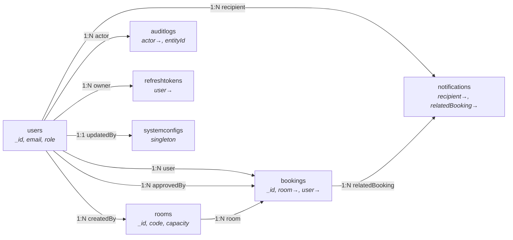
```mermaid
flowchart LR
    U["users<br/><i>_id, email, role</i>"]
    R["rooms<br/><i>_id, code, capacity</i>"]
    B["bookings<br/><i>_id, room→, user→</i>"]
    N["notifications<br/><i>recipient→, relatedBooking→</i>"]
    A["auditlogs<br/><i>actor→, entityId</i>"]
    T["refreshtokens<br/><i>user→</i>"]
    S["systemconfigs<br/><i>singleton</i>"]

    U -- "1:N user" --> B
    U -- "1:N approvedBy" --> B
    R -- "1:N room" --> B
    U -- "1:N recipient" --> N
    B -- "1:N relatedBooking" --> N
    U -- "1:N actor" --> A
    U -- "1:N owner" --> T
    U -- "1:1 updatedBy" --> S
    U -- "1:N createdBy" --> R
```

## 9.3 Population Strategy per Query

| Query | Populate? | Reason |
|---|---|---|
| List my bookings | **No** | Denormalised `roomCode`/`roomName` already on the document — zero extra reads |
| Booking detail page | **Yes**, 1 level, selected fields | Needs full room facilities, images, and approver name |
| Admin approval queue | **Yes**, `user` (name, email, role) only | Approver must know who is asking |
| Room list | **No** | Self-contained document |
| Reports/aggregations | **`$lookup`** | Done inside the pipeline, one round-trip |
| Notification bell | **No** | Message text is denormalised at creation time |

This table is the answer to the most common MERN performance failure: reflexively calling `.populate()` on every query.

---

# 10. API Planning

## 10.1 Global Conventions

- **Base URL:** `https://roomflow-api.onrender.com/api/v1`
- **Content type:** `application/json` (except image upload: `multipart/form-data`)
- **Auth:** `Authorization: Bearer <accessToken>`; refresh token travels in an httpOnly cookie
- **Success envelope:**
  ```json
  { "success": true, "message": "Bookings fetched", "data": [], "meta": { "page": 1, "limit": 10, "total": 42, "totalPages": 5 } }
  ```
- **Error envelope:**
  ```json
  { "success": false, "message": "Room already booked for this slot", "code": "BOOKING_CONFLICT", "errors": [{ "field": "startTime", "message": "Overlaps booking RF-202607-0031" }] }
  ```
- **Status codes:** `200` OK · `201` Created · `204` No Content · `400` Validation · `401` Unauthenticated · `403` Unauthorised · `404` Not Found · `409` Conflict · `422` Business-rule violation · `429` Rate limited · `500` Server error

**PUT vs PATCH — the rule used consistently throughout:** `PUT` replaces the full resource representation (client sends all editable fields); `PATCH` applies a partial or state-transition change (approve, block, mark-read). Every module below has both, and each is used for its correct semantic — not as decoration.

## 10.2 Module: Authentication — `/auth`

| Method | Endpoint | Access | Description | Body / Params |
|---|---|---|---|---|
| POST | `/auth/register` | Public | Register new user | `{ name, email, password, confirmPassword, role, identifier, department, phone }` |
| POST | `/auth/login` | Public | Authenticate, issue tokens | `{ email, password }` |
| POST | `/auth/refresh` | Public (cookie) | Rotate refresh token, issue new access token | cookie `refreshToken` |
| POST | `/auth/logout` | Private | Revoke current refresh token | — |
| POST | `/auth/logout-all` | Private | Revoke all sessions of this user | — |
| POST | `/auth/forgot-password` | Public | Email reset link | `{ email }` |
| POST | `/auth/reset-password/:token` | Public | Set new password | `{ password, confirmPassword }` |
| POST | `/auth/verify-email/:token` | Public | Confirm email address | — |
| GET | `/auth/me` | Private | Current user + permissions | — |
| GET | `/auth/sessions` | Private | List active sessions/devices | — |
| PUT | `/auth/me` | Private | Full profile replace | `{ name, phone, department, avatar }` |
| PATCH | `/auth/change-password` | Private | Change password | `{ currentPassword, newPassword }` |
| PATCH | `/auth/me/avatar` | Private | Update avatar only | `multipart: avatar` |
| DELETE | `/auth/sessions/:tokenId` | Private | Revoke one device session | — |
| DELETE | `/auth/me` | Private | Self-deactivate account | `{ password }` |

## 10.3 Module: Room Management — `/rooms`

| Method | Endpoint | Access | Description |
|---|---|---|---|
| GET | `/rooms` | Private (all) | List rooms — `?page&limit&search&category&minCapacity&maxCapacity&facilities&building&floor&status&sort` |
| GET | `/rooms/:id` | Private (all) | Single room with facilities + images |
| GET | `/rooms/:id/availability` | Private (all) | Free/busy slots — `?date=YYYY-MM-DD` or `?from&to` |
| GET | `/rooms/:id/bookings` | Private (all) | Bookings for this room — `?from&to&status` |
| GET | `/rooms/available` | Private (all) | Rooms free in a window — `?date&startTime&endTime&capacity&facilities` |
| GET | `/rooms/categories` | Private (all) | Category list with room counts |
| GET | `/rooms/facilities` | Private (all) | Facility vocabulary |
| POST | `/rooms` | Admin | Create room |
| POST | `/rooms/:id/images` | Admin | Upload images (max 5) — `multipart` |
| POST | `/rooms/bulk` | Admin | Bulk import rooms (CSV/JSON) |
| PUT | `/rooms/:id` | Admin | Full room replace |
| PATCH | `/rooms/:id/status` | Admin | `{ status: 'maintenance' }` |
| PATCH | `/rooms/:id/facilities` | Admin | Partial facilities update |
| PATCH | `/rooms/:id/operating-hours` | Admin | Update hours / blackout dates |
| PATCH | `/rooms/:id/images/:imageId/primary` | Admin | Set cover image |
| DELETE | `/rooms/:id` | Admin | Soft delete (blocked if future active bookings) |
| DELETE | `/rooms/:id/images/:imageId` | Admin | Remove one image (also deletes from Cloudinary) |

## 10.4 Module: Booking Management — `/bookings`

| Method | Endpoint | Access | Description |
|---|---|---|---|
| GET | `/bookings` | Private (scoped) | List — students see own; staff see own + approvables; admin sees all. `?page&limit&status&roomId&userId&from&to&sort` |
| GET | `/bookings/:id` | Owner/Approver/Admin | Booking detail + status history |
| GET | `/bookings/me` | Private | My bookings |
| GET | `/bookings/pending` | Staff/Admin | Approval queue |
| GET | `/bookings/calendar` | Private (scoped) | Calendar feed — `?view=month|week|day&date&roomId` |
| GET | `/bookings/:id/history` | Owner/Admin | Immutable status timeline |
| GET | `/bookings/export` | Staff/Admin | CSV export — `?from&to&status` |
| POST | `/bookings` | Private | Create booking (conflict-checked, transactional) |
| POST | `/bookings/check-conflict` | Private | Dry-run conflict check (used by the form before submit) |
| POST | `/bookings/recurring` | Staff/Admin | Create a recurring series |
| PUT | `/bookings/:id` | Owner (pending only) | Full edit of a still-pending booking (re-runs conflict check) |
| PATCH | `/bookings/:id/approve` | Staff/Admin | `{ remark? }` → `approved` |
| PATCH | `/bookings/:id/reject` | Staff/Admin | `{ reason }` → `rejected` |
| PATCH | `/bookings/:id/cancel` | Owner/Admin | `{ reason }` → `cancelled` |
| PATCH | `/bookings/:id/complete` | Admin/System | → `completed` |
| PATCH | `/bookings/:id/reschedule` | Owner (pending only) | `{ bookingDate, startTime, endTime }` — re-validates conflicts |
| PATCH | `/bookings/bulk/approve` | Admin | `{ ids: [] }` |
| DELETE | `/bookings/:id` | Admin | Hard delete (audit-logged; admin-only escape hatch) |
| DELETE | `/bookings/recurring/:groupId` | Owner/Admin | Cancel a whole series |

## 10.5 Module: Dashboard — `/dashboard`

| Method | Endpoint | Access | Description |
|---|---|---|---|
| GET | `/dashboard/admin` | Admin | Aggregate stats, trends, pending count, utilisation |
| GET | `/dashboard/staff` | Staff | My bookings, my approval queue, today's schedule |
| GET | `/dashboard/student` | Student | Upcoming bookings, pending requests, notifications |
| GET | `/dashboard/stats` | Private (role-scoped) | Lightweight KPI tiles only |
| GET | `/dashboard/activity` | Admin | Recent system activity feed |
| POST | `/dashboard/widgets` | Private | Save a custom widget layout |
| PUT | `/dashboard/preferences` | Private | Replace dashboard preferences |
| PATCH | `/dashboard/widgets/:id` | Private | Toggle/reorder one widget |
| DELETE | `/dashboard/widgets/:id` | Private | Remove a widget |

*Design note:* one endpoint returns the entire dashboard payload (FR-DASH-04). Six parallel requests to build one screen is a common MERN mistake — it multiplies latency and cold-start cost on Render's free tier.

## 10.6 Module: Reports — `/reports`

| Method | Endpoint | Access | Description |
|---|---|---|---|
| GET | `/reports/daily` | Staff/Admin | `?date=YYYY-MM-DD` |
| GET | `/reports/weekly` | Admin | `?weekStart=YYYY-MM-DD` |
| GET | `/reports/monthly` | Admin | `?month=YYYY-MM` |
| GET | `/reports/utilization` | Admin | `?from&to&roomId&groupBy=room\|category\|building` |
| GET | `/reports/most-booked` | Admin | `?from&to&limit=10` |
| GET | `/reports/peak-hours` | Admin | Hour-of-day booking histogram |
| GET | `/reports/user-activity` | Admin | Bookings per user, cancellation rate |
| GET | `/reports/cancellations` | Admin | Cancellation/rejection analysis |
| GET | `/reports/export` | Admin | `?type=utilization&format=csv` |
| POST | `/reports/custom` | Admin | Run an ad-hoc report from a filter body |
| POST | `/reports/schedule` | Admin | Schedule a recurring emailed report |
| PUT | `/reports/schedule/:id` | Admin | Replace a scheduled report |
| PATCH | `/reports/schedule/:id/toggle` | Admin | Enable/disable |
| DELETE | `/reports/schedule/:id` | Admin | Remove a scheduled report |

## 10.7 Module: Notifications — `/notifications`

| Method | Endpoint | Access | Description |
|---|---|---|---|
| GET | `/notifications` | Private | My notifications — `?page&limit&isRead&type` |
| GET | `/notifications/unread-count` | Private | Badge counter |
| GET | `/notifications/:id` | Private (owner) | Single notification |
| POST | `/notifications/broadcast` | Admin | Announcement to a role or all users |
| POST | `/notifications/test-email` | Admin | SMTP health check |
| PUT | `/notifications/preferences` | Private | Replace channel preferences |
| PATCH | `/notifications/:id/read` | Private | Mark one as read |
| PATCH | `/notifications/read-all` | Private | Mark all as read |
| DELETE | `/notifications/:id` | Private | Delete one |
| DELETE | `/notifications/clear-all` | Private | Delete all read notifications |

## 10.8 Module: User Management — `/users`

| Method | Endpoint | Access | Description |
|---|---|---|---|
| GET | `/users` | Admin | `?page&limit&search&role&isBlocked&department&sort` |
| GET | `/users/:id` | Admin | User detail + booking summary |
| GET | `/users/:id/bookings` | Admin | That user's booking history |
| GET | `/users/stats` | Admin | Counts by role/status |
| GET | `/users/export` | Admin | CSV export |
| POST | `/users` | Admin | Create a user directly (bypasses self-registration) |
| POST | `/users/invite` | Admin | Email an invitation link |
| POST | `/users/bulk` | Admin | Bulk import |
| PUT | `/users/:id` | Admin | Full profile replace |
| PATCH | `/users/:id/role` | Admin | `{ role }` — self-demotion blocked |
| PATCH | `/users/:id/block` | Admin | `{ isBlocked, reason }` — revokes all refresh tokens |
| PATCH | `/users/:id/approve` | Admin | Approve a pending staff-role request |
| PATCH | `/users/:id/reset-password` | Admin | Force a password reset email |
| DELETE | `/users/:id` | Admin | Soft delete — self-deletion blocked |

## 10.9 Module: Settings — `/settings`

| Method | Endpoint | Access | Description |
|---|---|---|---|
| GET | `/settings/profile` | Private | My profile |
| GET | `/settings/system` | Admin | System configuration |
| GET | `/settings/holidays` | Private | Holiday list |
| POST | `/settings/holidays` | Admin | Add a holiday |
| PUT | `/settings/profile` | Private | Replace profile |
| PUT | `/settings/system` | Admin | Replace full system config |
| PATCH | `/settings/profile` | Private | Partial profile update |
| PATCH | `/settings/system/booking-rules` | Admin | Update only booking rules |
| PATCH | `/settings/password` | Private | Change password |
| DELETE | `/settings/holidays/:id` | Admin | Remove a holiday |
| DELETE | `/settings/profile/avatar` | Private | Remove avatar |

## 10.10 Module: Audit & System — `/audit`, `/health`

| Method | Endpoint | Access | Description |
|---|---|---|---|
| GET | `/audit` | Admin | `?page&limit&actor&action&entityType&from&to` |
| GET | `/audit/:id` | Admin | Single entry with before/after diff |
| GET | `/audit/entity/:type/:id` | Admin | Full history of one entity |
| GET | `/audit/export` | Admin | CSV export |
| GET | `/health` | Public | Liveness + DB connectivity |
| GET | `/health/ready` | Public | Readiness probe |

*Note:* `audit` intentionally exposes **no** POST/PUT/PATCH/DELETE. Audit logs are written only by the service layer and are immutable — an audit trail that can be edited is not an audit trail. This is a deliberate, defensible exception to the "all five verbs per module" instruction, and worth stating in the report.

## 10.11 Endpoint Count Summary

| Module | GET | POST | PUT | PATCH | DELETE | Total |
|---|---|---|---|---|---|---|
| Auth | 2 | 8 | 1 | 2 | 2 | 15 |
| Rooms | 7 | 3 | 1 | 4 | 2 | 17 |
| Bookings | 7 | 3 | 1 | 6 | 2 | 19 |
| Dashboard | 5 | 1 | 1 | 1 | 1 | 9 |
| Reports | 9 | 2 | 1 | 1 | 1 | 14 |
| Notifications | 3 | 2 | 1 | 2 | 2 | 10 |
| Users | 5 | 3 | 1 | 4 | 1 | 14 |
| Settings | 3 | 1 | 2 | 3 | 2 | 11 |
| Audit/Health | 6 | 0 | 0 | 0 | 0 | 6 |
| **Total** | **47** | **23** | **9** | **23** | **13** | **115** |

---

# 11. Authentication Flow

## 11.1 Token Strategy — and Why Two Tokens

| Token | Lifetime | Storage | Contents | Purpose |
|---|---|---|---|---|
| **Access token** | 15 min | React memory (`AuthContext` state) | `{ sub, role, name, iat, exp }` | Sent on every API call |
| **Refresh token** | 7 days | httpOnly + Secure + SameSite cookie; **hash** stored in DB | Opaque random 64 bytes | Obtains a new access token |

**Decision rationale.** A single long-lived JWT in `localStorage` is the most common MERN auth design and the weakest: any XSS steals a token that stays valid for days, and there is no way to revoke it. The two-token design fixes both problems — the stolen access token dies in ≤ 15 minutes, and the refresh token is unreachable from JavaScript. Because the refresh token's hash lives in the DB, logout, "logout all devices", and admin-block can all revoke sessions instantly. That revocability is the property plain JWT lacks, and it is why the `refreshtokens` collection exists.

**Refresh token rotation.** Each refresh consumes the old token and issues a new one. If an already-used token is presented again, that indicates theft/replay → all of that user's tokens are revoked and a security notification is sent. This is standard rotation-with-reuse-detection.

## 11.2 Registration & Login Flow

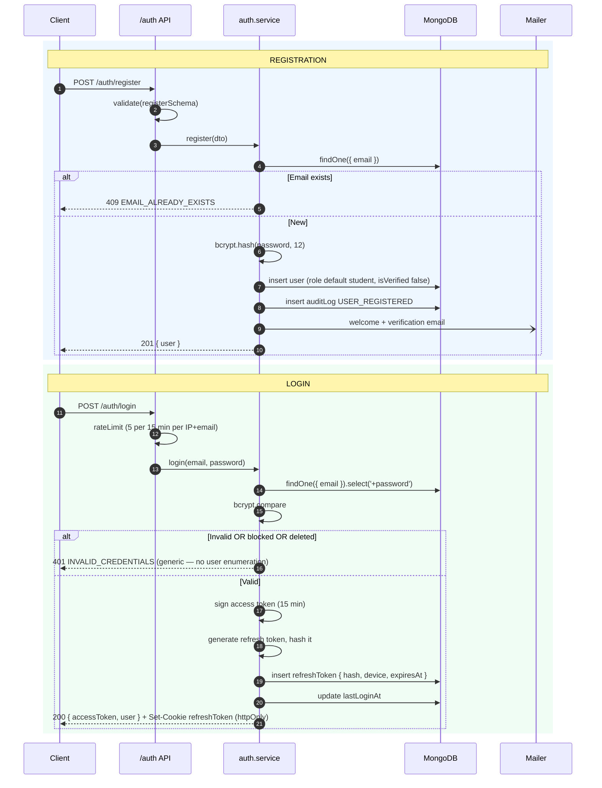
```mermaid
sequenceDiagram
    autonumber
    participant C as Client
    participant A as /auth API
    participant S as auth.service
    participant DB as MongoDB
    participant M as Mailer

    rect rgb(238,246,255)
    Note over C,M: REGISTRATION
    C->>A: POST /auth/register
    A->>A: validate(registerSchema)
    A->>S: register(dto)
    S->>DB: findOne({ email })
    alt Email exists
        S-->>C: 409 EMAIL_ALREADY_EXISTS
    else New
        S->>S: bcrypt.hash(password, 12)
        S->>DB: insert user (role default student, isVerified false)
        S->>DB: insert auditLog USER_REGISTERED
        S-)M: welcome + verification email
        S-->>C: 201 { user }
    end
    end

    rect rgb(240,253,244)
    Note over C,M: LOGIN
    C->>A: POST /auth/login
    A->>A: rateLimit (5 per 15 min per IP+email)
    A->>S: login(email, password)
    S->>DB: findOne({ email }).select('+password')
    S->>S: bcrypt.compare
    alt Invalid OR blocked OR deleted
        S-->>C: 401 INVALID_CREDENTIALS (generic — no user enumeration)
    else Valid
        S->>S: sign access token (15 min)
        S->>S: generate refresh token, hash it
        S->>DB: insert refreshToken { hash, device, expiresAt }
        S->>DB: update lastLoginAt
        S-->>C: 200 { accessToken, user } + Set-Cookie refreshToken (httpOnly)
    end
    end
```

## 11.3 JWT Verification & Silent Refresh

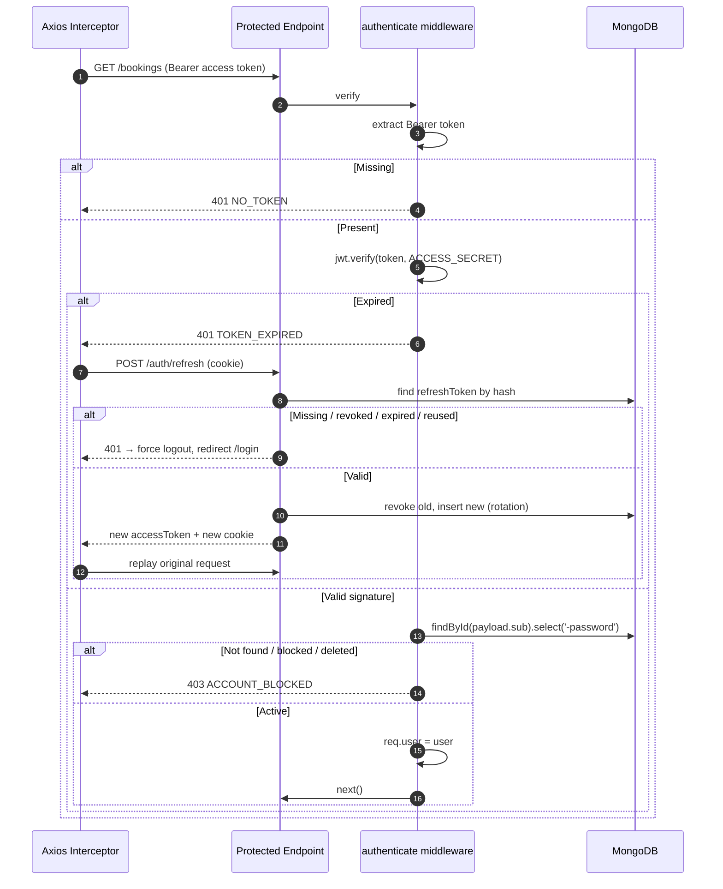
```mermaid
sequenceDiagram
    autonumber
    participant C as Axios Interceptor
    participant API as Protected Endpoint
    participant MW as authenticate middleware
    participant DB as MongoDB

    C->>API: GET /bookings (Bearer access token)
    API->>MW: verify
    MW->>MW: extract Bearer token
    alt Missing
        MW-->>C: 401 NO_TOKEN
    else Present
        MW->>MW: jwt.verify(token, ACCESS_SECRET)
        alt Expired
            MW-->>C: 401 TOKEN_EXPIRED
            C->>API: POST /auth/refresh (cookie)
            API->>DB: find refreshToken by hash
            alt Missing / revoked / expired / reused
                API-->>C: 401 → force logout, redirect /login
            else Valid
                API->>DB: revoke old, insert new (rotation)
                API-->>C: new accessToken + new cookie
                C->>API: replay original request
            end
        else Valid signature
            MW->>DB: findById(payload.sub).select('-password')
            alt Not found / blocked / deleted
                MW-->>C: 403 ACCOUNT_BLOCKED
            else Active
                MW->>MW: req.user = user
                MW->>API: next()
            end
        end
    end
```

**Why re-fetch the user from the DB on every request rather than trusting the JWT payload?** Because a JWT is a snapshot. If an admin blocks a user or changes their role, a token minted a minute earlier would still carry the old role for up to 15 minutes. One indexed `findById` per request (~1 ms, served from the WiredTiger cache) buys immediate revocation and correct authorization. For this system, correctness beats the micro-optimisation — and if it ever becomes a bottleneck, the fix is a short-TTL in-memory user cache, not weaker security.

## 11.4 Protected Routes — Frontend

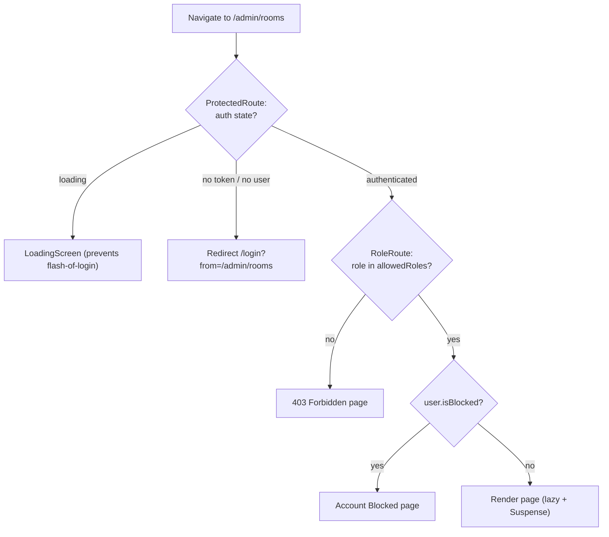
```mermaid
flowchart TD
    N["Navigate to /admin/rooms"] --> PR{"ProtectedRoute:<br/>auth state?"}
    PR -- "loading" --> LS["LoadingScreen (prevents flash-of-login)"]
    PR -- "no token / no user" --> RD["Redirect /login?from=/admin/rooms"]
    PR -- "authenticated" --> RR{"RoleRoute:<br/>role in allowedRoles?"}
    RR -- "no" --> F["403 Forbidden page"]
    RR -- "yes" --> BL{"user.isBlocked?"}
    BL -- "yes" --> BP["Account Blocked page"]
    BL -- "no" --> P["Render page (lazy + Suspense)"]
```

Two details that matter: the `from` query parameter returns the user to their intended page after login, and the explicit `loading` state prevents the flash-of-login-screen that occurs when auth state is still being restored on refresh.

**Frontend guards are UX, not security.** Anyone can edit client state and reach an admin page shell — they will simply get 403s from every API call, because authorization is enforced server-side on every route (**P4**). This distinction should be stated in the report; it is a frequent viva question.

## 11.5 Role-Based Access Control

**Decision: permission-based RBAC, not role-string checks scattered through routes.**

```javascript
// constants/permissions.js — the single source of authorization policy
const PERMISSIONS = {
  admin:   ['*'],                                  // wildcard
  staff:   ['room:read', 'booking:create', 'booking:read:all',
            'booking:approve', 'booking:reject', 'booking:cancel:own',
            'report:read', 'dashboard:staff'],
  student: ['room:read', 'booking:create', 'booking:read:own',
            'booking:cancel:own', 'dashboard:student', 'profile:update'],
  guest:   ['room:read', 'booking:create:limited', 'booking:read:own'],
};
```

Routes then declare intent, not identity:

```javascript
router.patch('/:id/approve', authenticate, authorize('booking:approve'), bookingController.approve);
```

*Why this matters (**P4**, Open/Closed).* Adding a "Warden" role becomes one entry in this object. With `if (req.user.role === 'admin' || req.user.role === 'staff')` scattered across 40 route files, the same change is a 40-file audit with a real chance of missing one — which is a privilege-escalation bug.

### Access Control Matrix

| Resource / Action | Admin | Staff | Student | Guest |
|---|:---:|:---:|:---:|:---:|
| View rooms | ✅ | ✅ | ✅ | ✅ |
| Create / edit / delete room | ✅ | ❌ | ❌ | ❌ |
| Create booking | ✅ | ✅ | ✅ | ⚠️ limited |
| View own bookings | ✅ | ✅ | ✅ | ✅ |
| View all bookings | ✅ | ✅ | ❌ | ❌ |
| Approve / reject booking | ✅ | ✅ | ❌ | ❌ |
| Cancel own booking | ✅ | ✅ | ✅ | ✅ |
| Cancel any booking | ✅ | ❌ | ❌ | ❌ |
| Manage users / roles | ✅ | ❌ | ❌ | ❌ |
| Block / unblock user | ✅ | ❌ | ❌ | ❌ |
| View reports | ✅ | ⚠️ own rooms | ❌ | ❌ |
| System settings | ✅ | ❌ | ❌ | ❌ |
| View audit logs | ✅ | ❌ | ❌ | ❌ |

**Ownership checks are separate from role checks.** `booking:read:own` still requires verifying `booking.user.equals(req.user._id)` inside the service. A student holding a valid token must not read another student's booking by guessing an ID — this is IDOR (Insecure Direct Object Reference), the single most common access-control flaw in student MERN projects, and the service layer is where it is prevented.

---

# 12. Complete User Journey

## 12.1 Journey Overview

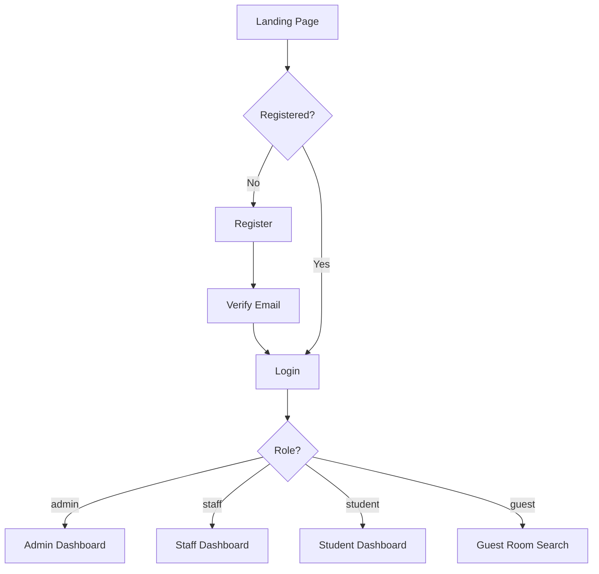
```mermaid
flowchart TD
    L["Landing Page"] --> D{"Registered?"}
    D -- "No" --> RG["Register"] --> VE["Verify Email"] --> LI["Login"]
    D -- "Yes" --> LI
    LI --> RT{"Role?"}
    RT -- "admin" --> AD["Admin Dashboard"]
    RT -- "staff" --> SD["Staff Dashboard"]
    RT -- "student" --> STD["Student Dashboard"]
    RT -- "guest" --> GD["Guest Room Search"]
```

## 12.2 Admin Flow

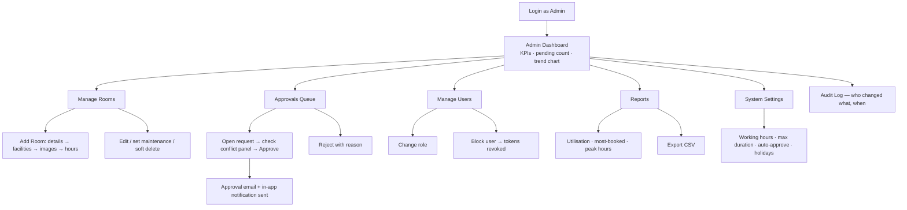
```mermaid
flowchart TD
    A1["Login as Admin"] --> A2["Admin Dashboard<br/>KPIs · pending count · trend chart"]
    A2 --> A3["Manage Rooms"]
    A3 --> A3a["Add Room: details → facilities → images → hours"]
    A3 --> A3b["Edit / set maintenance / soft delete"]
    A2 --> A4["Approvals Queue"]
    A4 --> A4a["Open request → check conflict panel → Approve"]
    A4 --> A4b["Reject with reason"]
    A4a --> A4c["Approval email + in-app notification sent"]
    A2 --> A5["Manage Users"]
    A5 --> A5a["Change role"]
    A5 --> A5b["Block user → tokens revoked"]
    A2 --> A6["Reports"]
    A6 --> A6a["Utilisation · most-booked · peak hours"]
    A6 --> A6b["Export CSV"]
    A2 --> A7["System Settings"]
    A7 --> A7a["Working hours · max duration · auto-approve · holidays"]
    A2 --> A8["Audit Log — who changed what, when"]
```

**Admin's primary daily loop:** open dashboard → clear the pending-approvals queue → scan today's schedule for conflicts or maintenance issues. The UI is designed so this loop is two clicks from login.

## 12.3 Faculty / Staff Flow

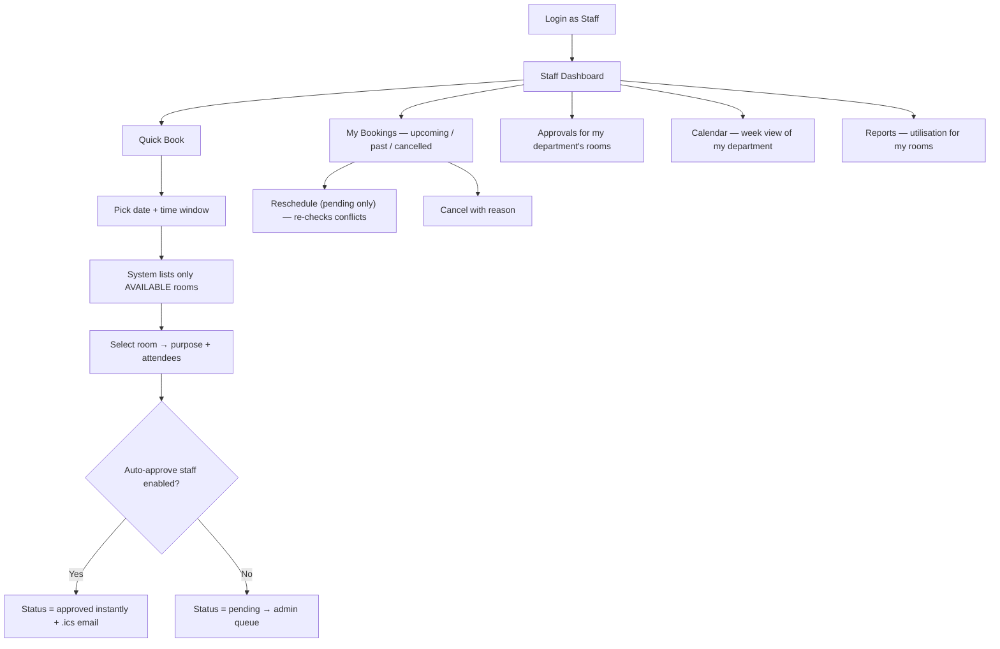
```mermaid
flowchart TD
    S1["Login as Staff"] --> S2["Staff Dashboard"]
    S2 --> S3["Quick Book"]
    S3 --> S3a["Pick date + time window"]
    S3a --> S3b["System lists only AVAILABLE rooms"]
    S3b --> S3c["Select room → purpose + attendees"]
    S3c --> S3d{"Auto-approve staff enabled?"}
    S3d -- "Yes" --> S3e["Status = approved instantly + .ics email"]
    S3d -- "No" --> S3f["Status = pending → admin queue"]
    S2 --> S4["My Bookings — upcoming / past / cancelled"]
    S4 --> S4a["Reschedule (pending only) — re-checks conflicts"]
    S4 --> S4b["Cancel with reason"]
    S2 --> S5["Approvals for my department's rooms"]
    S2 --> S6["Calendar — week view of my department"]
    S2 --> S7["Reports — utilisation for my rooms"]
```

## 12.4 Student / Employee Flow

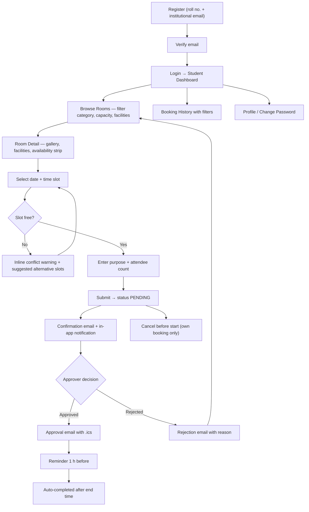
```mermaid
flowchart TD
    T1["Register (roll no. + institutional email)"] --> T2["Verify email"]
    T2 --> T3["Login → Student Dashboard"]
    T3 --> T4["Browse Rooms — filter category, capacity, facilities"]
    T4 --> T5["Room Detail — gallery, facilities, availability strip"]
    T5 --> T6["Select date + time slot"]
    T6 --> T7{"Slot free?"}
    T7 -- "No" --> T7a["Inline conflict warning + suggested alternative slots"] --> T6
    T7 -- "Yes" --> T8["Enter purpose + attendee count"]
    T8 --> T9["Submit → status PENDING"]
    T9 --> T10["Confirmation email + in-app notification"]
    T10 --> T11{"Approver decision"}
    T11 -- "Approved" --> T12["Approval email with .ics"] --> T13["Reminder 1 h before"] --> T14["Auto-completed after end time"]
    T11 -- "Rejected" --> T15["Rejection email with reason"] --> T4
    T9 --> T16["Cancel before start (own booking only)"]
    T3 --> T17["Booking History with filters"]
    T3 --> T18["Profile / Change Password"]
```

## 12.5 Guest Flow (Optional Module)

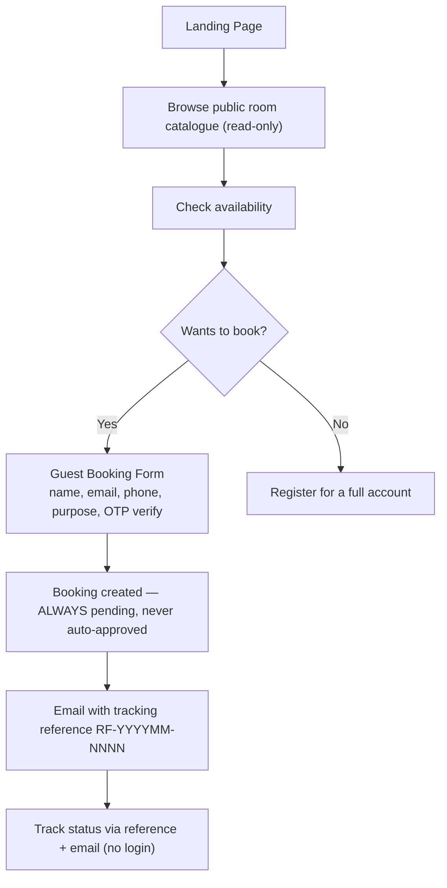
```mermaid
flowchart TD
    G1["Landing Page"] --> G2["Browse public room catalogue (read-only)"]
    G2 --> G3["Check availability"]
    G3 --> G4{"Wants to book?"}
    G4 -- "Yes" --> G5["Guest Booking Form<br/>name, email, phone, purpose, OTP verify"]
    G5 --> G6["Booking created — ALWAYS pending, never auto-approved"]
    G6 --> G7["Email with tracking reference RF-YYYYMM-NNNN"]
    G7 --> G8["Track status via reference + email (no login)"]
    G4 -- "No" --> G9["Register for a full account"]
```

**Guest constraints (deliberate, security-relevant):** never auto-approved; one booking per email per day; maximum 2 hours; only rooms flagged `guestBookable`; OTP email verification before the booking is persisted. Without these, the guest path is an open spam/abuse endpoint.

## 12.6 Cross-Role Booking State Journey

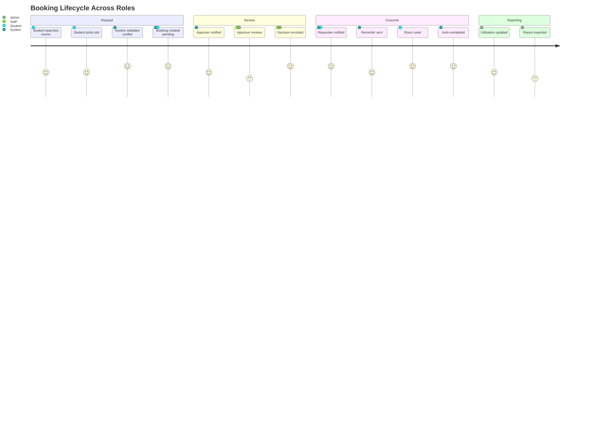
```mermaid
journey
    title Booking Lifecycle Across Roles
    section Request
      Student searches rooms: 4: Student
      Student picks slot: 4: Student
      System validates conflict: 5: System
      Booking created pending: 5: System, Student
    section Review
      Approver notified: 4: System
      Approver reviews: 3: Staff, Admin
      Decision recorded: 5: Staff, Admin
    section Outcome
      Requester notified: 5: System, Student
      Reminder sent: 4: System
      Room used: 5: Student
      Auto-completed: 5: System
    section Reporting
      Utilisation updated: 4: Admin
      Report exported: 3: Admin
```

---

# 13. UI Planning

## 13.1 Design System Foundation

| Token | Value | Usage |
|---|---|---|
| Primary | `indigo-600` | Actions, links, active nav |
| Success | `emerald-500` | Approved, available |
| Warning | `amber-500` | Pending, maintenance |
| Danger | `rose-500` | Rejected, cancelled, destructive |
| Neutral | `slate-50…900` | Surfaces, text, borders |
| Font | Inter (system fallback) | Whole app |
| Radius | `rounded-xl` cards, `rounded-lg` inputs | Consistent softness |
| Shadow | `shadow-sm` rest, `shadow-md` hover | Subtle elevation |
| Spacing | 4 px base scale | Rhythm |

**Status colour is fixed vocabulary** — pending = amber, approved = emerald, rejected = rose, cancelled = slate, completed = blue — and it must be identical on badges, calendar chips, and charts. Users learn colour faster than text.

## 13.2 Page-by-Page Specification

### 13.2.1 Landing Page (`/`)
- **Hero:** headline, one-line value proposition, "Get Started" + "Browse Rooms" CTAs, product screenshot.
- **Features grid:** 6 cards — real-time availability, conflict-free booking, approval workflow, calendar view, analytics, email alerts.
- **How it works:** 3 steps (Search → Book → Confirmed).
- **Stats band:** rooms, bookings, users (live from a public stats endpoint).
- **Room preview:** 4 featured room cards.
- **Footer:** links, contact, GitHub, college credit.
- *Goal:* a first-time visitor understands the product in under 10 seconds — this page is also the demo's opening frame.

### 13.2.2 Login / Register / Forgot / Reset (`/login`, …)
- Split layout: left illustration + tagline, right form (single column, max-width 400 px).
- Email + password with show/hide toggle, "Remember me", "Forgot password?".
- Inline field-level errors from Zod; form-level error banner for `401`.
- Register adds: role selector (Student/Staff), identifier, department, password-strength meter, confirm password.
- Submit button shows spinner and disables — prevents double submission.
- Reset page validates token *before* rendering the form, so an expired link fails immediately rather than after typing a password.

### 13.2.3 Dashboard (`/dashboard`) — role-adaptive
- **Shell:** collapsible sidebar (icon-only on `md`, drawer on mobile) + topbar (search, notification bell, avatar menu).
- **Admin:** 4 stat cards → booking trend line chart + status donut → pending approvals table → today's schedule strip.
- **Staff:** 3 stat cards → quick-book widget → my upcoming bookings → approvals needing action.
- **Student:** 3 stat cards → quick availability search → my upcoming bookings → recent notifications.
- Skeleton loaders for every card — never a blank screen or a full-page spinner.

### 13.2.4 Room Listing (`/rooms`)
- Sticky filter bar: search, category chips, capacity range, facility multi-select, building, availability date/time.
- Responsive grid: 1 / 2 / 3 / 4 columns at `sm` / `md` / `lg` / `xl`.
- `RoomCard`: cover image, name + code, category badge, capacity, facility icons (3 + "more"), availability dot, "Book Now".
- Toggle grid ⇄ table view; server-side pagination; `EmptyState` with a "clear filters" action.
- Filter state is synced to the URL query string, so a filtered view is shareable and survives refresh.

### 13.2.5 Room Detail (`/rooms/:id`)
- Image gallery with lightbox; sticky booking widget on desktop (date, time, "Check Availability").
- Tabs: Overview · Facilities · Availability · Rules.
- Availability strip: 24-hour horizontal bar, booked segments in amber/emerald, hover shows purpose.
- "Similar rooms" row for when the chosen room is busy.

### 13.2.6 Booking Page (`/rooms/:id/book`)
- 3-step stepper: **Select Slot** → **Details** → **Review & Confirm**.
- Step 1: date picker (past dates and blackout dates disabled) + visual slot picker where taken slots are non-selectable — prevention beats error messages.
- Step 2: purpose (textarea, 10–500 chars), attendees (validated against capacity in real time), optional equipment notes.
- Step 3: read-only summary + approval-requirement notice + terms checkbox.
- Live conflict check on slot change (debounced 400 ms, calls `POST /bookings/check-conflict`); on conflict, shows the next 3 free slots as one-click alternatives.

### 13.2.7 Calendar View (`/calendar`)
- Toolbar: view switcher (Month/Week/Day), date navigation, "Today", room filter, status filter, legend.
- Month: colour-coded chips, "+N more" overflow.
- Week: 7 columns × hour rows, blocks positioned by time.
- Day: single-room timeline with a current-time indicator line.
- Click a slot → pre-filled booking form; click an event → detail drawer.
- Scoped by role: student sees own + public busy blocks (busy blocks anonymised — a student does not need to know *who* booked it, only that it is taken; this is privacy by design).

### 13.2.8 My Bookings (`/bookings/me`)
- Tabs: Upcoming · Pending · Past · Cancelled, each with a count badge.
- Table on desktop, cards on mobile (the same data, different component — a horizontally scrolling table on a phone is a usability failure).
- Row actions by status: View · Reschedule (pending) · Cancel (before start) · Download .ics (approved).
- Confirm dialog with mandatory reason for cancellation.

### 13.2.9 Reports (`/reports`)
- Filter bar: date range presets (Today / This Week / This Month / Custom), room, category, group-by.
- KPI row: total bookings, approval rate, average utilisation, peak hour.
- Charts: utilisation bar (by room), booking trend line, status donut, peak-hours heatmap.
- Data table under each chart, with an export button per report.
- Print-friendly stylesheet — reports end up in the project report and in college files.

### 13.2.10 Profile & Settings (`/profile`, `/settings`)
- Left vertical tabs: Profile · Password · Notifications · (Admin) System.
- Profile: avatar upload with crop preview, name, phone, department; email read-only (identity anchor).
- Password: current + new + confirm, strength meter, "log out other devices" checkbox.
- System (admin): institution name, working hours, min/max duration, advance window, auto-approve toggle, reminder lead time, holiday manager.
- Autosave is **not** used — an explicit Save with a dirty-state guard, because these settings affect everyone.

## 13.3 Responsive Strategy

| Breakpoint | Layout |
|---|---|
| < 640 px | Single column, bottom nav, drawer sidebar, cards instead of tables, full-screen modals |
| 640–1024 px | Two-column grids, collapsible icon sidebar |
| 1024–1280 px | Three-column grids, persistent sidebar |
| > 1280 px | Four-column grids, sticky booking widget, wide charts |

---

# 14. Component Hierarchy (React)

## 14.1 Application Tree

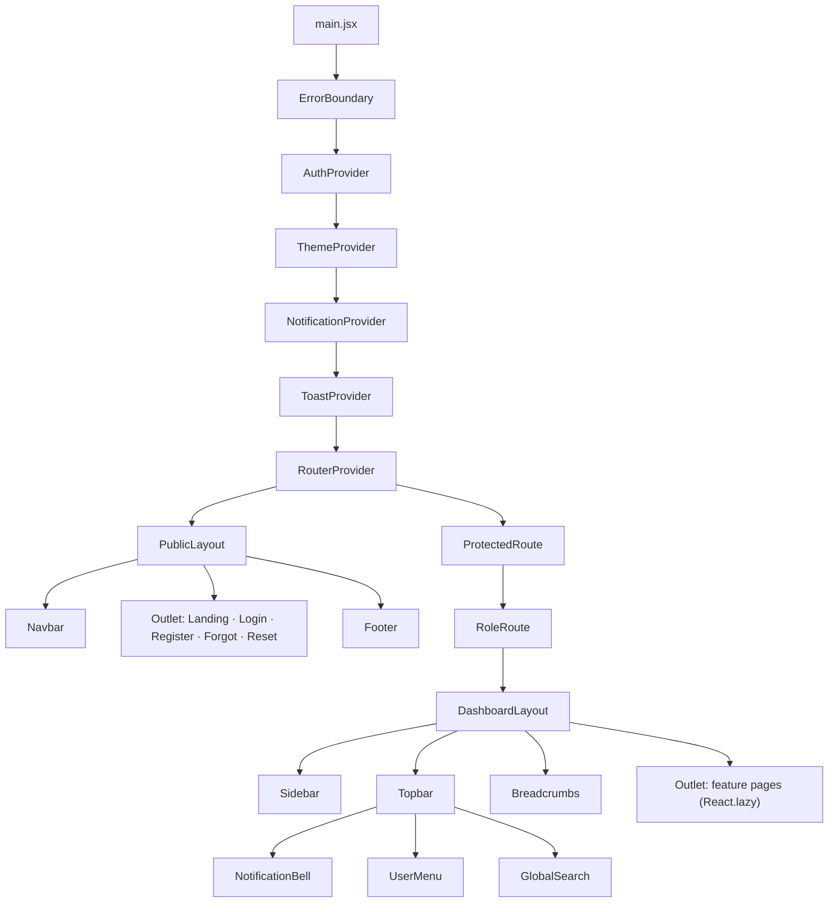
```mermaid
flowchart TD
    M["main.jsx"] --> EB["ErrorBoundary"]
    EB --> AP["AuthProvider"]
    AP --> TP["ThemeProvider"]
    TP --> NP["NotificationProvider"]
    NP --> TOP["ToastProvider"]
    TOP --> RP["RouterProvider"]

    RP --> PL["PublicLayout"]
    RP --> PR["ProtectedRoute"]

    PL --> NB["Navbar"]
    PL --> OUT1["Outlet: Landing · Login · Register · Forgot · Reset"]
    PL --> FT["Footer"]

    PR --> RR["RoleRoute"]
    RR --> DL["DashboardLayout"]
    DL --> SB["Sidebar"]
    DL --> TB["Topbar"]
    DL --> BC["Breadcrumbs"]
    DL --> OUT2["Outlet: feature pages (React.lazy)"]

    TB --> NBell["NotificationBell"]
    TB --> UM["UserMenu"]
    TB --> GS["GlobalSearch"]
```

## 14.2 Feature Component Trees

**Room Listing**

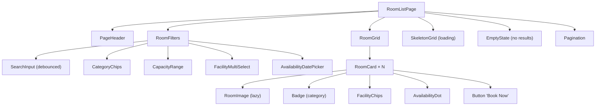
```mermaid
flowchart TD
    RLP["RoomListPage"] --> PH["PageHeader"]
    RLP --> RF["RoomFilters"]
    RF --> SI["SearchInput (debounced)"]
    RF --> CS["CategoryChips"]
    RF --> CR["CapacityRange"]
    RF --> FM["FacilityMultiSelect"]
    RF --> AD["AvailabilityDatePicker"]
    RLP --> RG["RoomGrid"]
    RG --> RC["RoomCard × N"]
    RC --> IMG["RoomImage (lazy)"]
    RC --> BDG["Badge (category)"]
    RC --> FC["FacilityChips"]
    RC --> AS["AvailabilityDot"]
    RC --> BTN["Button 'Book Now'"]
    RLP --> SK["SkeletonGrid (loading)"]
    RLP --> ES["EmptyState (no results)"]
    RLP --> PG["Pagination"]
```

**Booking Form**

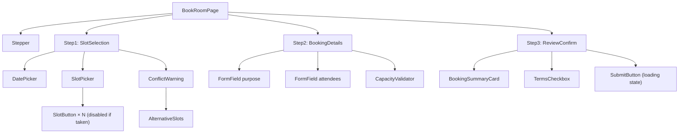
```mermaid
flowchart TD
    BP["BookRoomPage"] --> ST["Stepper"]
    BP --> S1["Step1: SlotSelection"]
    S1 --> DP["DatePicker"]
    S1 --> SP["SlotPicker"]
    SP --> SLOT["SlotButton × N (disabled if taken)"]
    S1 --> CW["ConflictWarning"]
    CW --> ALT["AlternativeSlots"]
    BP --> S2["Step2: BookingDetails"]
    S2 --> FF1["FormField purpose"]
    S2 --> FF2["FormField attendees"]
    S2 --> CV["CapacityValidator"]
    BP --> S3["Step3: ReviewConfirm"]
    S3 --> SUM["BookingSummaryCard"]
    S3 --> TC["TermsCheckbox"]
    S3 --> SUB["SubmitButton (loading state)"]
```

**Admin Approvals**

```mermaid
flowchart TD
    AQ["ApprovalsPage"] --> FB["FilterBar"]
    AQ --> BT["BookingTable"]
    BT --> TR["BookingRow × N"]
    TR --> BSB["BookingStatusBadge"]
    TR --> AB["ActionButtons"]
    AB --> APV["ApproveButton"]
    AB --> REJ["RejectButton"]
    REJ --> RM["RejectModal (reason required)"]
    AQ --> BD["BookingDetailDrawer"]
    BD --> CI["ConflictInsight"]
    BD --> UI2["RequesterInfo"]
    BD --> TL["BookingTimeline"]
```

## 14.3 Component Design Rules

| Rule | Reason |
|---|---|
| **Presentational vs container split** | `RoomCard` takes props and renders; `RoomListPage` fetches and orchestrates. Presentational components stay trivially testable and reusable. |
| **Composition over configuration** | `<Card><Card.Header/><Card.Body/></Card>` beats `<Card showHeader headerText=… />`. A component with 12 boolean props is a design smell. |
| **Props ≤ 7** | More than that signals the component is doing two jobs (SRP). |
| **No business logic in JSX** | Compute in a hook or util, render the result. Keeps components readable and logic testable. |
| **Every list item has a stable key** | `_id`, never array index — index keys corrupt state on reorder/filter. |
| **Loading, empty, error, and success are four explicit states** | Every data-driven component handles all four. "Forgot the empty state" is the most common UI gap in student projects. |
| **`React.memo` only where measured** | Premature memoisation adds complexity; profile first. |
| **Accessibility built in, not bolted on** | Every interactive element has an accessible name; modals trap focus and restore it on close. |

## 14.4 Reusable Component Inventory (Reuse Count)

| Component | Reused In | Count |
|---|---|---|
| `Button` | Everywhere | 60+ |
| `Input` / `FormField` | All forms | 40+ |
| `Modal` / `ConfirmDialog` | Delete, cancel, reject, block | 12+ |
| `Table` + `Pagination` | Users, bookings, rooms, audit, reports | 8 |
| `Badge` | Status, role, category, facility | 15+ |
| `Card` | Dashboard, rooms, bookings | 20+ |
| `EmptyState` | Every list | 10+ |
| `Skeleton` | Every async view | 12+ |
| `StatCard` | All 3 dashboards + reports | 14 |
| `DatePicker` / `TimeRangePicker` | Booking, filters, reports | 9 |

This inventory is the concrete evidence for the "reusable components" requirement — roughly 200 usages served by ~10 primitives.

---

# 15. Backend Folder Architecture

## 15.1 Layer Responsibility Map

```mermaid
flowchart TB
    subgraph E["Entry"]
        SRV["server.js — listen, graceful shutdown, signal handlers"]
        APP["app.js — express instance, global middleware, route mounting"]
    end
    subgraph R["Routing"]
        RTS["routes/v1/*.routes.js — path + verb + guard chain"]
    end
    subgraph MW["Cross-Cutting"]
        MWS["middleware/* — authenticate, authorize, validate, rateLimit, logger, error"]
    end
    subgraph C["Adapters"]
        CTL["controllers/* — req → dto, call service, res → envelope"]
    end
    subgraph S["Domain"]
        SVC["services/* — rules, transactions, orchestration"]
        UTL["utils/* — pure functions (conflict, dates, pagination)"]
    end
    subgraph D["Data & Integration"]
        MDL["models/* — schema, indexes, hooks"]
        CFG["config/* — db, cloudinary, mailer, logger, env"]
    end

    SRV --> APP --> RTS --> MWS --> CTL --> SVC
    SVC --> UTL
    SVC --> MDL --> DBX[("MongoDB")]
    SVC --> CFG
```

## 15.2 Why This Split Is Not Over-Engineering

A common objection: "why not put the query in the controller?" The answer is concrete rather than dogmatic:

1. **Booking creation is called from three places** — the REST controller, the recurring-booking service, and the seed script. If the logic lived in the controller, it would be duplicated three times and would drift.
2. **The conflict algorithm must be unit-testable** without spinning up Express or mocking `req`/`res`. As a pure function taking `(roomId, startsAt, endsAt)`, it is testable in milliseconds.
3. **Mobile support (P2)** may later need a slightly different response shape. A new controller can reuse the identical service.
4. **Transaction boundaries belong to business operations**, not to HTTP requests. The service owns the session.

## 15.3 Key File Contracts

| File | Contract |
|---|---|
| `app.js` | Exports the configured Express app **without** calling `listen()` — enabling Supertest integration tests |
| `server.js` | Connects the DB **before** listening; handles `SIGTERM`/`SIGINT` for graceful shutdown; catches `unhandledRejection`/`uncaughtException` |
| `config/env.js` | Validates all env vars at boot with Zod and **exits the process** if any are missing — fail fast at startup, never at 2 a.m. in a request |
| `config/db.js` | Single connection with pool size, retry, and event logging |
| `utils/ApiError.js` | `class ApiError extends Error { statusCode, code, errors, isOperational }` — distinguishes expected failures from bugs |
| `utils/asyncHandler.js` | Wraps async controllers so rejected promises reach the error middleware without `try/catch` in every controller |
| `utils/ApiResponse.js` | Guarantees one response envelope shape across all 115 endpoints |

---

# 16. MVC Architecture

## 16.1 MVC as Applied Here

Classical MVC assumes the server renders the View. In a MERN SPA the View lives in the browser, so RoomFlow uses **MVC + Service Layer** — sometimes called MVCS, and the honest description of what a modern REST backend actually is.

```mermaid
flowchart LR
    subgraph Client["VIEW — React SPA"]
        V["Components · Pages · Contexts"]
    end
    subgraph Server["Server"]
        C["CONTROLLER<br/>HTTP adapter"]
        S["SERVICE<br/>business logic"]
        M["MODEL<br/>Mongoose schema"]
    end
    DB[("MongoDB")]

    V -- "HTTP JSON" --> C
    C -- "DTO in" --> S
    S -- "domain result" --> C
    C -- "JSON envelope" --> V
    S -- "queries" --> M
    M -- "documents" --> S
    M <--> DB
```

## 16.2 Responsibility Table

| Component | Owns | Must Never |
|---|---|---|
| **Model** (`Booking.model.js`) | Field types, validators, indexes, virtuals, pre-save derivations (`startsAt`, `durationMinutes`), instance helpers | Know about approval workflow or send email |
| **View** (React) | Rendering, local UI state, client-side validation for UX, formatting | Enforce authorization or trust its own permission checks |
| **Controller** (`booking.controller.js`) | Extract `req.body`/`params`/`query`/`user`, call one service function, return `ApiResponse` | Query models directly, contain `if (conflict)` logic |
| **Service** (`booking.service.js`) | All rules: conflict, capacity, hours, status transitions, transactions, notification triggers, audit writes | Touch `req`/`res` or format HTTP responses |

## 16.3 Worked Example — Approve Booking Across Layers

```text
PATCH /api/v1/bookings/:id/approve
   │
   ├─ ROUTE      authenticate → authorize('booking:approve') → validate(approveSchema)
   │
   ├─ CONTROLLER const booking = await bookingService.approve(
   │                 req.params.id, req.body.remark, req.user
   │              );
   │              return res.status(200).json(new ApiResponse(200, booking, 'Booking approved'));
   │              // 3 lines. No business logic. This is correct, not lazy.
   │
   ├─ SERVICE    1. load booking (404 if missing)
   │             2. assert current status === 'pending'        → 422 INVALID_TRANSITION
   │             3. assert approver ≠ requester (if policy on)  → 403 SELF_APPROVAL
   │             4. re-run conflict check (another booking may have been approved meanwhile)
   │             5. START TRANSACTION
   │                  a. update status, approvedBy, approvedAt, push statusHistory
   │                  b. auto-reject other pending bookings overlapping the same slot
   │                  c. write audit log
   │                COMMIT
   │             6. enqueue approval email (+ .ics) and in-app notification — outside the transaction
   │             7. return booking DTO
   │
   └─ MODEL      schema validation, index-backed overlap query, timestamps
```

Step 4 is the detail that separates a working system from a demo: between request and approval, another approver may have approved a competing booking. Re-checking at approval time, inside the transaction, is what makes double-booking impossible.

---

# 17. Middleware Planning

## 17.1 Execution Order (Order Is Behaviour)

```mermaid
flowchart TD
    REQ["Incoming Request"] --> H["1. helmet — security headers"]
    H --> CO["2. cors — origin allowlist"]
    CO --> CP["3. compression — gzip"]
    CP --> BP["4. express.json / urlencoded — size-limited 10 kb"]
    BP --> CK["5. cookieParser"]
    CK --> SAN["6. mongoSanitize + hpp — injection defence"]
    SAN --> LOG["7. requestLogger — correlation id, morgan/winston"]
    LOG --> RL["8. rateLimiter — global + per-route"]
    RL --> RT["9. Router /api/v1"]
    RT --> AUTH["10. authenticate — JWT verify + load user"]
    AUTH --> AUTHZ["11. authorize — permission check"]
    AUTHZ --> VAL["12. validate — Zod schema"]
    VAL --> UPL["13. upload — multer (only on file routes)"]
    UPL --> CTRL["14. Controller"]
    CTRL --> NF["15. notFound — unmatched routes"]
    NF --> ERR["16. errorHandler — MUST be last, 4 args"]
    ERR --> RES["Response"]
```

**Why this exact order.** Security headers must apply even to error responses (hence first). Sanitisation must precede logging so injected payloads are never written into logs. Rate limiting must precede authentication so unauthenticated floods are cheap to reject. Validation must precede the controller so it can assume clean input. The error handler must be registered last, because Express identifies it purely by position and arity.

## 17.2 Middleware Specifications

### 17.2.1 Authentication Middleware — `authenticate.js`
- **Input:** `Authorization: Bearer <token>`
- **Steps:** extract → `jwt.verify` → load user (`select('-password')`) → check `isBlocked`/`isDeleted` → attach `req.user`
- **Failures:** `401 NO_TOKEN` · `401 TOKEN_EXPIRED` (distinct code so the client knows to refresh) · `401 INVALID_TOKEN` · `403 ACCOUNT_BLOCKED`
- **Variant:** `optionalAuth` for public endpoints that personalise when a token happens to be present

### 17.2.2 Authorization Middleware — `authorize.js`
- **Signature:** `authorize(...requiredPermissions)`
- **Logic:** look up `PERMISSIONS[req.user.role]`; allow if it contains `'*'` or every required permission
- **Companion:** `authorizeOwnership(model, paramKey)` — loads the document and allows if `doc.user` equals `req.user._id` **or** the user holds the global permission. This is the anti-IDOR guard, applied to booking detail, edit, and cancel.
- **Failure:** `403 INSUFFICIENT_PERMISSIONS` with the missing permission named (helps developers; leaks nothing sensitive)

### 17.2.3 Validation Middleware — `validate.js`
- **Signature:** `validate(schema, source = 'body')`
- **Library:** Zod — TypeScript-ready, composable, and returns structured issues
- **Behaviour:** parse → on failure return `400` with `errors: [{ field, message }]` → on success **replace** `req[source]` with the parsed (and stripped) value, so unknown fields are dropped before reaching business logic (mass-assignment defence)
- **Reusable pieces:** `objectIdSchema`, `paginationSchema`, `dateRangeSchema`, `timeSchema` (`/^([01]\d|2[0-3]):[0-5]\d$/`)

### 17.2.4 Error Middleware — `errorHandler.js`

```mermaid
flowchart TD
    E["Error reaches handler"] --> T{"Type?"}
    T -- "ApiError (operational)" --> A["Use its statusCode + code + errors"]
    T -- "ZodError" --> Z["400 VALIDATION_ERROR + field issues"]
    T -- "Mongoose ValidationError" --> V["400 + field messages"]
    T -- "Mongoose CastError" --> C["400 INVALID_ID"]
    T -- "Mongo duplicate key 11000" --> D["409 DUPLICATE_ENTRY + which field"]
    T -- "JsonWebTokenError" --> J["401 INVALID_TOKEN"]
    T -- "TokenExpiredError" --> X["401 TOKEN_EXPIRED"]
    T -- "MulterError" --> MU["400 FILE_TOO_LARGE / TOO_MANY_FILES"]
    T -- "Unknown (programmer error)" --> U["500 INTERNAL_ERROR<br/>log full stack, return generic message"]
    A & Z & V & C & D & J & X & MU & U --> R["Envelope + correlation id<br/>stack only when NODE_ENV=development"]
```

The operational-vs-programmer error distinction is the core idea: expected failures (conflict, not found, forbidden) return precise, user-facing messages; unexpected ones return a generic message while the full stack goes to the logs. Leaking a stack trace to a client is an information-disclosure vulnerability.

### 17.2.5 Logger Middleware — `requestLogger.js`
- Assigns a UUID correlation ID per request; echoes it in the `X-Request-Id` response header and includes it in every log line and error response — so a user's screenshot of an error is enough to find the exact server log.
- Logs method, URL, status, duration, user ID, IP, user agent.
- **Winston** with daily rotation; JSON format in production, colourised in development.
- **Redaction list:** `password`, `token`, `refreshToken`, `authorization`, `otp` are never logged.

### 17.2.6 Rate Limiter — `rateLimiter.js`

| Limiter | Window | Max | Applied To |
|---|---|---|---|
| `globalLimiter` | 15 min | 300 / IP | All `/api` |
| `authLimiter` | 15 min | 5 / IP+email | `/auth/login`, `/auth/register` |
| `passwordResetLimiter` | 60 min | 3 / email | `/auth/forgot-password` |
| `bookingLimiter` | 1 min | 10 / user | `POST /bookings` |
| `uploadLimiter` | 15 min | 20 / user | Image uploads |

### 17.2.7 Upload Middleware — `upload.js`
- Multer **memory** storage (Render's filesystem is ephemeral — writing to disk is a bug waiting to happen).
- Limits: 5 MB per file, 5 files per request.
- MIME allowlist: `image/jpeg`, `image/png`, `image/webp` — checked against the actual buffer signature, not the client-supplied `Content-Type` header, which is trivially forged.
- Buffer is streamed to Cloudinary; only `{ url, publicId }` is persisted.

---

# 18. MongoDB Schema Design

Schemas are given as design specifications (fields, types, constraints, indexes, hooks) — implementation follows after sign-off.

## 18.1 User Schema

| Field | Type | Constraints | Notes |
|---|---|---|---|
| `name` | String | required, 3–50, trim | |
| `email` | String | required, unique, lowercase, RFC-valid | Login identity, immutable after creation |
| `password` | String | required, min 8, `select: false` | bcrypt hash; `select:false` means it is never returned by accident |
| `role` | String | enum `[admin, staff, student, guest]`, default `student` | |
| `roleRequest` | String | enum, optional | Pending role upgrade awaiting admin approval |
| `phone` | String | 10 digits, optional | |
| `department` | String | optional, max 100 | |
| `identifier` | String | unique (sparse), optional | Roll no. / employee ID |
| `avatar` | Object | `{ url, publicId }` | Cloudinary |
| `isBlocked` | Boolean | default `false` | |
| `blockReason` | String | optional | |
| `isVerified` | Boolean | default `false` | Email verification |
| `isDeleted` | Boolean | default `false` | Soft delete |
| `lastLoginAt` | Date | | |
| `resetPasswordToken` | String | `select: false` | SHA-256 hash of the emailed token |
| `resetPasswordExpires` | Date | `select: false` | |
| `notificationPreferences` | Object | `{ email: true, inApp: true }` | |

**Hooks:** `pre('save')` hashes the password only when modified; `pre(/^find/)` excludes `isDeleted: true` by default.
**Methods:** `comparePassword()`, `createPasswordResetToken()`, `toJSON()` strips `password`, `__v`, `resetPasswordToken`.
**Virtual:** `bookingCount`.

## 18.2 Room Schema

| Field | Type | Constraints | Notes |
|---|---|---|---|
| `code` | String | required, unique, uppercase | e.g. `CS-LAB-01` |
| `name` | String | required, 3–100 | |
| `category` | String | required, enum (8 categories) | |
| `capacity` | Number | required, 1–1000 | Validated against `attendees` |
| `building` | String | required | |
| `floor` | Number | 0–50 | |
| `description` | String | max 1000 | |
| `facilities` | [String] | enum vocabulary | Controlled list — free text would break filtering |
| `images` | [Object] | max 5, `{ url, publicId, isPrimary }` | |
| `operatingHours` | Object | `{ open: "08:00", close: "20:00", days: [1..5] }` | |
| `blackoutDates` | [Object] | `{ date, reason }` | Holidays, exams |
| `status` | String | enum `[active, maintenance, inactive]`, default `active` | |
| `requiresApproval` | Boolean | default `true` | Per-room override |
| `guestBookable` | Boolean | default `false` | Gate for the guest module |
| `pricePerHour` | Number | default `0` | Reserved for hotel/commercial use |
| `createdBy` | ObjectId → User | | |
| `isDeleted` | Boolean | default `false` | |

**Validation hook:** exactly one image may be `isPrimary`.
**Virtual:** `currentStatus` — computes free/occupied from the live booking set.

## 18.3 Booking Schema

| Field | Type | Constraints | Notes |
|---|---|---|---|
| `bookingRef` | String | unique, auto `RF-YYYYMM-NNNN` | Human-quotable reference for support and guest tracking |
| `room` | ObjectId → Room | required, indexed | |
| `user` | ObjectId → User | required, indexed | |
| `roomCode`, `roomName`, `userName` | String | denormalised | Avoids populate on list views (§9.3) |
| `bookingDate` | Date | required, normalised to 00:00 UTC | First key of the conflict index |
| `startTime`, `endTime` | String | `HH:mm`, required | Display + form binding |
| `startsAt`, `endsAt` | Date | derived, required | **Authoritative** for overlap logic |
| `durationMinutes` | Number | derived | Enforces min/max duration |
| `purpose` | String | required, 10–500 | |
| `attendees` | Number | required, ≥ 1, ≤ room capacity | |
| `status` | String | enum (5 states), default `pending`, indexed | |
| `approvedBy` / `approvedAt` / `approvalRemark` | mixed | | |
| `rejectionReason` | String | required when status = `rejected` | |
| `cancelledBy` / `cancelledAt` / `cancellationReason` | mixed | | |
| `statusHistory` | [Object] | `{ status, changedBy, changedAt, reason }` | Embedded, bounded timeline |
| `recurrence` | Object | `{ type, until, groupId }` | Links a series |
| `reminderSent` | Boolean | default `false` | Idempotency guard for the reminder job |
| `attachments` | [Object] | optional | Permission letters etc. |

**Pre-validate hook:** derive `startsAt`/`endsAt`/`durationMinutes` from `bookingDate + startTime/endTime`, and assert `endsAt > startsAt`.
**Indexes:** the compound conflict index from §7.3.
**Statics:** `findOverlapping(roomId, startsAt, endsAt, excludeId)`.

## 18.4 Notification Schema

| Field | Type | Notes |
|---|---|---|
| `recipient` | ObjectId → User, indexed | |
| `type` | enum `[booking_created, booking_approved, booking_rejected, booking_cancelled, booking_reminder, approval_request, system, broadcast]` | Drives icon + colour in the UI |
| `title`, `message` | String | Denormalised text — no joins for the bell dropdown |
| `relatedBooking` | ObjectId → Booking, optional | |
| `link` | String | Deep link, e.g. `/bookings/:id` |
| `isRead` / `readAt` | Boolean / Date | |
| `channel` | enum `[in-app, email, both]` | |
| `emailStatus` | enum `[pending, sent, failed]` + `emailError` | Makes async mail failures observable and retryable |
| `priority` | enum `[low, normal, high]` | |

**TTL index:** auto-delete after 90 days — this collection would otherwise grow without bound.

## 18.5 AuditLog Schema

| Field | Type | Notes |
|---|---|---|
| `actor` | ObjectId → User (nullable for system actions) | |
| `actorRole`, `actorName` | String | Snapshot — the log must stay readable even if the user is later deleted |
| `action` | enum (`USER_LOGIN`, `ROOM_CREATED`, `BOOKING_APPROVED`, …) | |
| `entityType` | enum `[User, Room, Booking, SystemConfig]` | |
| `entityId` | ObjectId | |
| `before` / `after` | Object | Changed fields only, never whole documents, secrets redacted |
| `ipAddress`, `userAgent` | String | |
| `status` | enum `[success, failure]` | Failed logins are recorded too |
| `metadata` | Object | Correlation ID, extra context |

**Immutability:** `pre('findOneAndUpdate')` and `pre('deleteOne')` hooks throw. No route exposes write access (§10.10).

## 18.6 RefreshToken & SystemConfig

**RefreshToken** — `user`, `tokenHash` (unique), `deviceInfo`, `ipAddress`, `expiresAt` (TTL index), `isRevoked`, `revokedReason`, `replacedBy`. The `replacedBy` chain is what enables reuse-detection during rotation (§11.1).

**SystemConfig** — a singleton (enforced by a `key: 'global'` unique field) holding institution name, working hours, min/max booking duration, advance-booking window, auto-approve toggles, reminder lead time, holidays, email settings, and maintenance mode. Read through a cached accessor (5-minute in-memory cache) so it does not add a DB read to every booking (**FR-SET-04**).

---

# 19. Validation Rules

Validation happens at **three** layers, deliberately. Client validation is UX (fast feedback), server validation is security (never trust the client), schema validation is the final integrity net.

## 19.1 Authentication

| Field | Rules | Error Message |
|---|---|---|
| `name` | required, 3–50, letters/spaces/`.`/`-` only | "Name must be 3–50 characters" |
| `email` | required, valid format, lowercase, unique | "Please enter a valid email address" |
| `password` | required, ≥ 8, ≥ 1 upper, ≥ 1 lower, ≥ 1 digit, ≥ 1 special, not in a common-password list | "Password must be at least 8 characters with upper, lower, number, and symbol" |
| `confirmPassword` | must equal `password` | "Passwords do not match" |
| `role` | enum, `admin` **never** self-assignable | "Invalid role selection" |
| `phone` | optional, exactly 10 digits | "Enter a valid 10-digit phone number" |
| `identifier` | required for student/staff, alphanumeric 3–20, unique | "This ID is already registered" |

## 19.2 Room

| Field | Rules |
|---|---|
| `code` | required, unique, `^[A-Z0-9-]{3,20}$`, auto-uppercased |
| `name` | required, 3–100 |
| `category` | required, from the enum |
| `capacity` | required, integer, 1–1000 |
| `building` | required, 2–100 |
| `floor` | integer, 0–50 |
| `facilities` | array, each from the controlled vocabulary, no duplicates |
| `images` | ≤ 5 files, ≤ 5 MB each, JPEG/PNG/WebP verified by buffer signature |
| `operatingHours` | `close` must be after `open`; `days` ⊂ 0–6 |
| `status` | enum; cannot move to `inactive` while future approved bookings exist |

## 19.3 Booking — the Rule-Dense Module

| # | Rule | Layer | Error |
|---|---|---|---|
| 1 | `room` must exist, not be deleted, and have `status = active` | Service | `ROOM_UNAVAILABLE` |
| 2 | `bookingDate` must not be in the past | Zod + Service | `PAST_DATE_NOT_ALLOWED` |
| 3 | `bookingDate` ≤ today + `maxAdvanceBookingDays` | Service | `TOO_FAR_IN_ADVANCE` |
| 4 | `startTime`/`endTime` match `HH:mm` | Zod | `INVALID_TIME_FORMAT` |
| 5 | `endTime` > `startTime` | Zod refine | `END_BEFORE_START` |
| 6 | duration ≥ `minBookingDuration` (15 min) | Service | `DURATION_TOO_SHORT` |
| 7 | duration ≤ `maxBookingDuration` (240 min) | Service | `DURATION_TOO_LONG` |
| 8 | slot within the room's operating hours | Service | `OUTSIDE_OPERATING_HOURS` |
| 9 | day-of-week in the room's operating days | Service | `ROOM_CLOSED_ON_THIS_DAY` |
| 10 | date not in `blackoutDates` or system holidays | Service | `BLACKOUT_DATE` |
| 11 | `attendees` ≥ 1 and ≤ room capacity | Zod + Service | `EXCEEDS_CAPACITY` |
| 12 | `purpose` 10–500 characters | Zod | `PURPOSE_TOO_SHORT` |
| 13 | **no overlap** with pending/approved bookings for that room | Service (transaction) | `BOOKING_CONFLICT` |
| 14 | requester has no other booking overlapping the same window | Service | `USER_DOUBLE_BOOKING` |
| 15 | requester has fewer than N active bookings (default 5) | Service | `BOOKING_LIMIT_REACHED` |
| 16 | status transition must be legal per the state machine | Service | `INVALID_STATUS_TRANSITION` |
| 17 | `rejectionReason` required (10–300 chars) when rejecting | Zod conditional | `REASON_REQUIRED` |
| 18 | cancellation only before `startsAt` (admin exempt) | Service | `CANNOT_CANCEL_STARTED_BOOKING` |
| 19 | edit/reschedule only while `pending` and owned by the requester | Service | `EDIT_NOT_ALLOWED` |
| 20 | approver must not be the requester (when self-approval is disabled) | Service | `SELF_APPROVAL_FORBIDDEN` |

Rule 14 is easy to overlook: preventing room double-booking is not the same as preventing one person from booking two different rooms at the same hour, which is almost always a mistake worth catching.

## 19.4 Cross-Cutting Rules

| Rule | Applies To |
|---|---|
| All `ObjectId` params validated with a regex before any query | Every `:id` route (prevents `CastError` noise and probing) |
| Pagination: `page` ≥ 1, `limit` 1–100 (default 10) | All list endpoints |
| Date range: `from` ≤ `to`, span ≤ 366 days | Reports, calendar |
| Sort: whitelist of sortable fields only | All list endpoints (prevents injection via `sort`) |
| Strings trimmed and HTML-escaped on output | All user-supplied text (XSS defence) |
| Unknown body fields stripped by Zod | All write endpoints (mass-assignment defence) |

---

# 20. Booking Conflict Detection Algorithm

This is the functional core of the system. It gets its own section because everything else is CRUD.

## 20.1 The Overlap Condition

Two intervals `A = [A.start, A.end)` and `B = [B.start, B.end)` overlap **if and only if**:

```
A.start < B.end  AND  A.end > B.start
```

Intervals are treated as **half-open** — the end instant is excluded — so a booking ending at 10:00 and another starting at 10:00 do **not** conflict. Any other convention makes back-to-back bookings impossible, which users immediately perceive as a bug.

```mermaid
flowchart LR
    subgraph Cases["Six Positional Cases"]
        direction TB
        C1["1. New entirely BEFORE existing → no conflict"]
        C2["2. New overlaps START of existing → CONFLICT"]
        C3["3. New entirely INSIDE existing → CONFLICT"]
        C4["4. New CONTAINS existing → CONFLICT"]
        C5["5. New overlaps END of existing → CONFLICT"]
        C6["6. New entirely AFTER existing → no conflict"]
    end
    style C1 fill:#dcfce7,stroke:#16a34a
    style C6 fill:#dcfce7,stroke:#16a34a
    style C2 fill:#fee2e2,stroke:#dc2626
    style C3 fill:#fee2e2,stroke:#dc2626
    style C4 fill:#fee2e2,stroke:#dc2626
    style C5 fill:#fee2e2,stroke:#dc2626
```

The single condition `start < existing.end && end > existing.start` covers cases 2–5 and excludes 1 and 6. Enumerating four separate `if` branches — a common student implementation — is both slower and easier to get wrong.

## 20.2 The Query

```javascript
const conflict = await Booking.findOne({
  room: roomId,
  status: { $in: ['pending', 'approved'] },   // rejected/cancelled do not block
  startsAt: { $lt: newEndsAt },
  endsAt:   { $gt: newStartsAt },
  _id:      { $ne: excludeBookingId },        // for reschedule
}).session(session);
```

This is **one indexed query**, not a loop over the day's bookings. It is `O(log n)` on the compound index `{ room, bookingDate, status, startTime }` rather than `O(n)` in Node memory. Fetching all bookings and filtering with `.filter()` in JavaScript works in a demo with 20 bookings and collapses at 20,000 — that difference is exactly the kind of reasoning a viva panel probes.

## 20.3 Algorithm Flow

```mermaid
flowchart TD
    S["createBooking(dto, actor)"] --> V1{"Room exists & active?"}
    V1 -- No --> E1["422 ROOM_UNAVAILABLE"]
    V1 -- Yes --> V2{"Date in past or beyond advance window?"}
    V2 -- Yes --> E2["422 INVALID_DATE"]
    V2 -- No --> V3{"Within operating hours & open day?"}
    V3 -- No --> E3["422 OUTSIDE_OPERATING_HOURS"]
    V3 -- Yes --> V4{"Blackout or holiday?"}
    V4 -- Yes --> E4["422 BLACKOUT_DATE"]
    V4 -- No --> V5{"Duration within min/max?"}
    V5 -- No --> E5["422 INVALID_DURATION"]
    V5 -- Yes --> V6{"attendees ≤ capacity?"}
    V6 -- No --> E6["422 EXCEEDS_CAPACITY"]
    V6 -- Yes --> TX["BEGIN TRANSACTION"]
    TX --> Q1["Room overlap query (indexed)"]
    Q1 --> C1{"Conflict?"}
    C1 -- Yes --> AB["ABORT → 409 BOOKING_CONFLICT<br/>+ suggest next free slots"]
    C1 -- No --> Q2["User overlap query (same window, any room)"]
    Q2 --> C2{"User double-booked?"}
    C2 -- Yes --> AB2["ABORT → 409 USER_DOUBLE_BOOKING"]
    C2 -- No --> Q3{"User active booking limit reached?"}
    Q3 -- Yes --> AB3["ABORT → 422 BOOKING_LIMIT_REACHED"]
    Q3 -- No --> W1["INSERT booking (pending or auto-approved)"]
    W1 --> W2["INSERT audit log"]
    W2 --> CM["COMMIT"]
    CM --> N["Enqueue email + in-app notification (outside transaction)"]
    N --> R["201 Created"]

    style TX fill:#dbeafe,stroke:#2563eb
    style CM fill:#dcfce7,stroke:#16a34a
    style AB fill:#fee2e2,stroke:#dc2626
```

## 20.4 The Race Condition — and Why the Transaction Is Mandatory

Two users submit for Room 101, 10:00–11:00, 3 ms apart:

```mermaid
sequenceDiagram
    participant U1 as User A
    participant U2 as User B
    participant S as Server
    participant DB as MongoDB

    Note over U1,DB: WITHOUT a transaction — BROKEN
    U1->>S: POST /bookings
    U2->>S: POST /bookings
    S->>DB: check conflict (A) → none
    S->>DB: check conflict (B) → none
    S->>DB: insert A ✓
    S->>DB: insert B ✓
    Note over DB: DOUBLE BOOKED — the system's one job, failed

    Note over U1,DB: WITH transaction + guard — CORRECT
    U1->>S: POST /bookings
    U2->>S: POST /bookings
    S->>DB: TXN A: check → none → insert → COMMIT ✓
    S->>DB: TXN B: check → finds A → ABORT
    S-->>U2: 409 BOOKING_CONFLICT + alternative slots
```

**Defence in depth — three layers, because one is not enough:**

1. **Transaction with snapshot isolation** (`readConcern: 'snapshot'`, `writeConcern: 'majority'`) — the check and the insert are one atomic unit.
2. **Optimistic retry** — if MongoDB raises a `TransientTransactionError` / `WriteConflict`, retry up to 3 times with exponential backoff (50/100/200 ms). This is the documented pattern for Atlas transactions and handles genuinely simultaneous commits.
3. **Application-level lock key** — the booking document carries `slotKey = "<roomId>_<YYYY-MM-DD>_<startTime>"` with a partial unique index over `status ∈ {pending, approved}`. This makes the database itself reject an exact-duplicate slot even if a bug bypasses the service. It cannot catch *partial* overlaps (that is the transaction's job), but it is a cheap, absolute guarantee for the most common collision.

## 20.5 Complexity & Suggestion Engine

| Operation | Complexity | Notes |
|---|---|---|
| Single conflict check | `O(log n)` | Index seek, returns at most 1 document |
| Day availability for one room | `O(log n + k)` | `k` = bookings that day, typically < 20 |
| "Find available rooms" for a window | `O(m log n)` | One aggregation with `$lookup` + `$match`, not `m` separate queries |
| Recurring series of `r` occurrences | `O(r log n)` | All checks in one transaction; a partial-conflict report is returned per occurrence |

**Suggestion engine (on conflict).** Fetch that room's bookings for the day (one query), compute free gaps by sorting intervals and walking them, filter gaps that fit the requested duration, and return the three closest to the requested start. Cost is `O(k log k)`. Returning "unavailable" alone is a dead end for the user; returning "unavailable — but 11:00, 14:00, or 16:00 are free" is a product.

---

# 21. Booking Status Flow

## 21.1 State Machine

```mermaid
stateDiagram-v2
    [*] --> PENDING : create booking
    [*] --> APPROVED : auto-approve (staff/admin, if enabled)

    PENDING --> APPROVED : approve (staff/admin)
    PENDING --> REJECTED : reject (staff/admin, reason required)
    PENDING --> CANCELLED : cancel (owner/admin)
    PENDING --> EXPIRED : start time passed, no action (system job)

    APPROVED --> CANCELLED : cancel before start (owner/admin)
    APPROVED --> COMPLETED : end time passed (system job)

    REJECTED --> [*]
    CANCELLED --> [*]
    COMPLETED --> [*]
    EXPIRED --> [*]

    note right of PENDING
        Blocks the slot.
        Editable by owner.
    end note
    note right of APPROVED
        Blocks the slot.
        Not editable — cancel + rebook.
    end note
    note right of REJECTED
        Frees the slot.
        Terminal.
    end note
```

`EXPIRED` is included beyond the five requested states because without it, unactioned pending bookings block their slot forever. It is a system-only transition, invisible as a user action, and is reported to users as "Expired — not actioned in time".

## 21.2 Transition Matrix

| From ↓ / To → | pending | approved | rejected | cancelled | completed | expired |
|---|:---:|:---:|:---:|:---:|:---:|:---:|
| **pending** | — | Staff/Admin | Staff/Admin | Owner/Admin | ❌ | System |
| **approved** | ❌ | — | ❌ | Owner (before start) / Admin | System | ❌ |
| **rejected** | ❌ | ❌ | — | ❌ | ❌ | ❌ |
| **cancelled** | ❌ | ❌ | ❌ | — | ❌ | ❌ |
| **completed** | ❌ | ❌ | ❌ | ❌ | — | ❌ |
| **expired** | ❌ | ❌ | ❌ | ❌ | ❌ | — |

Terminal states are terminal: there is no "un-reject" or "un-cancel". A user who changes their mind creates a new booking. This keeps history truthful and the state machine trivially verifiable.

## 21.3 Implementation Pattern

```javascript
// utils/bookingStateMachine.js — one table, no scattered if-chains
const TRANSITIONS = {
  pending:   { approved: ['admin','staff'], rejected: ['admin','staff'],
               cancelled: ['owner','admin'], expired: ['system'] },
  approved:  { cancelled: ['owner','admin'], completed: ['system'] },
  rejected:  {}, cancelled: {}, completed: {}, expired: {},
};

export function assertTransition(from, to, actorRole) { /* throws ApiError 422 */ }
```

Every status change — from a controller, a cron job, or a bulk action — passes through this one function. That makes an illegal transition impossible to introduce by accident anywhere in the codebase, and it makes the whole state machine unit-testable in isolation.

## 21.4 Side Effects per Transition

| Transition | Notification | Audit | Other |
|---|---|---|---|
| `→ pending` | Confirmation to requester; action request to approvers | `BOOKING_CREATED` | Slot becomes blocked |
| `pending → approved` | Approval email + `.ics` | `BOOKING_APPROVED` | Overlapping pending bookings auto-rejected; reminder scheduled |
| `pending → rejected` | Rejection email with reason | `BOOKING_REJECTED` | Slot freed |
| `→ cancelled` | Cancellation to requester (and approver if it was approved) | `BOOKING_CANCELLED` | Slot freed; pending waitlist notified (future scope) |
| `approved → completed` | None (silent) | `BOOKING_COMPLETED` | Counts toward utilisation reports |
| `pending → expired` | Expiry notice to requester | `BOOKING_EXPIRED` | Slot freed |

## 21.5 Scheduled Jobs Driving the Machine

| Job | Schedule | Action | Idempotency Guard |
|---|---|---|---|
| `reminderJob` | every 15 min | Email reminders for bookings starting within the lead window | `reminderSent` flag |
| `autoCompleteJob` | hourly | `approved` + `endsAt < now` → `completed` | Status filter is itself the guard |
| `expirePendingJob` | hourly | `pending` + `startsAt < now` → `expired` | Status filter |
| `cleanupTokensJob` | daily 03:00 | Purge revoked/expired refresh tokens | Idempotent by nature |

**Deployment caveat, stated honestly:** Render's free tier spins containers down when idle, so in-process `node-cron` jobs will not fire reliably. Mitigation: an external scheduler (cron-job.org or GitHub Actions on a schedule) pings a protected `POST /api/v1/jobs/run` endpoint secured by a shared secret header. This is a real constraint of the chosen deployment and better surfaced in the architecture than discovered during the demo.

---

# 22. REST API Naming Convention

## 22.1 Rules

| # | Rule | ✅ Good | ❌ Bad |
|---|---|---|---|
| 1 | Nouns, never verbs, for resources | `/bookings` | `/getBookings` |
| 2 | Plural collection names | `/rooms` | `/room` |
| 3 | Lowercase, hyphen-separated | `/booking-requests` | `/bookingRequests`, `/booking_requests` |
| 4 | Hierarchy expresses ownership | `/rooms/:id/bookings` | `/getBookingsByRoom?id=` |
| 5 | HTTP verb carries the action | `DELETE /rooms/:id` | `GET /rooms/delete/:id` |
| 6 | Filtering, sorting, paging via query string | `/rooms?category=lab&page=2&sort=-capacity` | `/rooms/lab/page/2` |
| 7 | Versioned base path | `/api/v1/rooms` | `/api/rooms` |
| 8 | Sub-resources max 2 levels deep | `/rooms/:id/bookings` | `/buildings/:b/floors/:f/rooms/:r/bookings/:x` |
| 9 | Controller-style actions as `PATCH` sub-paths when they are state transitions | `PATCH /bookings/:id/approve` | `POST /approveBooking` |
| 10 | No trailing slash | `/rooms` | `/rooms/` |
| 11 | Response keys `camelCase` | `bookingDate` | `booking_date` |
| 12 | Status codes carry meaning; never `200` with `success: false` | `409` on conflict | `200 { error: 'conflict' }` |

**On rule 9 — a defensible deviation.** Strict REST purism would model approval as `PATCH /bookings/:id` with `{ status: 'approved' }`. RoomFlow uses `PATCH /bookings/:id/approve` instead, because approval is not a field write: it triggers auto-rejection of competing bookings, notification dispatch, and an audit entry, and it is governed by a distinct permission. A dedicated sub-path makes the permission mapping explicit and prevents a client from driving arbitrary state transitions through a generic field update. Naming the trade-off — rather than silently breaking a convention — is the point.

## 22.2 Query Parameter Vocabulary (Identical Across All List Endpoints)

| Parameter | Example | Meaning |
|---|---|---|
| `page`, `limit` | `?page=2&limit=20` | Pagination |
| `sort` | `?sort=-createdAt,name` | `-` prefix = descending; whitelisted fields only |
| `search` | `?search=seminar` | Text search |
| `fields` | `?fields=name,code,capacity` | Sparse fieldset |
| `from`, `to` | `?from=2026-08-01&to=2026-08-31` | Date range |
| `status`, `role`, `category` | `?status=pending` | Enum filters (comma-separated for OR) |

## 22.3 Error Code Vocabulary

Stable, machine-readable codes — the client switches on `code`, never on message text (messages get reworded; codes must not).

| Code | HTTP | Meaning |
|---|---|---|
| `VALIDATION_ERROR` | 400 | Request body failed schema |
| `INVALID_ID` | 400 | Malformed `ObjectId` |
| `NO_TOKEN` / `TOKEN_EXPIRED` / `INVALID_TOKEN` | 401 | Auth token states |
| `INVALID_CREDENTIALS` | 401 | Login failure (deliberately generic) |
| `ACCOUNT_BLOCKED` | 403 | Blocked user |
| `INSUFFICIENT_PERMISSIONS` | 403 | RBAC denial |
| `NOT_OWNER` | 403 | Ownership check failure |
| `RESOURCE_NOT_FOUND` | 404 | Missing entity |
| `BOOKING_CONFLICT` | 409 | Slot overlap |
| `DUPLICATE_ENTRY` | 409 | Unique index violation |
| `INVALID_STATUS_TRANSITION` | 422 | Illegal state change |
| `EXCEEDS_CAPACITY` / `OUTSIDE_OPERATING_HOURS` / `BLACKOUT_DATE` | 422 | Business-rule violations |
| `RATE_LIMIT_EXCEEDED` | 429 | Too many requests |
| `INTERNAL_ERROR` | 500 | Unexpected failure |

---

# 23. Security Best Practices

## 23.1 Threat Model → Control Mapping

| # | Threat | Control | Where |
|---|---|---|---|
| 1 | Password theft from a DB dump | bcrypt, cost 12, per-password salt | `User.model` pre-save |
| 2 | XSS stealing tokens | Refresh token in httpOnly cookie; access token in memory only; React auto-escaping; CSP header | Auth + Helmet |
| 3 | NoSQL injection (`{ $gt: '' }` as a password) | `express-mongo-sanitize`; Zod coerces to primitives; never spread `req.query` into a filter | Middleware + query builder |
| 4 | Brute-force login | `express-rate-limit` 5/15 min per IP+email; generic error message; exponential lockout after 10 failures | `authLimiter` |
| 5 | CSRF | `SameSite=Strict` cookie; refresh is the only cookie-authenticated route; all state changes need a Bearer header | Cookie config |
| 6 | IDOR — reading another user's booking | Ownership check inside the service, not only role check | `authorizeOwnership` + service |
| 7 | Privilege escalation via registration | `role` stripped from the register payload; `admin` never self-assignable; staff requires approval | `auth.service` |
| 8 | Mass assignment (`isBlocked: false` in a profile update) | Zod strips unknown keys; explicit field allowlist on update | `validate` middleware |
| 9 | Token replay after logout/block | Refresh tokens hashed in the DB and revocable; `isBlocked` re-checked on every request | `authenticate` |
| 10 | Malicious file upload | MIME allowlist verified against buffer signature, 5 MB limit, memory storage, Cloudinary-side scanning | `upload` middleware |
| 11 | Secrets in the repository | `.env` git-ignored, `.env.example` committed, platform secret managers, pre-commit secret scan | Git + Husky |
| 12 | Information disclosure via errors | Stack traces only in development; generic `500` message in production; correlation ID for support | `errorHandler` |
| 13 | Clickjacking / MIME sniffing | Helmet: `X-Frame-Options: DENY`, `nosniff`, HSTS, CSP | `app.js` |
| 14 | Unrestricted CORS | Strict origin allowlist from env, `credentials: true`, explicit method/header list | `corsOptions` |
| 15 | DoS via huge payload | `express.json({ limit: '10kb' })`; `limit` capped at 100; date range capped at 366 days | Middleware + validation |
| 16 | Dependency vulnerabilities | `npm audit` in CI, Dependabot, CodeQL workflow | GitHub Actions |
| 17 | Session hijack on shared machines | 15-minute access token; "log out all devices"; session list with device info | Token service |
| 18 | Insider misuse | Immutable audit log for every state change; admin actions attributed | `audit.service` |

## 23.2 Password Policy

- Minimum 8 characters with upper, lower, digit, and symbol; rejected if it appears in a common-password list.
- bcrypt cost 12 (~250 ms per hash — deliberately slow, that is the point).
- Reset tokens: 32 random bytes, **SHA-256 hashed before storage**, 15-minute expiry, single use. Storing a raw reset token means a DB read is an account takeover.
- All refresh tokens revoked on password change.
- Password never appears in any log, any response, or any error — enforced by `select: false` plus the logger redaction list.

## 23.3 Environment & Secrets

```bash
# server/.env.example — committed; real .env never is
NODE_ENV=development
PORT=5000
MONGO_URI=mongodb+srv://<user>:<pass>@cluster.mongodb.net/roomflow
JWT_ACCESS_SECRET=<64-byte random hex>
JWT_REFRESH_SECRET=<different 64-byte random hex>
JWT_ACCESS_EXPIRY=15m
JWT_REFRESH_EXPIRY=7d
CLIENT_URL=http://localhost:5173
CLOUDINARY_CLOUD_NAME=
CLOUDINARY_API_KEY=
CLOUDINARY_API_SECRET=
SMTP_HOST=
SMTP_PORT=587
SMTP_USER=
SMTP_PASS=
BCRYPT_ROUNDS=12
JOB_TRIGGER_SECRET=<random>
```

`config/env.js` validates every one of these with Zod at boot and exits with a clear message if any is missing or malformed. Access and refresh secrets are **different** values — sharing them would let an access token be presented as a refresh token.

## 23.4 Security Checklist Before Submission

- [ ] No secret, key, or connection string in git history (`git log -p | grep` audit + `gitleaks`)
- [ ] `npm audit` reports zero high/critical
- [ ] Helmet, CORS allowlist, and rate limiters active in production
- [ ] All 115 endpoints have explicit auth + permission declarations (route audit table)
- [ ] Ownership checks verified on every `:own` permission
- [ ] Error responses contain no stack traces in production
- [ ] MongoDB Atlas: IP allowlist set, database user has least privilege (`readWrite` on one DB, not `atlasAdmin`)
- [ ] HTTPS enforced on both tiers; HSTS enabled
- [ ] Default seeded admin password changed after first login

---

# 24. Performance Optimization

## 24.1 Database Layer

| Technique | Impact | Detail |
|---|---|---|
| Compound indexes matching query shape | 100–1000× on the conflict query | ESR ordering (§7.3) |
| `.lean()` on reads | 30–50 % faster, far less memory | Skips Mongoose hydration |
| Field projection | Smaller payloads and index-only scans | `.select('name code capacity')` |
| Mandatory pagination | Bounded response time as data grows | `limit` capped at 100 |
| Selective denormalisation | Removes a populate per booking row | `roomCode`, `roomName`, `userName` |
| Aggregation over N+1 queries | One round-trip for dashboards and reports | `$match` → `$group` → `$project` |
| `$match` before `$group` | Pipeline uses the index | Always filter first |
| Connection pooling | Avoids per-request handshake | `maxPoolSize: 10` |
| TTL indexes | Keeps hot collections small | Notifications 90 d, refresh tokens on expiry |
| `explain('executionStats')` on hot queries | Proves index usage | Target: `IXSCAN`, never `COLLSCAN` |

## 24.2 Backend Layer

| Technique | Detail |
|---|---|
| `compression()` | gzip on all JSON responses (~70 % smaller) |
| In-memory caching | System config (5 min TTL), room categories, facilities — rarely-changing reference data |
| Async side effects | Email and audit writes never block the response path |
| ETag / `Cache-Control` | `max-age=300` on the room catalogue; `no-store` on booking data |
| Bulk operations | `insertMany` / `bulkWrite` for recurring bookings and seeds |
| `Promise.all` for independent I/O | Dashboard aggregates run concurrently, not sequentially |
| Health-check ping | External uptime monitor every 10 min keeps the Render container warm — mitigates the free-tier ~50 s cold start, the single biggest demo-day risk |

## 24.3 Frontend Layer

| Technique | Detail | Target |
|---|---|---|
| Route-based code splitting | `React.lazy` + `Suspense` on every page | Main bundle < 250 KB gz |
| Component memoisation | `React.memo`, `useMemo`, `useCallback` — applied where profiling shows a problem | No wasted re-renders on typing |
| Debounced inputs | 400 ms on search and conflict checks | ~90 % fewer requests |
| Image optimisation | Cloudinary `f_auto,q_auto,w_400` transformations; `loading="lazy"`; explicit dimensions | No layout shift; smaller transfer |
| Skeleton loaders | Perceived performance; no layout jump | — |
| Virtualised long lists | `react-window` for audit logs and large tables | Constant DOM size |
| Split contexts + memoised values | Prevents app-wide re-render on any context change | — |
| Client cache | Request-level cache in `useFetch` with a stale-while-revalidate window | Fewer duplicate calls |
| Tailwind JIT purge | Only used classes ship | CSS < 30 KB |
| Optimistic UI | Mark-as-read, cancel — instant feedback with rollback on failure | — |
| Vercel edge CDN | Static assets served from the nearest PoP | FCP < 1.8 s |

## 24.4 Measurable Targets

| Metric | Target | Tool |
|---|---|---|
| Lighthouse Performance | ≥ 90 | Chrome DevTools |
| Lighthouse Accessibility | ≥ 95 | Chrome DevTools |
| API p95 (reads) | < 400 ms | Postman/k6 |
| Conflict-check write p95 | < 800 ms | k6 |
| Main bundle (gzip) | < 250 KB | `vite build --report` |
| Time to Interactive | < 2.5 s on 4G | Lighthouse |
| DB query on 50k bookings | < 50 ms | `explain()` |

---

# 25. Deployment Architecture

## 25.1 Topology

```mermaid
flowchart TB
    subgraph U["Users"]
        BR["Browsers · Mobile"]
    end
    subgraph V["Vercel — Frontend"]
        direction TB
        EDGE["Edge Network / CDN"]
        SPA["React SPA (static build)"]
        RW["SPA rewrite → index.html"]
    end
    subgraph R["Render — Backend"]
        direction TB
        LB["HTTPS + Load Balancer"]
        NODE["Node.js container<br/>Express · PM2-style restart"]
        HC["/api/v1/health"]
    end
    subgraph A["MongoDB Atlas"]
        PRI[("Primary")]
        SEC1[("Secondary")]
        SEC2[("Secondary")]
        BK["Automated Backups"]
    end
    subgraph X["Third Party"]
        CLD["Cloudinary CDN"]
        SMTP["SMTP Provider"]
        CRON["External Cron Trigger"]
    end

    BR --> EDGE --> SPA
    SPA -- "HTTPS /api/v1 (CORS allowlisted)" --> LB --> NODE
    NODE --> PRI
    PRI --> SEC1
    PRI --> SEC2
    PRI --> BK
    NODE --> CLD
    NODE --> SMTP
    CRON -- "secured trigger" --> NODE
    BR -- "image GET" --> CLD

    style V fill:#eff6ff,stroke:#2563eb
    style R fill:#f0fdf4,stroke:#16a34a
    style A fill:#fef3c7,stroke:#d97706
```

## 25.2 Environment Matrix

| | Development | Staging | Production |
|---|---|---|---|
| Frontend | `localhost:5173` (Vite HMR) | Vercel preview (per PR) | `roomflow.vercel.app` |
| Backend | `localhost:5000` (nodemon) | Render staging service | `roomflow-api.onrender.com` |
| Database | Local MongoDB / Atlas free | Atlas `roomflow_staging` | Atlas `roomflow_prod` |
| Email | Mailtrap (captured, never delivered) | Mailtrap | Real SMTP |
| Cloudinary | `roomflow_dev` folder | `roomflow_staging` | `roomflow_prod` |
| Logging | Console, colourised | File + console | JSON, rotated |
| Source maps | Yes | Yes | Hidden |

Separate databases per environment is non-negotiable — a seed script pointed at production is a project-ending accident.

## 25.3 CI/CD Pipeline

```mermaid
flowchart LR
    D["git push feature/*"] --> PR["Pull Request → develop"]
    PR --> CI1["CI: install → lint → test → build"]
    CI1 -- "fail" --> BLK["❌ Merge blocked"]
    CI1 -- "pass" --> PRV["Vercel preview deploy"]
    PRV --> RV["Code review + manual QA"]
    RV --> MRG["Merge → develop"]
    MRG --> STG["Auto-deploy staging"]
    STG --> UAT["UAT / guide review"]
    UAT --> REL["PR develop → main"]
    REL --> CI2["CI: full suite + audit"]
    CI2 --> PRD["Auto-deploy production<br/>Vercel + Render"]
    PRD --> SMK["Smoke test /health"]
    SMK -- "fail" --> RB["Rollback to previous deploy"]
```

## 25.4 Platform Configuration

**Vercel** — root directory `client`, build `npm run build`, output `dist`, env `VITE_API_URL`, and an SPA rewrite (`/(.*) → /index.html`) so deep links like `/bookings/123` do not 404 on refresh. That rewrite is the single most common Vercel + React Router deployment bug.

**Render** — root directory `server`, build `npm ci`, start `node src/server.js`, health check path `/api/v1/health`, auto-deploy from `main`, all secrets set as environment variables in the dashboard.

**Atlas** — M0 free tier (upgradeable to M10), region nearest the Render region to minimise latency, IP allowlist (`0.0.0.0/0` is required for Render's dynamic IPs on the free tier — a documented, accepted trade-off, compensated by strong credentials and least-privilege DB users), daily backups, and alerting on connection count and slow queries.

## 25.5 Known Deployment Constraints (Stated Honestly)

| Constraint | Impact | Mitigation |
|---|---|---|
| Render free tier sleeps after 15 min idle | ~50 s cold start on first request | External uptime ping every 10 min; loading state in the UI; warm the API before the demo |
| Atlas M0: 512 MB, shared CPU | Fine for the project's scale | TTL indexes; archive plan documented in §29 |
| Atlas M0 supports transactions on the replica set | Required by §20 — verified available | — |
| Vercel serverless functions unused | All backend on Render, one runtime | Keeps a single deployment model, no split logic |
| SMTP free tiers rate-limit | Bulk emails may throttle | Queue with retry; batch reminders |

---

# 26. Development Roadmap

## 26.1 Phase Overview

```mermaid
flowchart LR
    P0["Phase 0<br/>Setup"] --> P1["Phase 1<br/>Auth"] --> P2["Phase 2<br/>Rooms"] --> P3["Phase 3<br/>Booking Core"] --> P4["Phase 4<br/>Approval + Notify"] --> P5["Phase 5<br/>Dashboards + Calendar"] --> P6["Phase 6<br/>Reports + Users + Settings"] --> P7["Phase 7<br/>Polish + Security"] --> P8["Phase 8<br/>Test + Docs"] --> P9["Phase 9<br/>Deploy"]
```

## 26.2 Phase Detail

### Phase 0 — Foundation & Setup
Repository, folder skeleton, ESLint/Prettier/Husky, Vite + Tailwind + design tokens, Express boilerplate, Atlas connection, env validation, error/response utilities, health endpoint, base UI components (`Button`, `Input`, `Card`, `Modal`, `Spinner`), `.env.example`, README, Postman collection skeleton.
**Exit criteria:** `npm run dev` starts both tiers; `/api/v1/health` returns `200`; lint passes on a clean tree.

### Phase 1 — Authentication & Authorization
User model, register/login/refresh/logout, bcrypt, JWT service, refresh-token collection with rotation, forgot/reset password with email, `authenticate` + `authorize` middleware, permission map, `AuthContext`, Axios interceptors with the refresh queue, `ProtectedRoute`/`RoleRoute`, auth pages.
**Exit criteria:** all four roles can log in and reach only their permitted routes; a blocked user is rejected immediately; token refresh is transparent to the user.

### Phase 2 — Room Management
Room model with indexes, full CRUD, Cloudinary upload pipeline, filtering/search/pagination, category and facility vocabularies, operating hours and blackout dates, `RoomCard`/`RoomGrid`/`RoomFilters`, admin room form, room detail page with gallery.
**Exit criteria:** an admin can create a room with 5 images and a student can find it via filters in under 5 seconds.

### Phase 3 — Booking Core ⭐ *the critical phase*
Booking model with the conflict index, conflict detection algorithm, transactional create with retry, slot-key guard, availability endpoints, booking form stepper with live conflict check, slot picker, alternative-slot suggestions, my-bookings list, cancel flow.
**Exit criteria:** a scripted concurrency test firing 50 simultaneous requests at the same slot produces exactly one booking and 49 clean `409`s. **This is the project's headline demo.**

### Phase 4 — Approval Workflow & Notifications
State machine module, approve/reject/cancel/complete transitions, approval queue UI, auto-rejection of competing pending bookings, Notification model, in-app bell with unread count, Nodemailer + Handlebars templates, `.ics` generation, scheduled jobs (reminder, auto-complete, expire), external cron trigger endpoint.
**Exit criteria:** the full lifecycle — request → approve → reminder → auto-complete — runs end-to-end with emails landing in Mailtrap.

### Phase 5 — Dashboards & Calendar
Role-specific single-call dashboard endpoints, stat cards, chart components, quick-book widget, calendar month/week/day views, event chips, detail drawer, calendar filters, click-slot-to-book.
**Exit criteria:** each role's dashboard renders from one API call in under 1 second.

### Phase 6 — Reports, User Management & Settings
Aggregation pipelines for daily/weekly/monthly/utilisation/most-booked/peak-hours, report UI with filters and charts, CSV export, user management table with role change and block/unblock, audit log viewer, profile and password pages, system configuration form with cached accessor.
**Exit criteria:** utilisation for a month of seeded data computes in under 2 seconds and exports correctly to CSV.

### Phase 7 — Polish, Security & Performance Hardening
Security checklist (§23.4), rate limiters tuned, Helmet/CORS finalised, accessibility audit (contrast, focus, ARIA, keyboard paths), responsive audit at all breakpoints, empty/error/loading states everywhere, Lighthouse optimisation, `explain()` on hot queries, index verification, dark mode.
**Exit criteria:** Lighthouse ≥ 90/95; `npm audit` clean; zero `COLLSCAN` on hot paths.

### Phase 8 — Testing & Documentation
Unit tests (conflict detector, state machine, permissions, validators), integration tests (auth, room, booking flows), concurrency test, manual test matrix across 4 roles × 8 modules, Postman collection with examples, API documentation, setup guide, architecture diagrams exported, project report chapters, demo script and seeded demo data.
**Exit criteria:** ≥ 70 % coverage on services/utils; every documented endpoint has a working Postman example.

### Phase 9 — Deployment & Handover
Atlas production cluster, Render and Vercel production services, environment variables, custom domain (optional), CI/CD workflows, smoke tests, uptime monitor, seed admin, rollback rehearsal, final demo run-through, viva preparation, tagged `v1.0.0` release.
**Exit criteria:** a clean device with only the public URL can complete a full booking lifecycle.

---

# 27. Git Branch Strategy

## 27.1 Branch Model

```mermaid
gitGraph
    commit id: "init"
    branch develop
    checkout develop
    commit id: "setup"
    branch feature/auth
    checkout feature/auth
    commit id: "feat: login"
    commit id: "feat: jwt refresh"
    checkout develop
    merge feature/auth tag: "PR #1"
    branch feature/rooms
    checkout feature/rooms
    commit id: "feat: room crud"
    checkout develop
    merge feature/rooms tag: "PR #2"
    branch feature/booking-conflict
    checkout feature/booking-conflict
    commit id: "feat: overlap query"
    commit id: "feat: transaction"
    checkout develop
    merge feature/booking-conflict tag: "PR #3"
    checkout main
    merge develop tag: "v1.0.0"
    checkout develop
    branch bugfix/calendar-timezone
    checkout bugfix/calendar-timezone
    commit id: "fix: utc offset"
    checkout develop
    merge bugfix/calendar-timezone
```

## 27.2 Branch Rules

| Branch | Purpose | Source | Merges To | Protection |
|---|---|---|---|---|
| `main` | Production; always deployable | — | — | No direct push; PR + CI green + 1 approval; tagged releases |
| `develop` | Integration of completed features | `main` | `main` | No direct push; PR + CI green |
| `feature/*` | One feature per branch | `develop` | `develop` | Deleted after merge |
| `bugfix/*` | Non-urgent fix | `develop` | `develop` | Deleted after merge |
| `hotfix/*` | Urgent production fix | `main` | `main` **and** `develop` | Fast-track review |
| `release/*` | Release stabilisation | `develop` | `main` + `develop` | Version bump + changelog only |
| `docs/*` | Documentation only | `develop` | `develop` | Light review |

## 27.3 Naming & Commit Conventions

```text
feature/auth-jwt-refresh
feature/booking-conflict-detection
bugfix/calendar-timezone-offset
hotfix/login-500-error
docs/api-endpoints
```

**Conventional Commits**, enforced by a `commit-msg` hook:

```text
feat(booking): add transactional conflict detection
fix(auth): rotate refresh token on reuse detection
docs(api): document booking approval endpoints
refactor(service): extract state machine from booking service
test(booking): add 50-way concurrency test
chore(deps): bump mongoose to 8.4
perf(db): add compound index on room+date+status
```

## 27.4 Pull Request Discipline

Every PR must state: what changed, why, how it was tested, screenshots for UI work, and any breaking change. CI must pass (lint + test + build). No PR merges its own author's approval. Branches are squash-merged into `develop` to keep history readable, and `develop → main` uses a merge commit so releases are visible in the graph.

**For a team project this matters beyond hygiene:** the commit graph is submitted evidence of individual contribution. Every member should have feature branches, PRs, and reviews in their name.

---

# 28. Project Timeline (10 Weeks)

Anchored to a start of **Monday 3 August 2026**; Week 10 ends **Sunday 11 October 2026**.

```mermaid
gantt
    title RoomFlow — 10 Week Plan
    dateFormat YYYY-MM-DD
    axisFormat %d %b

    section Foundation
    Setup & tooling            :a1, 2026-08-03, 4d
    Design system & UI kit     :a2, 2026-08-05, 5d

    section Auth
    Backend auth + JWT         :b1, 2026-08-10, 5d
    Frontend auth + guards     :b2, 2026-08-13, 4d

    section Rooms
    Room API + Cloudinary      :c1, 2026-08-17, 5d
    Room UI + filters          :c2, 2026-08-20, 4d

    section Booking Core
    Conflict algorithm + txn   :crit, d1, 2026-08-24, 5d
    Booking UI + slot picker   :crit, d2, 2026-08-27, 5d

    section Workflow
    Approval state machine     :e1, 2026-08-31, 4d
    Notifications + jobs       :e2, 2026-09-03, 4d

    section Views
    Dashboards                 :f1, 2026-09-07, 4d
    Calendar views             :f2, 2026-09-10, 4d

    section Admin
    Reports + aggregation      :g1, 2026-09-14, 4d
    User mgmt + settings       :g2, 2026-09-17, 4d

    section Hardening
    Security + performance     :h1, 2026-09-21, 5d
    Accessibility + responsive :h2, 2026-09-24, 3d

    section Quality
    Testing                    :i1, 2026-09-28, 5d
    Documentation + report     :i2, 2026-10-01, 4d

    section Release
    Deployment + CI/CD         :j1, 2026-10-05, 3d
    Demo prep + buffer         :j2, 2026-10-08, 4d
```

## 28.1 Week-by-Week

| Week | Dates | Focus | Deliverable | Milestone |
|---|---|---|---|---|
| 1 | 03–09 Aug | Setup, design system, DB connection | Running skeleton, health endpoint, UI kit | ✅ M1 Foundation |
| 2 | 10–16 Aug | Authentication end to end | Login/register/refresh/reset, guards | ✅ M2 Auth |
| 3 | 17–23 Aug | Room management | Room CRUD + images + filters | ✅ M3 Rooms |
| 4 | 24–30 Aug | **Booking core + conflict detection** | Conflict-free booking with concurrency proof | ⭐ **M4 Core (critical)** |
| 5 | 31 Aug–06 Sep | Approval workflow + notifications | Full lifecycle with email + jobs | ✅ M5 Workflow |
| 6 | 07–13 Sep | Dashboards + calendar | 3 dashboards, 3 calendar views | ✅ M6 Views |
| 7 | 14–20 Sep | Reports, users, settings | Aggregations, CSV, user admin, config | ✅ M7 Admin |
| 8 | 21–27 Sep | Security, performance, accessibility | Hardened, Lighthouse ≥ 90 | ✅ M8 Hardened |
| 9 | 28 Sep–04 Oct | Testing + documentation | Tests ≥ 70 %, API docs, report chapters | ✅ M9 Quality |
| 10 | 05–11 Oct | Deployment + demo | Live URLs, CI/CD, rehearsed demo | 🎓 **M10 Release** |

## 28.2 Effort Distribution

| Area | Share | Reason |
|---|---|---|
| Backend API + business logic | 30 % | Where correctness lives |
| Frontend UI + integration | 30 % | Largest surface area |
| Booking conflict engine | 12 % | Highest-risk, highest-value component |
| Testing + QA | 10 % | Concurrency and lifecycle coverage |
| Documentation + report | 8 % | Graded deliverable |
| Deployment + DevOps | 5 % | Setup-heavy, then automatic |
| Buffer | 5 % | It will be used |

## 28.3 Parallelisation (Team of 3–4)

| Member | Primary | Secondary |
|---|---|---|
| Dev A | Backend: auth, users, security | API documentation |
| Dev B | Backend: booking engine, reports, jobs | Testing |
| Dev C | Frontend: auth, rooms, booking flow | Design system |
| Dev D | Frontend: dashboards, calendar, reports | Deployment, report |

The API contract (§10) is frozen at the end of Week 1, which is what allows frontend and backend to proceed in parallel without blocking each other. Frontend works against a mocked contract until the real endpoint lands.

---

# 29. Future Scope

## 29.1 Prioritised Enhancements

| # | Feature | Value | Effort | Architectural Readiness |
|---|---|---|---|---|
| 1 | **Mobile app (React Native / Flutter)** | High | High | ✅ Ready — REST API is client-agnostic (**P2**); only push-token storage needs adding |
| 2 | **Real-time updates (Socket.IO)** | High | Medium | ✅ Ready — event points already exist in the service layer where notifications are emitted |
| 3 | **QR check-in / check-out** | High | Medium | Adds `checkedInAt`/`checkedOutAt` to Booking; enables *actual* vs *booked* utilisation |
| 4 | **Waitlist on conflict** | High | Medium | State machine gains a `waitlisted` state; on cancellation, notify the queue head |
| 5 | **Google/Outlook Calendar two-way sync** | High | High | `.ics` already generated; OAuth + sync service is additive |
| 6 | **Recurring bookings UI** | Medium | Low | Backend `recurrence` field already designed |
| 7 | **SMS/WhatsApp notifications** | Medium | Low | Provider interface already abstracted (Liskov, §3.3) |
| 8 | **Payment gateway (hotel/commercial mode)** | Medium | High | `pricePerHour` field reserved; needs a payment module + invoice |
| 9 | **AI room recommendation** | Medium | Medium | Suggests rooms from past behaviour, group size, and facilities |
| 10 | **Predictive demand forecasting** | Medium | High | Historical booking data already captured with full timestamps |
| 11 | **IoT occupancy sensors** | Medium | High | Detects no-shows; auto-releases unused approved slots |
| 12 | **Multi-tenancy (multiple institutions)** | High | High | Requires a `tenantId` discriminator on every collection and query scoping — plan before it is needed |
| 13 | **Equipment/resource booking** | Medium | Medium | New vertical slice; the modular structure absorbs it without touching existing modules |
| 14 | **PWA + offline mode** | Medium | Medium | Service worker + IndexedDB cache for read-only views |
| 15 | **Multi-language (i18n)** | Low | Medium | `react-i18next`; string extraction needed |
| 16 | **Booking analytics with anomaly detection** | Low | High | Flags unusual patterns (hoarding, repeated no-shows) |
| 17 | **Booking archive + data lifecycle** | Medium | Low | Move completed bookings older than 2 years to `bookings_archive` |
| 18 | **GraphQL gateway alongside REST** | Low | High | Useful only if mobile clients need flexible field selection |

## 29.2 Architectural Decisions Made *For* the Future

These are the concrete places where present-day design bought future options:

1. **Client-agnostic REST API** — a mobile app is a new client, not a backend rewrite.
2. **Versioned base path** (`/api/v1`) — a breaking v2 contract can ship without breaking existing clients.
3. **Abstracted notification providers** — SMS/push slot in behind the same interface.
4. **Permission-based RBAC** — new roles are configuration, not code archaeology.
5. **Reserved fields** (`pricePerHour`, `recurrence`, `guestBookable`) — designed in, unused for now, no migration required later.
6. **Immutable audit log** — the data foundation for analytics and compliance already accumulating from day one.
7. **Service layer independent of HTTP** — reusable by a GraphQL resolver, a WebSocket handler, or a cron job.
8. **Modular monolith** — any module can be extracted to a service when (and only when) evidence justifies it.

---

# 30. Risks and Mitigation

## 30.1 Risk Register

| ID | Risk | Category | Likelihood | Impact | Score | Mitigation | Owner |
|---|---|---|---|---|:---:|---|---|
| R1 | **Booking conflict bug allows double booking** | Technical | Medium | **Critical** | 🔴 High | Transactions + retry + slot-key unique guard (§20.4); 50-way concurrency test in CI; dedicated code review of the algorithm | Backend lead |
| R2 | Timezone/DST errors shift bookings by hours | Technical | **High** | High | 🔴 High | Store all times in UTC; convert only at the presentation layer; `date-fns-tz`; explicit test cases across DST boundaries | Backend lead |
| R3 | Render cold start makes the demo look broken | Deployment | **High** | Medium | 🟠 Medium | Uptime ping every 10 min; warm the API 15 min before the demo; loading skeletons; a recorded backup demo video | DevOps |
| R4 | Scope creep — trying to build all 18 future features | Project | **High** | High | 🔴 High | Requirements frozen at end of Week 1 (§1 priorities: Must/Should/Could); Could-items only after Phase 8 | Team lead |
| R5 | JWT/refresh implementation flaw enables account takeover | Security | Medium | **Critical** | 🔴 High | Follow the documented flow exactly (§11); rotation with reuse detection; security checklist (§23.4); peer review of auth code | Backend lead |
| R6 | MongoDB Atlas free tier hits its 512 MB limit | Technical | Low | Medium | 🟡 Low | TTL indexes on notifications and tokens; bounded seed data; monitor usage; M10 upgrade path documented | DevOps |
| R7 | Email delivery fails or lands in spam | Integration | Medium | Medium | 🟡 Low | Mailtrap in development; SPF/DKIM if a custom domain is used; in-app notifications are the primary channel, email is secondary; retry with `emailStatus` tracking | Backend |
| R8 | Cloudinary quota exhausted by test uploads | Integration | Low | Low | 🟢 Low | 5 MB/file, 5 files/room limits; separate dev folder; periodic cleanup script | Backend |
| R9 | Team member unavailable (illness, placement) | Project | Medium | High | 🟠 Medium | Documented architecture (this document); shared conventions; no single-owner module; daily standups; pair on the critical booking phase | Team lead |
| R10 | Performance collapses with realistic data volume | Technical | Medium | High | 🟠 Medium | Indexes designed up front (§7.3); `explain()` verification; seed 50k bookings and load-test in Phase 7 | Backend lead |
| R11 | Frontend/backend integration breaks late | Technical | Medium | Medium | 🟡 Low | API contract frozen Week 1; Postman collection as the shared source of truth; integration checkpoint every Friday | Both leads |
| R12 | Data loss during development (dropped prod DB) | Operational | Low | **Critical** | 🟠 Medium | Separate databases per environment; Atlas daily backups; seed scripts refuse to run when `NODE_ENV=production` | DevOps |
| R13 | Secrets committed to a public GitHub repo | Security | Medium | **Critical** | 🔴 High | `.env` git-ignored from commit #1; `gitleaks` in the pre-commit hook; secret scanning enabled; immediate key rotation if it happens | All |
| R14 | Third-party API changes break the build | External | Low | Medium | 🟢 Low | Pin dependency versions (`package-lock.json` committed); Dependabot PRs reviewed, not auto-merged | DevOps |
| R15 | Guide/panel requests a major change late | Project | Medium | Medium | 🟠 Medium | Fortnightly demos to the guide; modular architecture localises change; 5 % schedule buffer | Team lead |
| R16 | Underestimating testing and documentation time | Project | **High** | Medium | 🟠 Medium | Weeks 9–10 reserved exclusively; documentation written incrementally, not at the end | Team lead |

## 30.2 Risk Heat Map

```mermaid
quadrantChart
    title Risk Exposure — Likelihood vs Impact
    x-axis "Low Likelihood" --> "High Likelihood"
    y-axis "Low Impact" --> "High Impact"
    quadrant-1 "Mitigate Aggressively"
    quadrant-2 "Monitor Closely"
    quadrant-3 "Accept"
    quadrant-4 "Contingency Plan"
    "R1 Double booking": [0.5, 0.95]
    "R2 Timezone bugs": [0.75, 0.8]
    "R3 Cold start": [0.8, 0.45]
    "R4 Scope creep": [0.8, 0.75]
    "R5 Auth flaw": [0.45, 0.95]
    "R6 DB quota": [0.2, 0.5]
    "R9 Member absent": [0.45, 0.75]
    "R10 Performance": [0.5, 0.7]
    "R12 Data loss": [0.15, 0.95]
    "R13 Leaked secrets": [0.45, 0.95]
    "R16 Test time": [0.75, 0.5]
```

## 30.3 Contingency Plans

| Trigger | Contingency |
|---|---|
| Booking engine incomplete by end of Week 5 | Cut Reports to daily-only and drop the calendar week view; the booking engine is the project — nothing else may displace it |
| Render deployment blocked | Fall back to Railway or Fly.io; the backend is platform-agnostic by design (12-Factor) |
| Email integration blocked | Ship in-app notifications only; email becomes a documented future item |
| A team member drops out | Redistribute along the module boundaries; drop Could-priority items (guest module, recurring UI) first |
| Live demo fails on the day | Pre-recorded demo video + a localhost fallback with seeded data, both prepared in Week 10 |

## 30.4 Quality Gates (Go / No-Go per Phase)

| Gate | Criteria | Blocks |
|---|---|---|
| G1 (end Phase 1) | All roles authenticate; guards enforce access; refresh works silently | Phase 2 |
| G2 (end Phase 3) | 50-way concurrency test yields exactly one booking | Phase 4 |
| G3 (end Phase 5) | Full lifecycle demo runs without manual DB edits | Phase 6 |
| G4 (end Phase 7) | Security checklist complete; Lighthouse ≥ 90 | Phase 8 |
| G5 (end Phase 9) | Public URL supports a complete booking lifecycle from a clean device | Submission |

---

## Appendix A — Architectural Decision Record (Summary)

| ID | Decision | Alternatives Considered | Rationale |
|---|---|---|---|
| ADR-01 | Modular monolith | Microservices | One bounded context, one DB, transactional conflict detection; avoids distributed complexity with no offsetting benefit at this scale |
| ADR-02 | Layered architecture (routes/controller/service/model) | Fat controllers | Testability, reuse across HTTP/cron/mobile, single home for business rules |
| ADR-03 | Access + refresh token pair | Single long-lived JWT | Revocability and XSS resistance; 15-minute blast radius on theft |
| ADR-04 | Refresh token hashed in DB | Stateless JWT only | Enables logout, logout-all, and instant admin block |
| ADR-05 | Permission-based RBAC | Role string checks in routes | Open/Closed; adding a role touches one file |
| ADR-06 | Context API + custom hooks | Redux Toolkit | Small global state; server state handled per-hook; less boilerplate at equal capability |
| ADR-07 | Transaction + retry + slot-key guard | Application-level check only | Defence in depth against the race condition that defines this product |
| ADR-08 | Half-open intervals `[start, end)` | Closed intervals | Makes back-to-back bookings possible — matches user expectation |
| ADR-09 | Store `startsAt`/`endsAt` as UTC Dates plus `HH:mm` strings | Strings only | Unambiguous comparison and sorting; strings retained for display and forms |
| ADR-10 | Selective denormalisation on bookings | Always populate | Removes a join per list row; renames are rare and history arguably should be historical |
| ADR-11 | Zod for validation | Joi / express-validator | Composable, TypeScript-ready, strips unknown keys (mass-assignment defence) |
| ADR-12 | Immutable audit log, no write API | Editable admin log | An editable audit trail provides no assurance |
| ADR-13 | Cloudinary for images | Local disk / S3 | Render's filesystem is ephemeral; Cloudinary adds CDN + transformations free |
| ADR-14 | Polling in v1, Socket.IO in v2 | WebSockets from day one | Avoids sticky-session and scaling complexity before the core is proven |
| ADR-15 | Monorepo (client + server) | Two repositories | One PR per feature spanning both tiers; both platforms support root-directory builds |

## Appendix B — Glossary

| Term | Meaning |
|---|---|
| **Conflict** | Two bookings for the same room whose time intervals overlap |
| **Half-open interval** | `[start, end)` — start included, end excluded |
| **IDOR** | Insecure Direct Object Reference — accessing another user's data by guessing an ID |
| **ESR rule** | Index field ordering: Equality, then Sort, then Range |
| **Operational error** | An expected failure (conflict, not found) returned to the user |
| **Programmer error** | An unexpected bug — logged in full, reported generically |
| **Slot key** | `roomId_date_startTime` — a composite guard against exact-duplicate bookings |
| **Soft delete** | `isDeleted: true` instead of document removal, preserving referential history |
| **Token rotation** | Issuing a new refresh token on each use and invalidating the old one |
| **Vertical slice** | A feature's routes, controller, service, and model kept together as one module |

---

## Document Sign-Off

| Role | Name | Approval | Date |
|---|---|---|---|
| Project Guide | | ☐ Approved | |
| Team Lead | | ☐ Approved | |
| Backend Lead | | ☐ Approved | |
| Frontend Lead | | ☐ Approved | |

> **Implementation begins only after this document is approved.** The API contract (§10), the database schemas (§18), and the conflict algorithm (§20) are the three artefacts that must not change after Week 1 without a formal change note — everything else can evolve.

*End of document — RoomFlow Software Architecture Specification v1.0*


