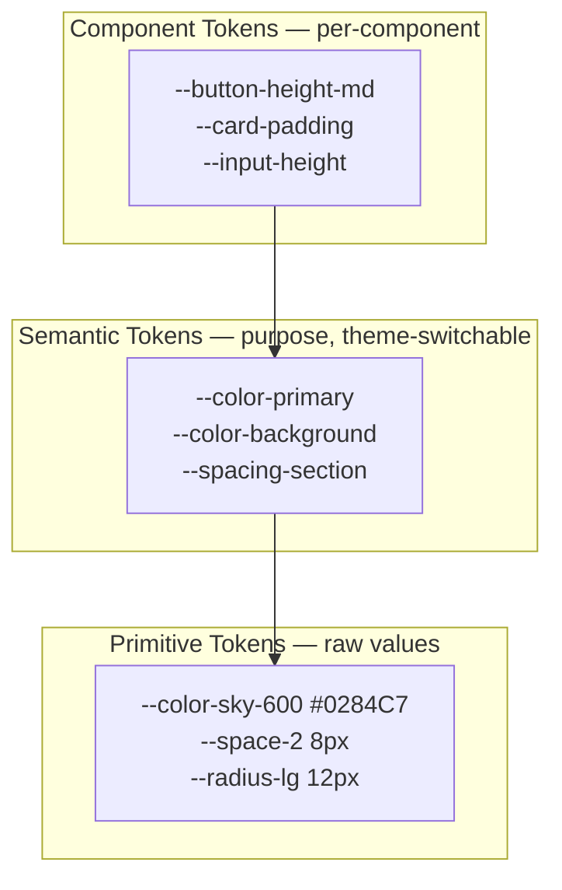
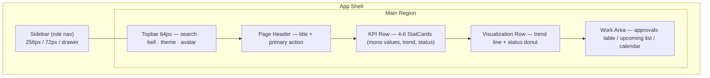
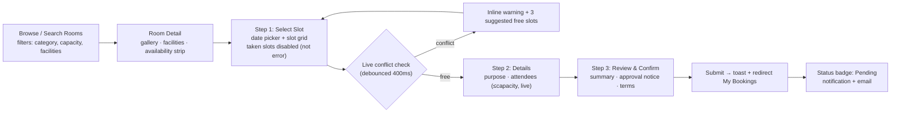
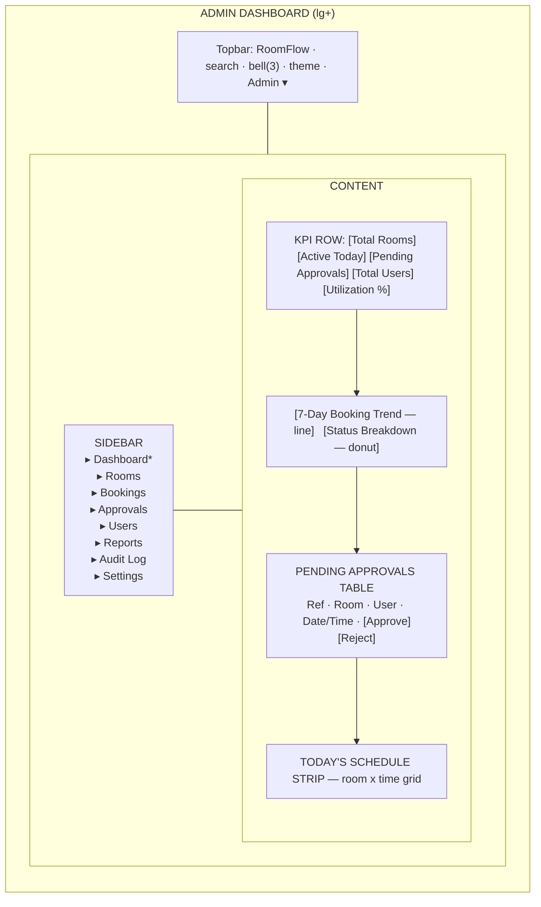
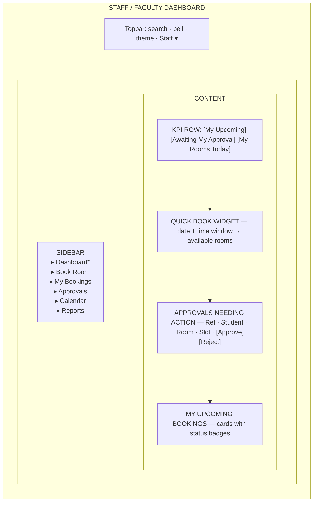
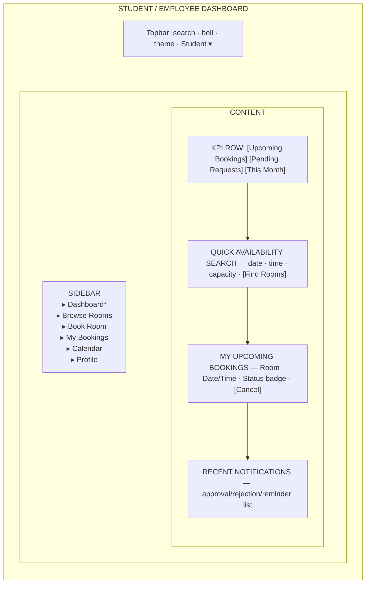

# RoomFlow – UI/UX Design System

| Field | Value |
|---|---|
| Project | RoomFlow – Smart Room Booking Management Portal |
| Document | UI/UX Design System Specification |
| Version | 1.0 |
| Status | Frozen (see ADRs, §18) |
| Stack | React + Vite · Tailwind CSS · shadcn/ui · Node · Express · MongoDB |
| Source of decisions | Installed skills: `ui-ux-pro-max`, `design-system`, `ui-styling` |
| Scope | Design system only — **no implementation code** |

> Every decision in this document is traced to a skill query. The trace tag `[skill: <domain>]` marks the origin. Nothing here is invented outside the skill database.

---

## Table of Contents

1. [Design Style Selection](#1-design-style-selection)
2. [Color Palette (Light & Dark)](#2-color-palette-light--dark)
3. [Typography](#3-typography)
4. [Design Tokens (3-Layer)](#4-design-tokens-3-layer)
5. [Spacing System (8px)](#5-spacing-system-8px)
6. [Border Radius & Shadows](#6-border-radius--shadows)
7. [Icon Style](#7-icon-style)
8. [Component Standards](#8-component-standards)
9. [Responsive Breakpoints](#9-responsive-breakpoints)
10. [Dashboard Layout](#10-dashboard-layout)
11. [Booking Flow UX](#11-booking-flow-ux)
12. [Admin Dashboard Wireframe](#12-admin-dashboard-wireframe)
13. [Staff Dashboard Wireframe](#13-staff-dashboard-wireframe)
14. [Student Dashboard Wireframe](#14-student-dashboard-wireframe)
15. [Accessibility (WCAG 2.1 AA)](#15-accessibility-wcag-21-aa)
16. [Tailwind Conventions](#16-tailwind-conventions)
17. [shadcn/ui Conventions](#17-shadcnui-conventions)
18. [Final Design Decisions (ADRs)](#18-final-design-decisions-adrs)

---

# 1. Design Style Selection

## 1.1 Skill Match

Skill query `--domain product "booking scheduling reservation calendar"` returned the exact product type:

> **Product Type: Booking & Appointment App** `[skill: product]`
> - Primary Style: **Soft UI Evolution + Flat Design**
> - Secondary Styles: **Minimalism, Micro-interactions**
> - Dashboard Style: **Drill-Down Analytics**
> - Color Palette Focus: *Trust blue + available green + booked grey + confirm accent*

For the dashboard surfaces, skill query `--domain style` returned:

> **Executive Dashboard** (BI/Analytics) `[skill: style]` — Light ✓ Full, Dark ✓ Full, WCAG AA, KPI cards 4–6 max, trend sparklines, status colors, print-friendly.

## 1.2 Chosen Style

| Layer | Style | Source |
|---|---|---|
| Foundation | **Flat Design + Minimalism** | Booking App primary/secondary `[skill: product]` |
| Elevation | **Soft UI Evolution** (subtle, not heavy neumorphism) | Booking App primary `[skill: product]` |
| Interaction | **Micro-interactions** (150–300 ms) | Booking App secondary `[skill: product]` |
| Data surfaces | **Executive Dashboard + Drill-Down Analytics** | `[skill: style, product]` |

## 1.3 Rejected: Dark Mode (OLED)

The `--design-system` query first proposed **Dark Mode (OLED)**, but the skill itself flags it **Light Mode ✗ No** `[skill: style]`. RoomFlow is used by students and staff in daylight (classrooms, offices, libraries) and must be print-friendly for reports. A light-first system with full dark support is the correct read of the skill data. OLED-only is rejected. *(ADR-D01)*

## 1.4 Style Principles (Skill-Derived)

- Flat surfaces, no gradients-as-decoration; color carries meaning, not ornament.
- Soft elevation only to signal interactivity/hierarchy (cards, dialogs).
- Every clickable element: `cursor-pointer`, hover transition 150–300 ms `[skill: checklist]`.
- SVG icons only — **no emoji as icons** `[skill: checklist]`.
- Status is a fixed color vocabulary, identical everywhere.

---

# 2. Color Palette (Light & Dark)

## 2.1 Light Mode — Skill Palette

Directly from skill query `--domain color "Booking & Appointment App"` `[skill: color]`:

| Token | Hex | Role |
|---|---|---|
| Primary | `#0284C7` | Primary actions, active nav, links (Trust Blue) |
| On Primary | `#FFFFFF` | Text/icon on primary |
| Secondary | `#0EA5E9` | Secondary actions, highlights |
| Accent | `#059669` | Confirm / available / success (Event Green) |
| On Accent | `#FFFFFF` | Text on accent |
| Background | `#F0F9FF` | App canvas |
| Foreground | `#0F172A` | Primary text |
| Card | `#FFFFFF` | Card / panel surface |
| Card Foreground | `#0F172A` | Text on card |
| Muted | `#EFF7FB` | Subtle fills, disabled bg |
| Muted Foreground | `#64748B` | Secondary text, captions |
| Border | `#E0F0F8` | Dividers, input borders |
| Destructive | `#DC2626` | Delete, reject, errors |
| On Destructive | `#FFFFFF` | Text on destructive |
| Ring | `#0284C7` | Focus ring |

## 2.2 Booking Status Colors

From Executive Dashboard status set `[skill: style]`, mapped to the booking state machine:

| Status | Fill | Text/Border | Hex |
|---|---|---|---|
| Available / Approved | Green | on light bg | `#059669` / `#22C55E` |
| Pending | Amber | on light bg | `#F59E0B` |
| Booked / Occupied | Slate (neutral, "booked grey") | | `#64748B` |
| Rejected / Cancelled | Red | | `#DC2626` / `#EF4444` |
| Completed | Blue | | `#0284C7` |

**Rule:** this vocabulary is identical on badges, calendar chips, and charts. Never convey status by color alone — always pair with text/icon `[skill: ux — Charts & Data]`.

## 2.3 Dark Mode

Built on the same hue family (Executive Dashboard = Dark ✓ Full `[skill: style]`), tuned so surfaces are dark slate (not pure OLED black) to keep the light-first identity:

| Token | Hex | Role |
|---|---|---|
| Primary | `#38BDF8` | Lifted blue for contrast on dark |
| On Primary | `#0B1220` | Dark text on bright primary |
| Secondary | `#0EA5E9` | Secondary |
| Accent | `#34D399` | Success on dark |
| Background | `#0B1220` | App canvas (deep slate) |
| Foreground | `#E2E8F0` | Primary text |
| Card | `#111A2E` | Card surface |
| Card Foreground | `#E2E8F0` | Text on card |
| Muted | `#1E293B` | Subtle fills |
| Muted Foreground | `#94A3B8` | Secondary text |
| Border | `#1E2A44` | Dividers |
| Destructive | `#F87171` | Errors on dark |
| Ring | `#38BDF8` | Focus ring |

## 2.4 Contrast Verification (WCAG 2.1 AA)

| Pair | Ratio | Pass |
|---|---|---|
| Foreground `#0F172A` on Background `#F0F9FF` | ~15.8:1 | AAA |
| On Primary `#FFF` on Primary `#0284C7` | ~4.6:1 | AA |
| Muted Foreground `#64748B` on Card `#FFF` | ~4.6:1 | AA |
| Dark Foreground `#E2E8F0` on Dark Bg `#0B1220` | ~14:1 | AAA |
| Dark On-Primary `#0B1220` on `#38BDF8` | ~8:1 | AAA |

Body text minimum 4.5:1; large text/UI 3:1 `[skill: ux — Accessibility]`.

---

# 3. Typography

## 3.1 Skill Pairings

Two skill results apply `[skill: typography]`:

- **Minimal Swiss** — Inter / Inter — *minimal, clean, swiss, functional, professional.*
- **Dashboard Data** — Fira Code / Fira Sans — *dashboards, analytics, admin panels.*

## 3.2 Chosen Pairing

| Role | Font | Source | Use |
|---|---|---|---|
| UI / Body / Headings | **Inter** | Minimal Swiss `[skill: typography]` | All interface text — universally readable for students, staff, admins |
| Tabular / Numeric / Data | **Fira Code** (mono) | Dashboard Data `[skill: typography]` | KPI numbers, booking IDs, time slots, table figures, timestamps |

*Rationale:* Inter is the cleaner SaaS choice for a mixed-audience portal; Fira Code (mono) is reserved for tabular figures so times and IDs align in tables and KPIs — both fonts are skill-sourced. *(ADR-D03)*

## 3.3 Type Scale (Base 16px `[skill: ux — Typography]`)

| Token | Size | rem | Line Height | Weight | Use |
|---|---|---|---|---|---|
| `text-xs` | 12px | 0.75 | 1.5 | 400/500 | Captions, badges (min body size) |
| `text-sm` | 14px | 0.875 | 1.5 | 400/500 | Secondary text, table cells |
| `text-base` | 16px | 1.0 | 1.5 | 400 | Body (default) |
| `text-lg` | 18px | 1.125 | 1.5 | 500 | Lead text |
| `text-xl` | 20px | 1.25 | 1.4 | 600 | Card titles |
| `text-2xl` | 24px | 1.5 | 1.3 | 600 | Section headings |
| `text-3xl` | 30px | 1.875 | 1.25 | 700 | Page titles |
| `text-4xl` | 36px | 2.25 | 1.2 | 700 | KPI values (mono) |

Rules: base 16px, line-height 1.5 for body, no body text < 12px `[skill: ux — Typography & Color]`.

---

# 4. Design Tokens (3-Layer)

Architecture from the `design-system` skill: **Primitive → Semantic → Component** `[skill: design-system/token-architecture]`.

## 4.1 Layer 1 — Primitives (raw, rarely change)

| Group | Tokens (examples) |
|---|---|
| Color scale | `--sky-500 #0EA5E9`, `--sky-600 #0284C7`, `--emerald-600 #059669`, `--amber-500 #F59E0B`, `--red-600 #DC2626`, `--slate-50…--slate-950` |
| Spacing | `--space-1 4px` … `--space-16 64px` (see §5) |
| Radius | `--radius-sm 4px`, `--radius-md 8px`, `--radius-lg 12px`, `--radius-full 9999px` |
| Shadow | `--shadow-sm`, `--shadow-md`, `--shadow-lg` (see §6) |
| Font size | `--fs-xs 12px` … `--fs-4xl 36px` |

## 4.2 Layer 2 — Semantic (theme-switchable aliases)

| Semantic token | Light → primitive | Dark → primitive |
|---|---|---|
| `--color-primary` | `--sky-600` | `--sky-400` |
| `--color-accent` | `--emerald-600` | `--emerald-400` |
| `--color-background` | `--sky-50` | `--slate-950` |
| `--color-foreground` | `--slate-900` | `--slate-200` |
| `--color-card` | `#FFFFFF` | `--slate-900` |
| `--color-muted-foreground` | `--slate-500` | `--slate-400` |
| `--color-border` | `#E0F0F8` | `--slate-800` |
| `--color-destructive` | `--red-600` | `--red-400` |
| `--color-ring` | `--sky-600` | `--sky-400` |

Dark mode swaps **only** this layer — primitives and components stay untouched `[skill: design-system]`.

## 4.3 Layer 3 — Component (map to shadcn)

`--button-*`, `--card-*`, `--input-*`, `--badge-*`, `--dialog-*` reference **semantic** tokens, never primitives directly. This is what lets a theme change ripple through every component from one place.

**Rule:** components reference semantic tokens; semantic reference primitives. No raw hex in components `[skill: ux — Typography & Color: "Raw hex in components" = anti-pattern]`.

---

# 5. Spacing System (8px)

Base unit **8px**, with a 4px half-step `[skill: design-system/token-architecture — 4px base scale]`.

| Token | px | rem | Typical use |
|---|---|---|---|
| `space-0.5` | 4 | 0.25 | Icon-to-text gap, tight |
| `space-1` | 8 | 0.5 | **Min gap between touch targets** `[skill: ux — Touch Spacing]` |
| `space-2` | 16 | 1.0 | Default control padding, card inner gap |
| `space-3` | 24 | 1.5 | Card padding, form field spacing |
| `space-4` | 32 | 2.0 | Section gap |
| `space-5` | 40 | 2.5 | Large section gap |
| `space-6` | 48 | 3.0 | Page vertical rhythm |
| `space-8` | 64 | 4.0 | Major layout separation |

Rules: all margins/paddings/gaps snap to this scale; **min 8px gap between adjacent clickable elements** (`gap-2`, never `gap-0/gap-1`) `[skill: ux — Touch Spacing, severity Medium]`.

---

# 6. Border Radius & Shadows

## 6.1 Radius `[skill: design-system]`

| Token | Value | Applied to |
|---|---|---|
| `radius-sm` | 4px | Badges, small chips, checkboxes |
| `radius-md` | 8px | Inputs, buttons, alerts |
| `radius-lg` | 12px | Cards, dialogs, popovers |
| `radius-xl` | 16px | Feature panels, modal shells |
| `radius-full` | 9999px | Avatars, status dots, pills |

## 6.2 Shadows — Soft UI Evolution, restrained `[skill: product, design-system]`

| Token | Value | Use |
|---|---|---|
| `shadow-sm` | `0 1px 2px rgb(0 0 0 / 0.05)` | Resting cards, inputs |
| `shadow-md` | `0 4px 6px -1px rgb(0 0 0 / 0.1)` | Hover lift, dropdowns |
| `shadow-lg` | `0 10px 15px -3px rgb(0 0 0 / 0.1)` | Dialogs, popovers |
| `shadow-focus` | `0 0 0 3px rgb(2 132 199 / 0.4)` | Focus ring (keyboard) `[skill: ux — Keyboard Nav]` |

Dark mode: shadows are near-invisible; hierarchy is carried by `--color-border` and surface lightness (`card` lighter than `background`) instead of shadow. Flat + soft, never heavy neumorphism.

---

# 7. Icon Style

| Decision | Value | Source |
|---|---|---|
| Library | **Lucide** (Heroicons acceptable alt) | `[skill: checklist — "SVG: Heroicons/Lucide"]` |
| Format | SVG only — **no emoji as icons** | `[skill: checklist, style checklist]` |
| Default size | 20px inline / 24px standalone | 8px scale |
| Stroke | 1.5–2px, consistent across the app | Flat/Minimal consistency |
| Color | Inherits `currentColor` (semantic token) | Token discipline |
| Touch target | Icon-only button ≥ **44×44px** hit area | `[skill: ux — Touch, CRITICAL]` |
| Labels | Icon-only buttons require `aria-label` | `[skill: ux — Accessibility; anti-pattern: icon-only without labels]` |

Domain icon map: `calendar` (bookings), `door-open` (rooms), `users` (management), `bell` (notifications), `check-circle` (approve), `x-circle` (reject), `clock` (pending), `bar-chart-3` (reports), `settings`, `log-out`.

---

# 8. Component Standards

All components follow: Flat + Soft UI elevation, micro-interaction transitions 150–300 ms, semantic tokens only, four explicit states (default / hover / focus / disabled) plus data states where relevant (loading / empty / error). Maps to shadcn/ui primitives (§17).

## 8.1 Buttons

| Variant | Fill | Use |
|---|---|---|
| Primary | `--color-primary`, on-primary text | Main action (Book, Save, Confirm) |
| Secondary | Muted bg, foreground text | Secondary action |
| Accent | `--color-accent` | Approve / Confirm booking |
| Destructive | `--color-destructive` | Reject, Delete, Cancel |
| Outline | Transparent, border | Tertiary |
| Ghost | Transparent, no border | Toolbar, icon buttons |

- Heights: `sm 32px`, `md 40px`, `lg 48px`. Min hit area 44×44px on mobile `[skill: ux — Touch, CRITICAL]`.
- Radius `md 8px`; `cursor-pointer`; hover transition 150–300 ms `[skill: checklist]`.
- Loading state: spinner + disabled, label persists (prevents double submit) `[skill: ux — Touch: Loading feedback]`.
- No instant 0 ms state changes `[skill: ux — anti-pattern]`.

## 8.2 Forms & Inputs

| Rule | Source |
|---|---|
| Visible `<label>` above every field (never placeholder-as-label) | `[skill: ux — Forms: "Placeholder-only label" = anti-pattern]` |
| Error message **near the field**, not only at top | `[skill: ux — Forms: "Errors only at top" = anti-pattern]` |
| Helper text under field; progressive disclosure for advanced options | `[skill: ux — Forms]` |
| Input height 40px, radius 8px, 12px inner padding | 8px scale |
| Focus: visible ring `shadow-focus` | `[skill: ux — Keyboard Nav]` |
| Error state: destructive border + `aria-invalid` + `aria-describedby` | `[skill: ux — Accessibility]` |
| Required fields marked in label; validate on blur + submit | Forms best practice |

## 8.3 Cards

- Surface `--color-card`, border `--color-border`, radius `lg 12px`, padding `space-3 (24px)`, `shadow-sm` resting → `shadow-md` on hover (if interactive).
- Room card: image (reserved aspect ratio to prevent CLS `[skill: ux — Performance: reserve space]`), name + code, category badge, capacity, facility icons, availability dot, primary action.
- KPI card (Executive Dashboard `[skill: style]`): large mono value (`text-4xl`), label, trend sparkline/arrow, status color border-left. Max 4–6 KPIs per view.

## 8.4 Tables

- Header: muted bg, `text-sm` medium, sticky on scroll.
- Rows: 48px min height, zebra optional, hover highlight, row actions right-aligned.
- Numeric/time/ID columns use **Fira Code** (mono) for alignment `[skill: typography]`.
- Mobile: tables collapse to stacked cards — **no horizontal scroll of data tables** `[skill: ux — Layout: "Horizontal scroll" = anti-pattern]`.
- States: loading = skeleton rows; empty = `EmptyState` with a clear action; error = inline retry.
- Pagination bottom-right; page size selector.

## 8.5 Dialogs / Modals

- Radius `lg/xl`, `shadow-lg`, overlay scrim, max-width by purpose (confirm 400px, form 560px).
- **Focus trapped inside; focus returns to trigger on close** `[skill: ux — Keyboard Nav]`.
- Esc + overlay click close (except destructive confirm — button only).
- Destructive confirm dialogs require explicit typed/second action; reason field where the domain needs one (reject/cancel).
- Mobile: full-screen sheet `[skill: ux — Responsive]`.

## 8.6 Badges

- Radius `full` (pill), `text-xs` medium, icon + text (never color-only `[skill: ux — Charts & Data]`).
- Booking status badges use the §2.2 vocabulary. Role badges: Admin/Staff/Student/Guest in neutral + accent.

## 8.7 Alerts / Toasts

| Type | Color | Icon |
|---|---|---|
| Success | Accent green | `check-circle` |
| Warning | Amber | `alert-triangle` |
| Error | Destructive red | `x-circle` |
| Info | Primary blue | `info` |

- Inline alerts for form/section context; toasts (top-right, auto-dismiss 4–6s) for async results.
- Toast is announced to screen readers via `aria-live="polite"` (assertive for errors) `[skill: ux — Accessibility]`.

## 8.8 Navbar (Topbar)

- Height 64px, `--color-card` surface, bottom border.
- Left: page title / breadcrumbs. Right: global search, notification bell (unread count badge), theme toggle, avatar menu.
- Sticky on scroll; collapses to hamburger + bell on mobile.

## 8.9 Sidebar

- Width 256px expanded / 72px icon-rail (`md`), off-canvas drawer on mobile `[skill: ux — Responsive]`.
- Role-scoped nav groups; active item = primary color + left accent bar.
- Each item: icon + label; icon-only rail shows tooltip (`aria-label` present).
- Bottom-nav pattern on mobile, **≤ 5 items** `[skill: ux — Navigation: "Bottom nav ≤5"]`.
- Predictable back behavior, deep-linkable routes `[skill: ux — Navigation]`.

---

# 9. Responsive Breakpoints

Skill-mandated test widths: **375px, 768px, 1024px, 1440px** `[skill: checklist]`; mobile-first, no horizontal scroll, viewport meta, zoom enabled `[skill: ux — Layout & Responsive]`.

| Name | Min width | Layout |
|---|---|---|
| Base (mobile) | 0–639px | 1 column · bottom nav · drawer sidebar · cards not tables · full-screen dialogs · larger touch targets `[skill: ux — Touch Friendly, HIGH]` |
| `sm` | 640px | 2-column grids |
| `md` | 768px | Icon-rail sidebar · 2–3 columns |
| `lg` | 1024px | Persistent sidebar · 3 columns · tables |
| `xl` | 1280px | 4 columns · sticky booking widget · wide charts |
| `2xl` | 1536px | Max content width capped (readability) |

Anti-patterns avoided: horizontal scroll, fixed-px container widths, disabling zoom, desktop-sized targets on mobile `[skill: ux]`.

---

# 10. Dashboard Layout

Pattern: **Executive Dashboard** shell — KPI row (4–6 max) → charts → work queue/table `[skill: style]`.

Rules: single API call per dashboard; skeleton loaders per card (never blank/full-spinner); one-page at-a-glance; print-friendly `[skill: style — Executive Dashboard checklist]`.

---

# 11. Booking Flow UX

Style: Micro-interactions + Soft UI, 3-step stepper, prevention over error messages `[skill: product, ux]`.

UX rules applied:
- Taken slots are **disabled, not error-on-submit** — prevention `[skill: ux — Forms]`.
- Live inline validation near field (attendees vs capacity) `[skill: ux — Forms]`.
- Conflict returns alternatives, never a dead end.
- Every async action has loading feedback + optimistic UI where safe `[skill: ux — Touch: Loading feedback]`.
- Motion conveys step transition (spatial continuity, 150–300 ms), respects `prefers-reduced-motion` `[skill: ux — Animation]`.

---

# 12. Admin Dashboard Wireframe

---

# 13. Staff Dashboard Wireframe

---

# 14. Student Dashboard Wireframe

Mobile variant (all roles): sidebar → bottom nav (≤5 items), KPI row → horizontal scroll or 2×2, tables → stacked cards `[skill: ux — Responsive, Navigation]`.

---

# 15. Accessibility (WCAG 2.1 AA)

Priority 1–2 in the skill are **CRITICAL** `[skill: ux]`. Mandatory checklist:

| # | Requirement | Skill Source |
|---|---|---|
| 1 | Text contrast ≥ **4.5:1** (body), 3:1 (large/UI) | Accessibility, CRITICAL |
| 2 | All interactive elements **keyboard reachable**, logical tab order | Keyboard Navigation |
| 3 | **Visible focus rings** — never removed | anti-pattern: "Removing focus rings" |
| 4 | Icon-only buttons have **`aria-label`** | anti-pattern: "Icon-only buttons without labels" |
| 5 | Touch targets **≥ 44×44px**, ≥ 8px apart | Touch & Interaction, CRITICAL |
| 6 | No instant (0 ms) state changes; feedback on every action | anti-pattern |
| 7 | **Alt text** on all meaningful images | Accessibility |
| 8 | Form labels visible; errors linked via `aria-describedby`, `aria-invalid` | Forms & Feedback |
| 9 | Status never conveyed by **color alone** (icon + text too) | Charts & Data |
| 10 | Respect **`prefers-reduced-motion`** | Animation |
| 11 | Reserve space for async content (**CLS < 0.1**) | Performance, HIGH |
| 12 | Viewport meta present; **zoom not disabled**; no horizontal scroll | Layout & Responsive |
| 13 | Live regions (`aria-live`) for toasts/async updates | Accessibility |
| 14 | Modals trap focus, restore focus on close | Keyboard Navigation |
| 15 | Semantic landmarks (`nav`, `main`, `header`), heading hierarchy | Accessibility |

Target: WCAG 2.1 **AA** across the app (palette already reaches AAA on primary text pairs, §2.4).

---

# 16. Tailwind Conventions

Skill: framework compatibility Tailwind 10/10 `[skill: style]`. Conventions (config-level guidance, no code):

- **Theme via CSS variables** — map semantic tokens (§4.2) into `tailwind.config` `theme.extend.colors` referencing CSS vars, so `bg-primary`/`text-foreground` resolve per theme.
- **Dark mode: `class` strategy** (`darkMode: 'class'`) — toggled on `<html>` `[skill: ui-styling/shadcn-theming]`.
- **Font families**: `sans → Inter`, `mono → Fira Code` `[skill: typography Tailwind Config]`.
- **Spacing/radius** extend to the 8px scale + radius tokens (§5, §6); avoid arbitrary `[13px]` values — snap to scale.
- **No raw hex in markup** — only token-mapped utilities (`bg-accent`, not `bg-[#059669]`) `[skill: ux — anti-pattern raw hex]`.
- **Mobile-first**: unprefixed = mobile, add `sm: md: lg: xl:` upward. No `max-*` desktop-first patterns.
- **Transitions**: standard `transition` + `duration-200` (150–300 ms band) `[skill: ux — Animation]`.
- **Reduced motion**: `motion-reduce:` variants disable non-essential animation.
- Use `@apply` sparingly — only for repeated primitive patterns; prefer component composition.

---

# 17. shadcn/ui Conventions

Skill: `ui-styling` shadcn references `[skill: ui-styling]`.

- **Theming**: shadcn CSS variables (`--background`, `--foreground`, `--primary`, `--ring`, …) are the **semantic layer** (§4.2). Set light values on `:root`, dark on `.dark`.
- **Dark mode**: `class` attribute strategy; theme toggle switches `.dark` on `<html>`; default = system, no transition flash `[skill: ui-styling/shadcn-theming]`.
- **Component set** to install: `button`, `input`, `label`, `select`, `textarea`, `checkbox`, `card`, `badge`, `dialog`, `sheet` (mobile), `dropdown-menu`, `table`, `tabs`, `toast`/`sonner`, `alert`, `tooltip`, `skeleton`, `avatar`, `calendar`, `popover`, `pagination`, `separator`.
- **Radius**: shadcn `--radius` = `12px` (`lg`) as base (§6.1).
- **Composition over configuration**: extend shadcn primitives into RoomFlow feature components (`RoomCard`, `BookingStatusBadge`) rather than prop-bloating.
- **Accessibility**: shadcn (Radix) gives focus trap, `aria-*`, keyboard nav out of the box — keep it, don't override focus styles away (§15 #3).
- **Icons**: Lucide (shadcn default) `[skill: checklist]`.

---

# 18. Final Design Decisions (ADRs)

All frozen. Each cites its skill source.

| ID | Decision | Rationale | Skill Source |
|---|---|---|---|
| **ADR-D01** | Style = **Flat + Minimalism + Soft UI Evolution + Micro-interactions**; light-first with full dark support. Reject OLED-only. | Exact match for "Booking & Appointment App"; students/staff use daylight + print reports; OLED style is Light✗. | `[product, style]` |
| **ADR-D02** | Palette = skill **Booking & Appointment App** set — Primary `#0284C7`, Accent `#059669`, Bg `#F0F9FF`, Destructive `#DC2626`. | "Trust blue + available green" is the skill's stated focus; verified WCAG AA/AAA. | `[color]` |
| **ADR-D03** | Typography = **Inter** (UI/body) + **Fira Code** (tabular/numeric/IDs). | Minimal Swiss = clean SaaS; Dashboard Data mono aligns times/IDs/KPIs. Both skill pairings. | `[typography]` |
| **ADR-D04** | **3-layer tokens** (Primitive → Semantic → Component); dark mode swaps semantic layer only. | Scalable theming; single change point. | `[design-system]` |
| **ADR-D05** | **8px spacing** base (4px half-step); min **8px** between touch targets. | Skill touch-spacing rule + 4px base scale. | `[design-system, ux]` |
| **ADR-D06** | Radius scale 4/8/12/16/full; restrained Soft-UI shadows sm/md/lg + focus ring. | Flat + soft elevation, not heavy neumorphism. | `[design-system, product]` |
| **ADR-D07** | Icons = **Lucide SVG only**; no emoji; icon-only buttons need `aria-label` + 44px target. | Skill checklist + accessibility CRITICAL. | `[checklist, ux]` |
| **ADR-D08** | Dashboards = **Executive Dashboard** (4–6 KPIs, sparklines, status colors, print-friendly). | Skill dashboard style for BI/analytics. | `[style]` |
| **ADR-D09** | Booking flow = **3-step stepper**, disabled (not error) taken slots, live conflict check + suggested alternatives. | Micro-interactions + prevention-over-error. | `[product, ux]` |
| **ADR-D10** | Breakpoints tested at **375 / 768 / 1024 / 1440**, mobile-first, no horizontal scroll, zoom enabled. | Skill responsive checklist. | `[checklist, ux]` |
| **ADR-D11** | Target **WCAG 2.1 AA** globally; status never color-only; visible focus; reduced-motion; CLS < 0.1. | Skill priorities 1–3 CRITICAL/HIGH. | `[ux]` |
| **ADR-D12** | Tailwind (`darkMode: class`, token-mapped colors, no raw hex) + shadcn semantic CSS vars, Radix a11y kept. | Framework 10/10; skill theming guidance. | `[ui-styling]` |

**Freeze rule:** palette (ADR-D02), typography (ADR-D03), token architecture (ADR-D04), and status vocabulary (§2.2) do not change post-approval without a formal design change note.

---

*End — RoomFlow UI/UX Design System v1.0. All decisions sourced from installed skills `ui-ux-pro-max`, `design-system`, `ui-styling`. No implementation code.*
